# Layer Report: AI Layer

**Audit Date:** 2026-04-05
**Agent:** ai-layer
**Severity Scale:** Critical / High / Medium / Low / Info

---

## Executive Summary

Meridian has a comprehensive and well-architected AI layer using the Anthropic SDK (Claude Sonnet 4.6). There are 22 AI modules in `lib/ai/`, 17 API endpoints under `/api/ai/`, 14 AI-specific React hooks, and 2 background cron jobs that generate AI insights. Key strengths: centralized AI client singleton with proper retry logic (exponential backoff on 429/529), graceful rules-based fallbacks when the API key is absent, and a consistent prompt engineering pattern across all modules.

Critical concerns: (1) the natural language SQL search executes AI-generated SQL against production data with insufficient DB-layer guardrails; (2) prompt injection is not validated before execution; (3) 10 of 17 AI routes lack rate limiting, creating Anthropic cost exposure; (4) the AI briefing and churn prediction both receive incorrect revenue/visit data from `daily_metrics` and are therefore producing insights from wrong inputs.

---

## AI Architecture Overview

```mermaid
flowchart TD
    subgraph AI_CLIENT["lib/ai/client.ts — Shared Singleton"]
        CLIENT["Anthropic(apiKey, timeout=30s)\nLazy init, null-safe"]
        MODEL["AI_MODEL = 'claude-sonnet-4-6'"]
        RETRY["withRetry(fn, 3 attempts)\nExponential backoff 1s/2s/4s\nOn: 429, 529"]
        EXTRACT["extractText()\nparseAIJson()"]
    end

    subgraph AI_MODULES["lib/ai/ — 22 Feature Modules"]
        BRIEFING["briefing.ts\nDaily studio summary"]
        CHURN["churn-prediction.ts\nPer-member churn risk"]
        HEALTH["health-score.ts\nEngagement health score"]
        CAMPAIGN["campaign.ts\nEmail copy generation"]
        NL_SEARCH["nl-search.ts\nNatural language to SQL"]
        INSIGHTS["insights-generator.ts\nProactive AI insights"]
        ANOMALY["revenue-anomaly.ts\nRevenue anomaly detection"]
        PATTERNS["booking-patterns.ts\nBooking pattern analysis"]
        TRAINER["trainer-summary.ts\nTrainer performance narrative"]
        INTAKE["intake-enrichment.ts\nMember intake form AI"]
        WAITLIST["waitlist-messaging.ts\nAI waitlist messages"]
        LEAD_SCORE["lead-scoring.ts\nAI lead qualification"]
        SEND_TIME["send-time.ts\nOptimal email send time"]
        SEASONAL["seasonal-predictor.ts\nDemand forecasting"]
        PRICING["pricing-analyzer.ts\nPricing recommendations"]
        CROSS_SELL["cross-sell.ts\nUpsell recommendations"]
        REPORT["report-narrative.ts\nAI-written report prose"]
        AUTO_RECS["automation-recommendations.ts\nFlow suggestions"]
        TRAINER_COMP["trainer-comparison.ts\nInter-trainer benchmarking"]
        AUTO_REPLY["auto-reply.ts\nEmail auto-reply drafts"]
        NL_TO_SEG["... (others)"]
    end

    subgraph AI_ROUTES["app/api/ai/ — 17 Endpoints"]
        R_BRIEFING["/api/ai/briefing\nrequireRole + rateLimit"]
        R_SEARCH["/api/ai/search\nrequireRole + rateLimit"]
        R_CHURN["/api/ai/churn-prediction\nrequireRole + rateLimit"]
        R_HEALTH["/api/ai/health-score\nrequireRole + rateLimit"]
        R_CAMPAIGN["/api/ai/campaign-copy\nrequireRole + rateLimit"]
        R_INSIGHTS["/api/ai/insights/**\nrequireRole — NO rateLimit"]
        R_ANOMALY["/api/ai/revenue-anomaly\nrequireRole — NO rateLimit"]
        R_PATTERNS["/api/ai/booking-patterns\nrequireRole — NO rateLimit"]
    end

    subgraph CRONS["Background AI Jobs"]
        CRON_INSIGHTS["cron-ai-insights\nDaily at 4 AM ET\nGenerates proactive insights"]
        CRON_COHORT["cron-cohort-refresh\nCohort analysis refresh"]
    end

    AI_CLIENT --> AI_MODULES
    AI_MODULES --> AI_ROUTES
    AI_MODULES --> CRONS
```



---

## Prompt Engineering Analysis

### Patterns observed across all 22 modules:

1. **System prompt separation:** Every module has a dedicated `SYSTEM_PROMPT` constant defining the AI's role and output format. Prompts are clear and well-scoped.

2. **Structured JSON output:** AI modules that need structured data (churn prediction, health score, anomaly detection) request JSON responses and use `parseAIJson<T>()` to parse with type safety.

3. **Rules-based fallbacks:** All modules check `getAnthropicClient() === null` and return sensible fallback data when the API key is absent. This enables unit testing without the real API.

4. **Model centralization:** All modules use `AI_MODEL = "claude-sonnet-4-6"` imported from `client.ts`. A model upgrade requires a single-line change.

5. **Token budget:** `max_tokens` is set per module. Briefing uses 500, churn prediction likely uses more. No module was found to be missing `max_tokens`.

---

## Findings

### HIGH-AI-001: NL Search executes AI-generated SQL without DB-layer read-only enforcement

**Severity:** High
**Location:** `apps/web/src/lib/ai/nl-search.ts`, `apps/web/src/app/api/ai/search/route.ts`

Application-layer mitigations exist (SELECT-only prompt, string-prefix check), but the `execute_readonly_sql` RPC is not confirmed to enforce read-only at the database level. A prompt injection or an unusually creative Claude response that crafts a SELECT with side-effecting functions (e.g., `SELECT pg_cancel_backend()`, or a CTE with a malformed subquery) would bypass the string-prefix check.

Additionally, the schema context provided in the system prompt contains all table and column names across the entire data model. This is necessary for the feature but also means a sufficiently crafted input could guide the AI to expose sensitive fields (e.g., `email`, `phone`, `health_score`) without an explicit column allowlist.

**Recommendation:**
1. Confirm `execute_readonly_sql` uses `BEGIN; SET TRANSACTION READ ONLY; ... ROLLBACK;` and runs under a role with only SELECT grants.
2. Add `SET statement_timeout = '5000'` to prevent long-running AI-generated queries.
3. Add a post-generation validator that checks the SQL for `studio_id =` presence before execution.

---

### HIGH-AI-002: AI briefing and churn prediction receive incorrect revenue/visit data as inputs

**Severity:** High
**Location:** `apps/web/src/app/api/ai/briefing/route.ts`, `apps/web/src/lib/ai/briefing.ts`

The AI briefing gathers context including `revenue_today` and `revenue_mtd` from the `transactions` table with date filters. This path appears correct (direct table query). However, `revenue_mtd` may also source from `daily_metrics` in some dashboard contexts, which is known-wrong.

More critically, `churn-prediction.ts` uses `total_spend_90d` and `days_since_last_visit` as inputs. If the member enrichment cron has not run recently, these values (stored in the `members` table's denormalized fields) may be stale. Visit data is only reconciled daily, so a member who checked in this morning would not have their `total_visits` incremented until the nightly cron.

**Recommendation:** The briefing route appears to fetch live transaction data correctly — document this clearly. For churn prediction, add a recency indicator to the response: "Data current as of [last enrichment run timestamp]".

---

### HIGH-AI-003: 10 of 17 AI routes have no rate limiting — unbounded Anthropic cost exposure

**Severity:** High
**Location:** `/api/ai/insights`, `/api/ai/insights/generate`, `/api/ai/recommendations`, `/api/ai/revenue-anomaly`, `/api/ai/booking-patterns`, `/api/ai/trainer-summary`, `/api/ai/intake-enrichment`, `/api/ai/auto-reply`, `/api/ai/waitlist-message`

These routes call Claude on each request with no rate limit. An admin who rapidly refreshes insights or triggers multiple AI recommendations will generate unbounded Anthropic API costs. At Claude Sonnet 4.6 pricing, 100 insight generation requests with 2,000 output tokens each would cost approximately $15. More concerning, if authentication is compromised, these endpoints could be called in a loop.

**Recommendation:** Apply `rateLimit()` to all AI routes. Use a studio-level key (`ai:studio:{studioId}`) to cap per-studio spend, not just per-user.

---

### MEDIUM-AI-004: Not all AI modules use withRetry() wrapper

**Severity:** Medium
**Location:** Multiple AI modules

The `withRetry()` function was added to `client.ts` as a shared retry wrapper for 429/529 errors. Not all AI modules have been updated to use it. Modules that call `anthropic.messages.create()` directly will throw immediately on rate limit, breaking the user experience. Modules using `withRetry()` will gracefully retry with backoff.

**Recommendation:** Audit all 22 modules for `anthropic.messages.create()` calls. Wrap each in `withRetry(() => anthropic.messages.create(...))`.

---

### MEDIUM-AI-005: AI briefing imports from deprecated lib/anthropic.ts

**Severity:** Medium
**Location:** `apps/web/src/app/api/ai/briefing/route.ts`

The briefing route imports from `@/lib/anthropic`:
```typescript
import { generateBriefing, BriefingContext } from "@/lib/anthropic";
```

But `briefing.ts` in `lib/ai/` imports from `@/lib/ai/client`:
```typescript
import { getAnthropicClient, AI_MODEL, extractText } from "@/lib/ai/client";
```

This suggests `lib/anthropic.ts` still exists as a legacy file and the briefing route has not been fully migrated to the new `lib/ai/` structure. If `lib/anthropic.ts` maintains its own Anthropic client instance, it creates a second singleton alongside `lib/ai/client.ts`.

**Recommendation:** Remove `lib/anthropic.ts` and update the briefing route to import `generateBriefing` from `@/lib/ai/briefing`.

---

### MEDIUM-AI-006: AI insights cron uses service-role client — no per-insight studio isolation validation

**Severity:** Medium
**Location:** `apps/web/src/lib/inngest/functions/cron-ai-insights.ts`

The AI insights cron uses the admin/service-role Supabase client (bypasses RLS) and must explicitly filter by `studio_id`. If the cron fails to include `studio_id` filters on any query, insights from one studio could bleed into another's feed. This is a multi-tenancy correctness issue that becomes critical at SaaS launch.

**Recommendation:** Add an explicit RLS check: after the cron generates insights, verify each insight's `studio_id` matches the target studio before inserting. Add a lint rule or code review checklist for service-role queries.

---

### LOW-AI-007: AI cache (ai_briefings table) has no eviction policy

**Severity:** Low
**Location:** `apps/web/src/app/api/ai/briefing/route.ts`

The briefing caches results for 30 minutes in the `ai_briefings` table. Old cache entries are never deleted. Over time this table will accumulate unbounded historical briefings. At 1 briefing per 30 minutes for a year, that's ~17,520 rows — not catastrophic but wasteful.

**Recommendation:** Add a cleanup step to the `cron-daily-metrics` or `cron-ai-insights` functions that deletes `ai_briefings` entries older than 24 hours.

---

### LOW-AI-008: Hardcoded AI_MODEL constant — no model version pinning strategy

**Severity:** Low
**Location:** `apps/web/src/lib/ai/client.ts`

`AI_MODEL = "claude-sonnet-4-6"` is correct. However, Anthropic occasionally deprecates model versions. There is no monitoring or alerting for model deprecation. When `claude-sonnet-4-6` is deprecated, all AI features will fail simultaneously.

**Recommendation:** Document the model pinning strategy. Subscribe to Anthropic deprecation notifications. Set a calendar reminder to review model versions quarterly.

---

### INFO-AI-009: AI fallback quality is high — feature degrades gracefully without API key

**Severity:** Info

All 22 AI modules implement rules-based fallbacks. The briefing fallback generates a multi-point summary from raw metrics. The churn fallback applies risk thresholds based on `days_since_last_visit`. This means the platform remains functional in environments without an Anthropic API key (e.g., local dev, CI). This is excellent engineering practice.

---

## Summary Table

| ID | Severity | Category | Title |
|----|----------|----------|-------|
| HIGH-AI-001 | High | Security | NL Search executes AI-generated SQL without DB read-only enforcement |
| HIGH-AI-002 | High | Data | AI briefing/churn receive potentially stale or incorrect data |
| HIGH-AI-003 | High | Cost | 10 of 17 AI routes lack rate limiting — unbounded cost exposure |
| MEDIUM-AI-004 | Medium | Reliability | Not all AI modules use withRetry() for rate limit handling |
| MEDIUM-AI-005 | Medium | Architecture | AI briefing imports from deprecated lib/anthropic.ts |
| MEDIUM-AI-006 | Medium | Multi-tenancy | AI insights cron uses service-role — studio isolation must be explicit |
| LOW-AI-007 | Low | Performance | ai_briefings cache table has no eviction policy |
| LOW-AI-008 | Low | Reliability | AI model version pinning has no deprecation monitoring |
| INFO-AI-009 | Info | Architecture | AI fallback is high quality — feature degrades gracefully |
