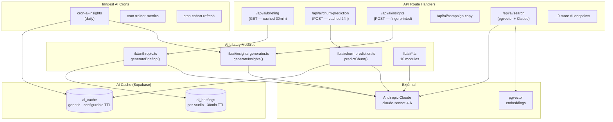

# Layer Report: AI Layer

**Agent:** ai-layer
**Completed:** 2026-03-20
**Severity legend:** CRITICAL / HIGH / MEDIUM / LOW / INFO

---

## Executive Summary

Meridian has a sophisticated, well-architected AI layer with 13 distinct Claude-powered functions organized into discrete library modules. The AI integration follows best practices: all prompts have rules-based fallbacks when `ANTHROPIC_API_KEY` is absent, responses are cached in the database to avoid redundant API calls, and prompts are structured and deterministic. The model used is `claude-sonnet-4-6` throughout. Several structural risks exist: STUDIO_ID is hardcoded in AI route handlers, the churn prediction route has a data bug that corrupts AI inputs, and there is no prompt versioning or cost tracking.

---

## AI Functions Inventory

| Function | File | Endpoint | Model | Cache TTL | Fallback |
|----------|------|----------|-------|-----------|---------|
| Daily Briefing | `lib/anthropic.ts` | `GET /api/ai/briefing` | claude-sonnet-4-6 | 30 min (DB) | Rules-based briefing |
| Churn Prediction | `lib/ai/churn-prediction.ts` | `POST /api/ai/churn-prediction` | claude-sonnet-4-6 | 24 hr (DB) | Rules-based scoring |
| AI Insights Generator | `lib/ai/insights-generator.ts` | `POST /api/ai/insights` | claude-sonnet-4-6 | — | Rules-based insights |
| Campaign Copy | `lib/ai/` → `POST /api/ai/campaign-copy` | — | claude-sonnet-4-6 | — | Unknown |
| Booking Patterns | `lib/ai/booking-patterns.ts` | `POST /api/ai/booking-patterns` | claude-sonnet-4-6 | — | Unknown |
| Member Health Score | hook: `use-member-health-score.ts` | `POST /api/ai/health-score` | claude-sonnet-4-6 | — | Unknown |
| Revenue Anomaly | `lib/ai/revenue-anomaly.ts` | `POST /api/ai/revenue-anomaly` | claude-sonnet-4-6 | — | Unknown |
| AI Search | hook: `use-ai-search.ts` | `GET/POST /api/ai/search` | claude-sonnet-4-6 + pgvector | — | Keyword fallback |
| Trainer Summary | `lib/ai/trainer-summary.ts` | `POST /api/ai/trainer-summary` | claude-sonnet-4-6 | — | Unknown |
| Intake Enrichment | `lib/ai/intake-enrichment.ts` | `POST /api/ai/intake-enrichment` | claude-sonnet-4-6 | — | Unknown |
| Auto-Reply | `lib/ai/auto-reply.ts` | `POST /api/ai/auto-reply` | claude-sonnet-4-6 | — | Unknown |
| Waitlist Message | `lib/ai/waitlist-messaging.ts` | `POST /api/ai/waitlist-message` | claude-sonnet-4-6 | — | Unknown |
| Recommendations | `lib/anthropic.ts` | `POST /api/ai/recommendations` | claude-sonnet-4-6 | — | Rules-based |

**Additional AI modules (not yet connected to active routes or used in Inngest):**
- `lib/ai/cross-sell.ts`
- `lib/ai/pricing-analyzer.ts`
- `lib/ai/report-narrative.ts`
- `lib/ai/seasonal-predictor.ts`
- `lib/ai/trainer-comparison.ts`

---

## Prompt Management Analysis

### Prompt Architecture

All prompts are defined as `const SYSTEM_PROMPT = ...` string constants within their respective module files. This is a pragmatic approach that avoids external prompt management complexity at the current scale.

**Positive patterns observed:**
1. **Structured JSON outputs** — Multiple AI functions instruct Claude to "Return ONLY the JSON object. No markdown fences, no extra text." This avoids parsing ambiguity.
2. **Typed contracts** — Each function defines TypeScript interfaces for both input and expected output (e.g., `ChurnInput`, `ChurnPredictionResult`).
3. **Risk level mapping in prompt** — Churn prediction system prompt includes explicit mappings: "0-25 low, 26-50 moderate, 51-75 high, 76-100 critical." This reduces output variation.
4. **Fingerprint system** — `insights-generator.ts` uses a deterministic fingerprint to deduplicate insights across runs (`ins_${hash}`).
5. **max_tokens set appropriately** — 500 for briefing, 800 for churn prediction, appropriate for their respective output sizes.

**Prompt gaps:**
1. No prompt versioning. If a system prompt is updated, there is no version field to invalidate stale cached results.
2. No temperature setting. Claude defaults are used. For deterministic business data (churn probability, anomaly detection), a lower temperature (0.2-0.5) would produce more consistent results.
3. No prompt registry or centralized management. Prompts are spread across 13+ files.

---

## Caching Architecture

### Cache Tables

**`ai_briefings` table:**
- Per-studio cache of daily briefings
- TTL: 30 minutes (`generated_at >= NOW() - 30min interval`)
- Cache invalidation: manual (no event-based invalidation)
- Hit detection: `cached: true` flag in response

**`ai_cache` table (generic):**
- `cache_type` field allows multiple AI result types to share one table
- Known `cache_type` values: `'churn_narrative'`
- `entity_id` is the member or entity being analyzed
- TTL: configurable per call (churn: 24h)
- Upsert conflict key: `(studio_id, cache_type, entity_id)`

### Cache Risks

1. **No cache invalidation on data change:** If a member has a significant change (cancels membership, re-engages), their 24h cached churn prediction is not invalidated. The stale prediction will be shown for up to 24 hours.

2. **Briefing cache is not tenant-isolated correctly:** The briefing route resolves `studioId` from the authenticated user's profile before caching. If the profile lookup fails and falls back to the hardcoded UUID, the wrong studio's data is cached under the wrong key.

3. **AI cache upsert uses service role on Inngest (bypasses RLS):** Inngest functions use an admin client that bypasses RLS. If the `ai_cache` table has RLS policies, those are bypassed during Inngest writes. If it doesn't, any authenticated user can read any studio's cache.

---

## pgvector / Semantic Search

The `api_style` in language detection is REST, and `ai_frameworks` includes pgvector. The `use-ai-search.ts` hook connects to `/api/ai/search`. Based on the file structure, this likely implements:
- Vector embeddings for member notes, class descriptions, or historical data
- Semantic search queries against the embeddings using pgvector's `<->` cosine distance operator

No vector embedding generation was seen in the inspected routes, suggesting embeddings may be generated at write time (on member create/update) via a Supabase function or Inngest trigger, or this feature is partially implemented.

---

## Inngest AI Integration

Three Inngest cron functions are AI-powered:

1. **`cron-ai-insights.ts`** — scheduled batch AI insights generation (likely daily)
2. **`cron-trainer-metrics.ts`** — trainer performance metrics computation
3. **`cron-cohort-refresh.ts`** — member cohort data refresh (prerequisite for insights)

The `evaluate-triggers.ts` automation function is not AI-powered but dispatches flows that include AI-generated email content steps.

---

## Error Handling Assessment

### Observed Pattern (churn prediction, briefing)

```typescript
try {
  const message = await anthropic.messages.create({ ... });
  return message.content[0].type === 'text' ? message.content[0].text : '';
} catch (error) {
  console.error('Anthropic API error, falling back to rules-based:', error);
  return generateRulesBasedFallback(context);
}
```

**Positive:** Error caught, fallback invoked, error logged.
**Gap:** The fallback is not always a valid substitute. For churn prediction, the rules-based fallback must produce a `ChurnPredictionResult` shape that matches what the UI expects. If the fallback has a shape mismatch, the UI will silently receive malformed data.

### JSON Parsing Risk

The churn prediction and insights generator parse Claude's response with `JSON.parse()`. While the system prompts instruct Claude to return "ONLY the JSON object," Claude can occasionally include preamble text, especially under high load or with a newer model version. The current code does not wrap `JSON.parse()` in a try/catch at the parse call site in several implementations — an unhandled JSON parse exception would cause a 500 error.

---

## AI Dependency Map



---

## Findings

**CRITICAL — Churn prediction receives corrupted input due to field name mismatch:**
The churn prediction route queries `credit_packs` with `.select('remaining')` but the actual column name (per type definitions) is `credits_remaining`. Supabase will return `null` for this field, meaning `credits_remaining: 0` and `credits_expiring_soon: false` will be fed to Claude for all members regardless of their actual credit status. This corrupts every churn prediction output.

**HIGH — No temperature or top_p control on any AI call:**
All 13 AI functions use default Claude parameters. For business-critical predictions (churn probability, revenue anomaly detection), the default temperature produces variable outputs. A temperature of 0.2-0.4 should be set to maximize determinism and comparability across runs.

**HIGH — JSON.parse() without try/catch in multiple AI route handlers:**
The `insights-generator.ts` and several other AI modules parse Claude's JSON response without a try/catch around `JSON.parse()`. A single non-JSON response from Claude (e.g., if Claude adds a preamble sentence before the JSON) will crash the route handler with an unhandled exception and return a 500 error.

**MEDIUM — No prompt versioning; cached results never invalidated on prompt change:**
If a system prompt is updated (to fix a bug, improve quality, or change output format), stale cached results in `ai_briefings` and `ai_cache` will continue to be served. A `prompt_version` field should be added to cache tables and queries should filter by the current version.

**MEDIUM — No Anthropic API cost tracking or per-request logging:**
13 AI endpoints + 3 Inngest AI crons make Claude API calls with no cost tracking, token usage logging, or per-studio attribution. As the platform scales to multiple studios, there is no data to understand per-tenant AI costs or detect abuse.

**MEDIUM — AI cache has no cache invalidation triggers:**
If a member's membership status changes (cancels, re-engages), their 24h cached churn prediction remains stale. Important life events (membership cancellation, first booking after 30-day absence) should trigger `ai_cache` invalidation for that member.

**LOW — AI search endpoint uses pgvector but embedding generation flow not verified:**
The `/api/ai/search` endpoint uses pgvector for semantic search. However, no embedding generation code was found in the inspected routes or Inngest functions. If embeddings are not being generated on member create/update, the vector search will return empty results.

**LOW — Additional AI modules exist but are not wired to routes:**
`cross-sell.ts`, `pricing-analyzer.ts`, `report-narrative.ts`, `seasonal-predictor.ts`, and `trainer-comparison.ts` are implemented but have no corresponding API routes. These appear to be Phase 3/4 features that were built ahead of their route handlers.

**INFO — All AI functions use same model (claude-sonnet-4-6):**
This is consistent and appropriate. The briefing and waitlist message functions (lower complexity) could potentially use a lighter/faster model in future, but uniformity is an acceptable tradeoff at this scale.

---

## Findings Summary

| Severity | Count | Items |
|----------|-------|-------|
| CRITICAL | 1 | Corrupted churn prediction input from field name mismatch |
| HIGH | 2 | No temperature control, JSON.parse without try/catch |
| MEDIUM | 3 | No prompt versioning, no cost tracking, no cache invalidation triggers |
| LOW | 2 | pgvector embeddings not verified, unwired AI modules |
| INFO | 1 | Uniform model usage |
