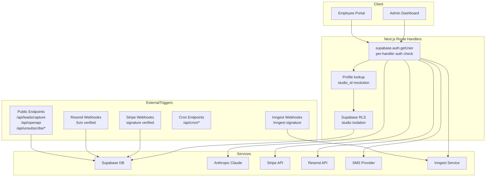

# Layer Report: API Surface

**Agent:** api-surface
**Completed:** 2026-03-20
**Severity legend:** CRITICAL / HIGH / MEDIUM / LOW / INFO

---

## Executive Summary

Meridian exposes ~120 REST endpoints via Next.js App Router Route Handlers across 40+ resource domains. The API is internally consistent in its authentication pattern (Supabase JWT via `supabase.auth.getUser()`), studio isolation (RLS + explicit `studio_id` filter), and error response format (`{ error: string }`). Several high-severity gaps exist: inconsistent role authorization across endpoints, hardcoded STUDIO_ID in ~15+ handlers, a missing middleware auth gate, and webhook endpoints that are publicly reachable without rate limiting.

---

## Route Map by Domain

### AI Endpoints (`/api/ai/`)

| Method | Endpoint | Auth | Role Check | Cache |
|--------|----------|------|------------|-------|
| GET | `/api/ai/briefing` | JWT | None | 30min DB cache |
| POST | `/api/ai/churn-prediction` | JWT | None | 24h DB cache |
| POST | `/api/ai/campaign-copy` | JWT | None | None |
| POST | `/api/ai/booking-patterns` | JWT | None | None |
| POST | `/api/ai/health-score` | JWT | None | None |
| POST | `/api/ai/insights` | JWT | None | None |
| POST | `/api/ai/intake-enrichment` | JWT | None | None |
| POST | `/api/ai/recommendations` | JWT | None | None |
| POST | `/api/ai/revenue-anomaly` | JWT | None | None |
| GET/POST | `/api/ai/search` | JWT | None | None |
| POST | `/api/ai/trainer-summary` | JWT | None | None |
| POST | `/api/ai/auto-reply` | JWT | None | None |
| POST | `/api/ai/waitlist-message` | JWT | None | None |

### Analytics Endpoints (`/api/analytics/`)

| Method | Endpoint | Auth | Notes |
|--------|----------|------|-------|
| GET | `/api/analytics/daily-metrics` | JWT | — |
| GET | `/api/analytics/summary` | JWT | — |
| GET | `/api/analytics/snapshot` | JWT | — |
| GET | `/api/analytics/cohorts` | JWT | — |
| GET | `/api/analytics/heatmap` | JWT | — |
| GET | `/api/analytics/revenue-breakdown` | JWT | — |
| GET | `/api/analytics/member-movement` | JWT | — |

### Core CRUD Endpoints

| Method | Endpoint | Auth | Role Check |
|--------|----------|------|------------|
| GET/POST | `/api/bookings` | JWT | None |
| GET/PATCH/DELETE | `/api/bookings/[id]` | JWT | None |
| GET/POST | `/api/classes` | JWT | None |
| GET/PATCH/DELETE | `/api/classes/[id]` | JWT | None |
| GET/POST | `/api/members` | JWT | None |
| GET/PATCH/DELETE | `/api/members/[id]` | JWT | None |
| GET/POST | `/api/campaigns` | JWT | Admin/Manager |
| GET/PATCH/DELETE | `/api/campaigns/[id]` | JWT | Admin/Manager |
| GET/POST | `/api/automations` | JWT | — |
| GET/PATCH/DELETE | `/api/automations/[id]` | JWT | — |
| GET/POST | `/api/leads` | JWT | — |
| GET/PATCH/DELETE | `/api/leads/[id]` | JWT | — |
| GET/POST | `/api/corporate` | JWT | — |
| GET/PATCH/DELETE | `/api/corporate/[id]` | JWT | — |
| GET/POST | `/api/events` | JWT | — |
| GET/PATCH/DELETE | `/api/events/[id]` | JWT | — |
| GET/POST | `/api/segments` | JWT | None |
| GET/PATCH/DELETE | `/api/segments/[id]` | JWT | — |
| GET/POST | `/api/staff` | JWT | — |
| GET/PATCH/DELETE | `/api/staff/[id]` | JWT | — |
| GET/POST | `/api/employees` | JWT | — |
| GET/PATCH/DELETE | `/api/employees/[id]` | JWT | — |
| GET/POST | `/api/trainers` | JWT | — |
| GET | `/api/trainers/performance` | JWT | — |
| GET | `/api/trainers/leaderboard` | JWT | — |
| GET/POST | `/api/products` | JWT | — |
| GET/PATCH/DELETE | `/api/products/[id]` | JWT | — |
| GET/POST | `/api/orders` | JWT | — |
| GET/PATCH/DELETE | `/api/orders/[id]` | JWT | — |
| GET | `/api/revenue` | JWT | — |

### Operations Endpoints

| Method | Endpoint | Auth | Notes |
|--------|----------|------|-------|
| POST | `/api/check-in` | JWT | QR check-in |
| GET | `/api/check-in/qr` | JWT | QR generation |
| POST | `/api/clock` | JWT | Clock in/out |
| GET | `/api/geofence` | JWT | — |
| POST/PATCH/DELETE | `/api/geofence/[id]` | JWT | — |
| GET | `/api/payroll/periods` | JWT | — |
| GET/POST | `/api/invoices` | JWT | — |
| GET/PATCH | `/api/invoices/[id]` | JWT | — |
| GET/POST | `/api/reports` | JWT | — |
| GET | `/api/reports/[id]` | JWT | — |
| GET | `/api/reports/templates` | JWT | — |
| POST | `/api/reports/exports` | JWT | — |
| GET/POST | `/api/settings` | JWT | — |

### Migration Endpoints

| Method | Endpoint | Auth | Notes |
|--------|----------|------|-------|
| POST | `/api/migration/upload` | JWT | CSV/file upload |
| POST | `/api/migration/validate` | JWT | — |
| POST | `/api/migration/import` | JWT | — |
| GET | `/api/migration/status` | JWT | — |
| GET | `/api/migration/jobs` | JWT | — |
| POST | `/api/migration/wave-assign` | JWT | — |

### Specialized Endpoints

| Method | Endpoint | Auth | Notes |
|--------|----------|------|-------|
| GET | `/api/qr/member` | JWT | Member QR code |
| GET | `/api/qr/promo` | JWT | Promo QR code |
| POST | `/api/leads/capture` | None (public) | Lead form capture |
| POST | `/api/leads/score` | JWT | AI lead scoring |
| GET/POST | `/api/campaigns/send` | JWT | Trigger send |
| POST | `/api/campaigns/send-test` | JWT | Test send |
| POST | `/api/campaigns/process-scheduled` | JWT (cron) | Scheduled send processing |
| POST | `/api/sms/send` | JWT | SMS dispatch |
| GET/POST | `/api/shipping/rates` | JWT | — |
| GET | `/api/openapi` | None (public) | OpenAPI spec |
| GET | `/api/email-preferences/[memberId]` | JWT | — |
| PATCH | `/api/email-preferences/[memberId]` | JWT | — |
| GET/POST | `/api/email-templates` | JWT | — |
| GET | `/api/unsubscribe/[token]` | None (public) | Token-based |
| GET | `/api/corporate/dashboard` | JWT | — |
| GET | `/api/pricing-simulator` | JWT | — |
| POST | `/api/pricing-simulator` | JWT | — |
| GET | `/api/pricing-simulator/current-plans` | JWT | — |
| GET/PATCH/DELETE | `/api/pricing-simulator/[id]` | JWT | — |
| GET | `/api/cron/waitlist-promote` | Cron secret | — |
| GET/POST | `/api/auth/profile` | JWT | — |
| GET/POST/PUT | `/api/inngest` | Inngest signature | — |

### Webhook Endpoints (Public, Signature-Verified)

| Endpoint | Verification Method |
|----------|-------------------|
| `/api/webhooks/stripe` | `stripe-signature` header + Stripe SDK |
| `/api/webhooks/resend` | Svix signature headers |
| `/api/webhooks/twilio` | (not inspected in detail) |
| `/api/webhooks/easypost` | (not inspected in detail) |

---

## Middleware Chain Analysis

**Auth middleware:** None found at the Next.js middleware layer (`middleware.ts` does not exist). Authentication is performed per-handler by calling `supabase.auth.getUser()` at the top of each route handler. This creates a pattern where:

1. If a developer forgets to add the auth check to a new handler, that endpoint is publicly accessible.
2. There is no centralized location to add cross-cutting concerns (rate limiting, logging, CORS overrides).

**CORS:** Not explicitly configured. Next.js defaults allow same-origin only. For Phase 5 (iOS app), CORS headers will need to be added either in `next.config.ts` or a middleware.

**Rate limiting:** No rate limiting on any endpoint. This is particularly risky on AI endpoints (each call to Claude costs money) and on lead capture (`/api/leads/capture`, which is public).

**Role-based authorization pattern:**
Only `campaigns/route.ts` was confirmed to implement role checking (`ALLOWED_ROLES = ['admin', 'manager']`). The majority of handlers perform only authentication (JWT presence), not authorization (role verification). This means any authenticated user — including a basic `member` role — can call admin-only APIs like `/api/members`, `/api/revenue`, `/api/staff`, etc.

---

## API Flow Diagram

---

## Findings

**HIGH — No centralized auth middleware:**
All 120+ endpoints individually call `supabase.auth.getUser()`. Any new handler added without the boilerplate is publicly accessible. Before Phase 5, a `middleware.ts` at the app root should protect all `/api/*` routes except explicitly whitelisted public endpoints (`/api/leads/capture`, `/api/openapi`, `/api/unsubscribe/*`, `/api/webhooks/*`).

**HIGH — Missing role-based authorization on sensitive endpoints:**
Most admin endpoints (members, revenue, staff, employees, trainers, segments, settings, geofence, payroll, invoices, reports, migration, corporate, events, orders, products) check only that the user is authenticated but not that they hold an admin or manager role. A `member`-role user who obtains a valid JWT can read and write to all of these.

**HIGH — No rate limiting on public or AI endpoints:**
`/api/leads/capture` is public with no rate limit — trivially spammable. All 13 AI endpoints (`/api/ai/*`) call Anthropic Claude with no rate limiting or per-user throttling, creating both a cost attack surface and potential API abuse vector.

**MEDIUM — STUDIO_ID hardcoded in route handlers (multi-tenancy not enforced at API layer):**
At least `campaigns/route.ts`, `churn-prediction/route.ts`, and `evaluate-triggers.ts` hardcode `STUDIO_ID = '11111111-1111-1111-1111-111111111111'` instead of resolving it from the authenticated user's profile. This will silently serve the wrong studio's data to users from different studios once multi-tenancy is activated.

**MEDIUM — Inconsistent studio_id resolution patterns:**
Some handlers fall back to the hardcoded UUID: `profile?.studio_id ?? '11111111-1111-1111-1111-111111111111'`. Others use `STUDIO_ID` constant. There is no single utility function for resolving `studio_id`. A shared `getStudioId(user, supabase)` helper should be standardized.

**MEDIUM — `campaigns/process-scheduled` is JWT-protected but called as a cron job:**
Cron-triggered endpoints need either a secret token in the request (not a user JWT) or to be called via Inngest. If called without a valid user session the cron will fail silently.

**LOW — `GET /api/openapi` exposes the full API schema without authentication:**
Publishing the OpenAPI spec is intentional (per CLAUDE.md "Open API — Day one"). However, the spec may contain internal implementation details. Consider adding a flag in production to redact internal fields.

**LOW — No request body validation with Zod on most endpoints:**
`campaigns/route.ts` and `classes/route.ts` do manual field presence checks but do not use Zod for schema validation. Invalid types (e.g., string where number expected) will pass the presence check and cause downstream DB errors. Zod is already a dependency.

**INFO — `/api/cron/waitlist-promote` is a GET endpoint:**
Cron jobs that mutate state (promoting waitlisted members) should be POST, not GET, to prevent accidental or bot-triggered execution via link prefetching.

---

## Findings Summary

| Severity | Count | Items |
|----------|-------|-------|
| CRITICAL | 0 | — |
| HIGH | 3 | No auth middleware, missing role auth, no rate limiting |
| MEDIUM | 3 | STUDIO_ID hardcoding, inconsistent studio_id resolution, cron endpoint auth |
| LOW | 2 | OpenAPI exposure, missing Zod validation |
| INFO | 1 | Cron GET vs POST |
