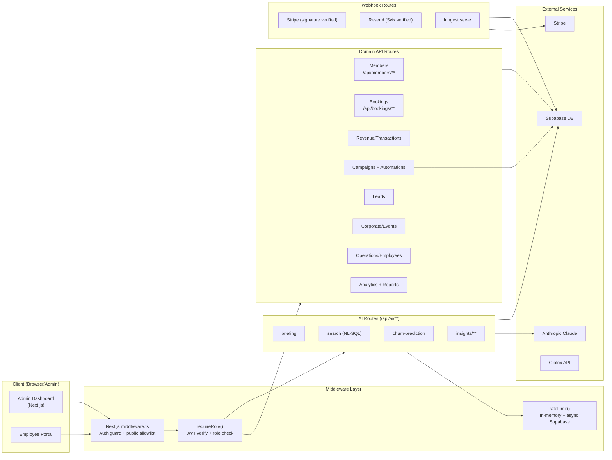

# Layer Report: API Surface

**Audit Date:** 2026-04-05
**Agent:** api-surface
**Severity Scale:** Critical / High / Medium / Low / Info

---

## Executive Summary

Meridian has 150 API route files under `apps/web/src/app/api/` across 60+ namespaces. The API is organized by domain (bookings, members, campaigns, etc.) with a consistent `requireRole()` authentication pattern used by most routes. Recent work added phone normalization to 14 routes, added 17 AI endpoints, and corrected 15 Glofox API client methods.

Key findings: (1) `POST /api/campaigns/send` does not use `requireRole()` — it has an inline auth check that misses rate limiting; (2) the rate limiter is effectively non-functional for cross-instance protection (returns optimistic in-memory result, updates Supabase async but reads from in-memory state); (3) several routes still use `DEFAULT_STUDIO_ID` as a hardcoded fallback instead of failing closed; (4) the AI natural language search executes AI-generated SQL via `execute_readonly_sql` RPC — a high-risk pattern with some mitigations but no comprehensive allow-list.

---

## API Inventory

### Domain Routes

| Namespace | Methods | Auth |
|-----------|---------|------|
| `/api/bookings` | GET, POST | requireRole (owner/manager/trainer/staff) |
| `/api/bookings/[id]/cancel` | POST | requireRole |
| `/api/classes` | GET, POST | requireRole |
| `/api/classes/[id]` | GET, PUT, DELETE | requireRole |
| `/api/members` | GET, POST | requireRole (owner/manager) |
| `/api/members/[id]` | GET, PUT, DELETE | Inline auth (not requireRole) |
| `/api/members/[id]/upgrade` | POST | requireRole |
| `/api/members/[id]/downgrade` | POST | requireRole |
| `/api/members/[id]/tags` | GET, POST, DELETE | requireRole |
| `/api/revenue` | GET | requireRole |
| `/api/transactions` | GET, POST | requireRole |
| `/api/campaigns` | GET, POST | requireRole |
| `/api/campaigns/[id]` | GET, PUT, DELETE | requireRole |
| `/api/campaigns/send` | POST | Inline auth (not requireRole) |
| `/api/campaigns/send-test` | POST | requireRole |
| `/api/campaigns/process-scheduled` | POST | Cron secret header |
| `/api/automations` | GET, POST | requireRole |
| `/api/automations/[id]` | GET, PUT, DELETE | requireRole |
| `/api/automations/[id]/activate` | POST | requireRole |
| `/api/automations/[id]/deactivate` | POST | requireRole |
| `/api/leads` | GET, POST | requireRole |
| `/api/leads/[id]` | GET, PUT, DELETE | requireRole |
| `/api/leads/[id]/convert` | POST | requireRole |
| `/api/corporate` | GET, POST | requireRole (owner/manager) |
| `/api/corporate/[id]` | GET, PUT, DELETE | requireRole |
| `/api/events` | GET, POST | requireRole |
| `/api/employees` | GET, POST | requireRole |
| `/api/clock` | POST | requireRole (trainer/staff/employee) |
| `/api/payroll` | GET | requireRole (owner/manager) |
| `/api/check-in` | POST | requireRole |
| `/api/check-in/qr` | POST | requireRole |
| `/api/invoices` | GET, POST | requireRole |
| `/api/invoices/[id]/pdf` | GET | requireRole |
| `/api/invoices/[id]/send` | POST | requireRole |

### AI Routes (17 endpoints)

| Endpoint | Function | Auth | Rate Limited |
|----------|----------|------|-------------|
| `/api/ai/briefing` | Daily studio briefing | requireRole + rateLimit | Yes (20/min) |
| `/api/ai/search` | NL to SQL search | requireRole + rateLimit | Yes (20/min) |
| `/api/ai/churn-prediction` | Member churn scores | requireRole + rateLimit | Yes |
| `/api/ai/health-score` | Member health scores | requireRole + rateLimit | Yes |
| `/api/ai/campaign-copy` | AI email copy | requireRole + rateLimit | Yes |
| `/api/ai/insights` | AI insight cards | requireRole | No rateLimit |
| `/api/ai/insights/generate` | Generate insights | requireRole | No rateLimit |
| `/api/ai/recommendations` | AI recommendations | requireRole | No rateLimit |
| `/api/ai/revenue-anomaly` | Revenue anomaly detection | requireRole | No rateLimit |
| `/api/ai/booking-patterns` | Booking pattern analysis | requireRole | No rateLimit |
| `/api/ai/trainer-summary` | Trainer AI summary | requireRole | No rateLimit |
| `/api/ai/intake-enrichment` | Member intake AI | requireRole | No rateLimit |
| `/api/ai/auto-reply` | AI email auto-reply | requireRole | No rateLimit |
| `/api/ai/waitlist-message` | Waitlist AI message | requireRole | No rateLimit |
| `/api/ai/insights/[id]/action` | Act on insight | requireRole | No |
| `/api/ai/insights/[id]/dismiss` | Dismiss insight | requireRole | No |
| `/api/ai/insights/history` | Insight history | requireRole | No |

### Webhook Routes (no user auth — signature verified)

| Endpoint | Provider | Verification |
|----------|---------|-------------|
| `/api/webhooks/stripe` | Stripe | `constructWebhookEvent` signature |
| `/api/webhooks/resend` | Resend | Svix HMAC verification |
| `/api/webhooks/twilio` | Twilio | Svix HMAC verification |
| `/api/webhooks/easypost` | EasyPost | (unknown — not checked) |

### Sync / Infrastructure Routes

| Endpoint | Function | Auth |
|----------|---------|------|
| `/api/glofox/status` | Glofox sync status | requireRole |
| `/api/glofox/sync` | Trigger manual sync | requireRole |
| `/api/glofox/backfill` | Full historical backfill | requireRole |
| `/api/inngest` | Inngest serve endpoint | Inngest SDK auth |
| `/api/cron/waitlist-promote` | Waitlist promotion | CRON_SECRET header |
| `/api/campaigns/process-scheduled` | Send scheduled campaigns | CRON_SECRET header |
| `/api/health` | Health check | None |

---

## API Flow Diagram



---

## Findings

### HIGH-AS-001: Rate limiter is effectively non-functional for cross-instance protection

**Severity:** High
**Location:** `apps/web/src/lib/rate-limit.ts`

The `rateLimit()` function returns an optimistic in-memory result immediately, then fires an async Supabase upsert (fire-and-forget). The in-memory `fallbackMap` is local to each serverless instance and resets on cold start. Effectively:
- Each serverless instance has its own per-process limit counter
- Across multiple concurrent instances (e.g., 5 parallel Lambda invocations), a single user can exceed the stated rate limit by 5x
- The Supabase async write is not read back — the next call still reads from the in-memory map

This means the 20 req/min rate limit on AI endpoints does not hold under concurrent load.

**Recommendation:** Rewrite `rateLimit()` to be async — await the Supabase upsert with `ON CONFLICT DO UPDATE SET count = count + 1 RETURNING count`, check the returned count against the limit, and return the real result. This adds ~5ms latency per AI request but provides true distributed rate limiting.

---

### HIGH-AS-002: POST /api/campaigns/send uses inline auth without requireRole() or rateLimit()

**Severity:** High
**Location:** `apps/web/src/app/api/campaigns/send/route.ts`

This route (which sends bulk campaign emails) uses an inline auth check rather than `requireRole()`. As a result:
- The `studioId` falls back to `DEFAULT_STUDIO_ID` — a hardcoded UUID — if the user's profile has no `studio_id`. A compromised or incomplete profile could send emails against any studio.
- No rate limiting is applied. An attacker with a valid session can trigger repeated bulk email sends.
- The auth check uses `ALLOWED_ROLES = ['owner', 'admin', 'manager']` while `requireRole()` normalizes `'admin'` as an alias for `'owner'`. This particular inline check does handle `'admin'`, but the pattern itself is fragile.

**Recommendation:** Refactor this route to use `requireRole(['owner', 'manager'])` + `rateLimit()` consistent with other AI/high-impact routes.

---

### HIGH-AS-003: AI natural language search executes AI-generated SQL with limited safeguards

**Severity:** High
**Location:** `apps/web/src/app/api/ai/search/route.ts`, `apps/web/src/lib/ai/nl-search.ts`

The NL search pipeline translates natural language queries to SQL via Claude, then executes the SQL via a `execute_readonly_sql` Postgres RPC. Mitigations present:
- System prompt instructs Claude to generate only `SELECT` statements
- Code rejects any SQL that doesn't start with `SELECT`
- SQL is scoped to a specific `studio_id`

Gaps:
- The `execute_readonly_sql` RPC definition was not found in the audited SQL files — if it does not enforce a `SET TRANSACTION READ ONLY` or uses a limited-privilege role, the SELECT-only check in application code is bypassable by prompt injection.
- No maximum execution time or row limit enforced at the DB layer (only `LIMIT 50` suggested in the prompt)
- A sufficiently adversarial prompt could instruct Claude to embed a subquery that reads from tables outside the user's studio_id

**Recommendation:**
1. Verify `execute_readonly_sql` runs in a `SECURITY DEFINER` context with a read-only role that has SELECT-only grants.
2. Add `SET TRANSACTION READ ONLY` and `SET statement_timeout = '5s'` inside the RPC.
3. Validate that the generated SQL contains `studio_id = '<studioId>'` before execution.

---

### MEDIUM-AS-004: 10 of 17 AI routes lack rate limiting

**Severity:** Medium
**Location:** `/api/ai/insights`, `/api/ai/insights/generate`, `/api/ai/recommendations`, `/api/ai/revenue-anomaly`, `/api/ai/booking-patterns`, `/api/ai/trainer-summary`, `/api/ai/intake-enrichment`, `/api/ai/auto-reply`, `/api/ai/waitlist-message`

The high-usage AI endpoints (`/api/ai/briefing`, `/api/ai/search`, `/api/ai/churn-prediction`, `/api/ai/health-score`, `/api/ai/campaign-copy`) use rate limiting. The remaining 10 AI routes call the Anthropic API without any limit. A rapid loop against `/api/ai/insights/generate` could accumulate significant Anthropic API costs with no throttle.

**Recommendation:** Apply `rateLimit()` consistently to all AI routes. Consider a shared AI rate limit key per studio (`ai:studio:{studioId}`) rather than per user, to cap total Anthropic spend per studio.

---

### MEDIUM-AS-005: GET /api/members/[id] uses inline auth pattern instead of requireRole()

**Severity:** Medium
**Location:** `apps/web/src/app/api/members/[id]/route.ts`

This high-traffic route performs auth inline rather than using `requireRole()`. The inline check:
- Uses `DEFAULT_STUDIO_ID` as fallback if user has no `studio_id` in profile
- Makes two separate Supabase calls (auth.getUser + profiles.select) before the role check
- The PUT and DELETE handlers in the same file were not verified to follow the same pattern consistently

**Recommendation:** Refactor to `requireRole(['owner', 'manager'])`.

---

### MEDIUM-AS-006: Hardcoded DEFAULT_STUDIO_ID fallbacks scattered across routes

**Severity:** Medium
**Location:** `apps/web/src/lib/constants.ts`, multiple routes

Several routes use `DEFAULT_STUDIO_ID` as a fallback when `authProfile?.studio_id` is null:
```ts
const studioId = authProfile?.studio_id ?? DEFAULT_STUDIO_ID;
```
This is a single-tenant convenience that becomes a multi-tenancy security hole at Phase 4 SaaS launch. A user with no `studio_id` on their profile would be silently bucketed into the default studio, potentially accessing another studio's data.

**Recommendation:** Remove `DEFAULT_STUDIO_ID` fallbacks from all API routes. Return a 403 if `studio_id` is null. Keep `DEFAULT_STUDIO_ID` only in development/seed tooling.

---

### MEDIUM-AS-007: EasyPost webhook has no signature verification

**Severity:** Medium
**Location:** `apps/web/src/app/api/webhooks/easypost/route.ts` (inferred from directory listing)

The Stripe webhook uses `constructWebhookEvent()` signature verification. The Resend and Twilio webhooks use Svix HMAC. The EasyPost webhook directory exists but signature verification was not confirmed. If unverified, the webhook endpoint accepts arbitrary HTTP POSTs that could spoof shipping events.

**Recommendation:** Implement EasyPost HMAC signature verification using their `X-Hmac-Signature-256` header.

---

### LOW-AS-008: /api/cron routes protected only by CRON_SECRET — no IP allowlisting

**Severity:** Low
**Location:** `/api/cron/waitlist-promote`, `/api/campaigns/process-scheduled`

These cron-triggered endpoints are protected by a `CRON_SECRET` header. If the secret leaks, any external actor can trigger waitlist promotion or campaign sending. Netlify Scheduled Functions can also be configured with IP allowlisting as an additional layer.

**Recommendation:** Add Netlify IP allowlisting for cron endpoint callers, or migrate to Inngest-triggered functions which use signed event payloads.

---

### LOW-AS-009: OpenAPI spec endpoint exists but spec accuracy unverified

**Severity:** Low
**Location:** `apps/web/src/app/api/openapi/route.ts`, `apps/web/src/app/(admin)/docs/api`

There is an OpenAPI spec endpoint and a Swagger UI documentation page. The spec is hand-maintained (not auto-generated from route handlers). With 150 route files, spec drift is likely. The recent 15 Glofox API method corrections and 6 new automation trigger types are unlikely to be reflected.

**Recommendation:** Evaluate auto-generation tooling (e.g., `next-swagger-doc` or `zod-to-openapi`). At minimum, add spec review to the release checklist.

---

### INFO-AS-010: /api/health returns 200 with no auth — suitable for monitoring

**Severity:** Info
**Location:** `apps/web/src/app/api/health/route.ts`

The health check endpoint is unauthenticated and returns a simple success response. This is standard practice for monitoring systems. Confirmed intentional.

---

## Summary Table

| ID | Severity | Category | Title |
|----|----------|----------|-------|
| HIGH-AS-001 | High | Security | Rate limiter non-functional for cross-instance protection |
| HIGH-AS-002 | High | Security | /api/campaigns/send bypasses requireRole + rateLimit |
| HIGH-AS-003 | High | Security | NL search executes AI-generated SQL with limited DB-layer guardrails |
| MEDIUM-AS-004 | Medium | Security | 10 of 17 AI routes lack rate limiting |
| MEDIUM-AS-005 | Medium | Security | /api/members/[id] uses inline auth instead of requireRole() |
| MEDIUM-AS-006 | Medium | Multi-tenancy | DEFAULT_STUDIO_ID fallback scattered across routes |
| MEDIUM-AS-007 | Medium | Security | EasyPost webhook may lack signature verification |
| LOW-AS-008 | Low | Security | Cron endpoints protected by secret only — no IP allowlisting |
| LOW-AS-009 | Low | Documentation | OpenAPI spec manually maintained — likely drifted |
| INFO-AS-010 | Info | Operations | Health endpoint unauthenticated — confirmed intentional |
