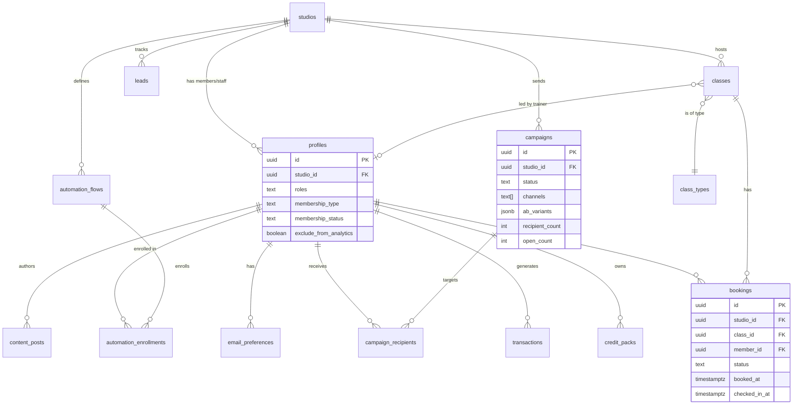

# Layer Report: Data Model

**Agent:** data-model
**Completed:** 2026-03-20
**Severity legend:** CRITICAL / HIGH / MEDIUM / LOW / INFO

---

## Executive Summary

Meridian's data model is well-designed for a multi-tenant SaaS fitness studio OS. The schema is built on PostgreSQL via Supabase with Row-Level Security (RLS) on all tables. Entity relationships are coherent, migrations are transactional (wrapped in `BEGIN`/`COMMIT`), and indexes are thoughtfully applied. The data model supports the full business domain: members, classes, bookings, revenue, marketing, corporate, employees, and AI caching. Several structural findings emerged around multi-tenancy enforcement, the STUDIO_ID hardcoding pattern, and schema drift risk.

---

## Detected Schema (from SQL migrations and TypeScript types)

### Core Tables

#### `profiles` (members + staff + trainers — unified)
- `id` UUID PK
- `user_id` UUID (Supabase Auth reference)
- `studio_id` UUID FK → studios
- `full_name` TEXT
- `email` TEXT
- `phone` TEXT
- `roles` TEXT[] — `['member']`, `['admin']`, `['trainer', 'member']`, etc.
- `status` TEXT — `active | inactive | paused`
- `membership_type` TEXT — `unlimited | 10_class | 6_class | drop_in`
- `membership_status` TEXT
- `join_date` DATE
- `acquisition_source` TEXT (Phase 2 addition)
- `acquisition_campaign_id` UUID (no FK — by design)
- `timezone` TEXT DEFAULT `America/New_York`
- `exclude_from_analytics` BOOLEAN

**Key design:** Single `profiles` table covers members, trainers, admins, and staff via the `roles` TEXT[] column. This implements the "dual-role account" design decision correctly. Profiles with `['trainer', 'member']` in their roles array can be both.

#### `classes`
- `id` UUID PK
- `studio_id` UUID FK
- `class_type_id` UUID FK → class_types
- `trainer_id` UUID FK → profiles (nullable)
- `start_time` TIMESTAMPTZ
- `end_time` TIMESTAMPTZ
- `capacity` INT
- `status` TEXT — `scheduled | in_progress | completed | cancelled`
- `bonus_threshold` INT DEFAULT 7
- `bonus_earned` BOOLEAN

#### `bookings`
- `id` UUID PK
- `studio_id` UUID FK
- `class_id` UUID FK → classes
- `member_id` UUID FK → profiles
- `status` TEXT — `confirmed | checked_in | cancelled | late_cancelled | no_show | waitlisted`
- `booked_at` TIMESTAMPTZ
- `checked_in_at` TIMESTAMPTZ (nullable)

#### `credit_packs`
- `id` UUID PK
- `member_id` UUID FK
- `studio_id` UUID FK
- `remaining` INT (note: TypeScript type uses `credits_remaining` — column name mismatch detected)
- `expires_at` TIMESTAMPTZ (nullable)

#### `transactions`
- `id` UUID PK
- `studio_id` UUID FK
- `member_id` UUID FK
- `amount` DECIMAL/INT (cents)
- `type` TEXT
- `status` TEXT — `completed | pending | failed | refunded`

#### `members` (appears in Stripe webhook as separate table from `profiles`)
- Referenced in `webhooks/stripe/route.ts` as `.from('members')`
- But `members/route.ts` queries `.from('profiles')`
- **This is a critical naming inconsistency** — see Findings.

### Phase 2 Tables (from `phase2-migration.sql`)

| Table | Purpose | Key Columns |
|-------|---------|-------------|
| `campaigns` | Email/SMS campaigns | `studio_id`, `status`, `channels[]`, `ab_test_enabled`, metrics |
| `campaign_recipients` | Per-member send tracking | `campaign_id`, `member_id`, `resend_message_id`, engagement timestamps |
| `automation_flows` | Visual automation builder | `studio_id`, `trigger_type`, `steps JSONB`, `version` |
| `automation_enrollments` | Member-in-flow state | `automation_id`, `member_id`, `current_step`, `flow_snapshot JSONB` |
| `automation_cooldowns` | Global rate limiting | `member_id`, `studio_id`, `last_automation_email_at` |
| `leads` | Lead pipeline | `studio_id`, `email`, `status`, `score`, `source` |
| `lead_activities` | Lead timeline | `lead_id`, `activity_type`, `metadata JSONB` |
| `content_posts` | Community board / content hub | `studio_id`, `author_id`, `is_published`, `like_count` |
| `content_comments` | Post comments | `post_id`, `author_id` |
| `content_likes` | Post likes | `post_id`, `author_id` UNIQUE |
| `email_preferences` | Unsubscribe management | `member_id`, `marketing_email`, `hard_bounced` |

### AI / Caching Tables

| Table | Purpose |
|-------|---------|
| `ai_briefings` | Caches daily briefings (30-min TTL) |
| `ai_cache` | Generic AI result cache with `cache_type`, `entity_id`, `expires_at` |
| `email_send_log` | Per-send Resend tracking with `resend_id`, `message_id`, `opened_at`, `clicked_url` |
| `activity_log` | General audit trail for all mutations |
| `smart_segments` | Pre-computed member segments |

---

## Entity Relationship Diagram

---

## Index Analysis

### Confirmed indexes (Phase 2 migration):
- `idx_campaigns_studio_status` — (studio_id, status) — good for listing by status
- `idx_campaigns_scheduled` — partial on `scheduled_at WHERE status = 'scheduled'` — excellent for cron job
- `idx_campaign_recipients_campaign` — (campaign_id)
- `idx_campaign_recipients_member` — (member_id)
- `idx_automation_enrollments_status` — (automation_id, status)
- `idx_leads_studio_status` — (studio_id, status)
- `idx_leads_score` — (studio_id, score DESC) — enables fast lead scoring list
- `idx_leads_follow_up` — partial on next_follow_up_at WHERE status NOT IN ('converted', 'lost')
- `idx_email_prefs_member` — (member_id, studio_id)

### Potentially missing indexes:
- `bookings(member_id, status)` — churn-prediction queries filter by both; N+1 risk if not indexed
- `bookings(checked_in_at)` — used in multiple date-range queries
- `transactions(member_id, created_at)` — spend trend calculations do range queries
- `profiles(email, studio_id)` — used in dedup checks on member creation
- `ai_cache(studio_id, cache_type, entity_id)` — confirmed upsert conflict key, index likely exists but not verified in seen migrations

---

## Schema Drift Indicators

1. The `automation_flows` table uses `status = 'active'` in `evaluate-triggers.ts` but the SQL schema defines `is_active BOOLEAN` — not a `status` column. This will cause runtime query failures.

2. `credit_packs` table: the API (`/api/ai/churn-prediction`) queries `.select('remaining')` but `@meridian/types` defines the field as `credits_remaining`. One of these is wrong and will silently return null.

3. The Stripe webhook handler writes to `.from('members')` but most of the API layer uses `.from('profiles')`. If `members` is a separate table (not a view), there is a data split between these two tables.

4. `email_send_log` is referenced extensively (by resend webhook, churn prediction, campaigns) but no CREATE TABLE for it appears in the seen Phase 2 migration. This table was likely created in Phase 1 SQL (not available for review), but the schema needs verification.

---

## Findings

**CRITICAL — `automation_flows` status field mismatch:**
`evaluate-triggers.ts` queries `.eq('status', 'active')` but the Phase 2 SQL schema defines `is_active BOOLEAN DEFAULT FALSE`, not a `status` column. The query will always return 0 flows, silently breaking all automation triggers.

**CRITICAL — `members` vs `profiles` table split:**
The Stripe webhook handler writes subscription updates to `.from('members')` while the members API reads from `.from('profiles')`. If these are two separate tables (not an alias or view), then Stripe subscription data is written to a table never read by the members API, creating a permanent data split where `membership_status` shown to admins is never updated by Stripe events.

**HIGH — `credit_packs.remaining` vs `credits_remaining` field name mismatch:**
`/api/ai/churn-prediction/route.ts` queries `.select('remaining')` on `credit_packs`. The shared type in `@meridian/types` defines `credits_remaining`. This will silently return undefined values and produce incorrect churn inputs.

**HIGH — STUDIO_ID hardcoded in 10+ route handlers:**
The string `'11111111-1111-1111-1111-111111111111'` appears in at least: `campaigns/route.ts`, `evaluate-triggers.ts`, `churn-prediction/route.ts`, and others. This is intentional for Phase 1 single-tenant operation but will block multi-tenant SaaS deployment. A tracker issue should exist before Phase 5.

**MEDIUM — `automation_cooldowns` tracks per-24h global rate limit but no automation-level frequency cap:**
The cooldown table prevents more than 1 email per 24h globally per member but there is no per-flow re-enrollment cooldown enforced at the DB level. The `reenrollment_cooldown_days` column exists on `automation_flows` but the enforcement is in application code (Inngest), which can be bypassed by direct DB writes.

**MEDIUM — No DB-level constraint preventing over-capacity bookings:**
The booking creation code does a count-then-insert without a database-level unique constraint or advisory lock. The comment in the code acknowledges this: "For Phase 1 this count-then-insert approach is acceptable." Under concurrent load, race conditions could allow over-capacity. A DB-level trigger or check constraint should be added before Phase 5 (member self-booking).

**MEDIUM — `leads` table missing `email_hash` column:**
The TypeScript type `Lead` defines an `email_hash: string` field (for SHA-256 dedup) but the Phase 2 SQL schema does not add this column to the `leads` table. The dedup functionality in the type contract will not work at the DB level.

**LOW — `automation_enrollments` UNIQUE constraint allows reenrollment bypass:**
`UNIQUE(automation_id, member_id)` means a member can never be re-enrolled in any flow. But `allow_reenrollment: BOOLEAN DEFAULT FALSE` and `reenrollment_cooldown_days` suggest re-enrollment is a supported feature. The unique constraint would need to be removed and replaced with application-level enforcement to enable this.

**LOW — GDPR deletion function does not cover Phase 1 tables:**
`delete_member_phase2_data()` covers Phase 2 tables correctly. Phase 1 tables (`bookings`, `transactions`, `credit_packs`, `activity_log`) presumably have a separate function, but it was not seen in available migrations. This gap needs verification.

**INFO — `content_posts.author_id` set to nullable in GDPR function:**
The GDPR function anonymizes content posts by setting `author_id = NULL`. This requires `author_id` to be nullable in the DB schema, but the column is defined as `NOT NULL REFERENCES profiles(id)`. Either the constraint must be changed to nullable, or the GDPR function will fail.

---

## Findings Summary

| Severity | Count | Items |
|----------|-------|-------|
| CRITICAL | 2 | automation_flows status field mismatch, members vs profiles table split |
| HIGH | 2 | credit_packs field name mismatch, STUDIO_ID hardcoding |
| MEDIUM | 3 | No DB-level capacity constraint, leads email_hash missing, reenrollment unique constraint |
| LOW | 2 | GDPR coverage gaps, reenrollment constraint conflict |
| INFO | 1 | content_posts.author_id nullability conflict |
