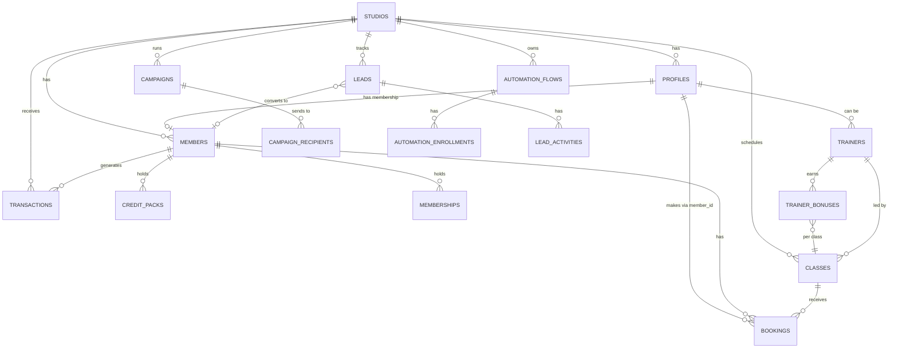

# Layer Report: Data Model

**Audit Date:** 2026-04-05
**Agent:** data-model
**Severity Scale:** Critical / High / Medium / Low / Info

---

## Executive Summary

Meridian's data model is a PostgreSQL schema hosted on Supabase with strong multi-tenant isolation via Row Level Security (RLS). The schema spans two major phases: Phase 1 (core booking/membership/revenue tables) and Phase 2 (campaigns, automation, leads, content). Recent additions include the `member_360` view, `glofox_plan_map` table with 20 plan mappings, and 1,894 real Glofox transactions.

The model is well-structured overall. Critical issues: (1) `daily_metrics` revenue data is wrong — existing rows were computed before the Glofox transaction import and will not be retroactively corrected; (2) `credit_packs` table is empty — never populated from Glofox; (3) the `automation_flows` CHECK constraint is out of sync with 6 new trigger types added in the recent sprint and will reject new flows using those types.

---

## Schema Overview

### Core Tables (Phase 1)

| Table | Purpose | Key Columns | RLS |
|-------|---------|-------------|-----|
| `studios` | Multi-tenant root | `id`, `name`, `slug` | Yes |
| `profiles` | All users (members + staff) | `id`, `studio_id`, `roles[]`, `health_score`, `glofox_id`, `engagement_status` | Yes |
| `members` | Membership-specific data | `id`, `profile_id`, `studio_id`, `membership_tier`, `membership_status`, `plan_price`, `credits_remaining` | Yes |
| `classes` | Group class schedule | `id`, `studio_id`, `starts_at`, `capacity`, `booked_count`, `checked_in_count`, `trainer_id` | Yes |
| `bookings` | Class reservations | `id`, `member_id`, `class_id`, `studio_id`, `status`, `attended`, `checked_in_at` | Yes |
| `transactions` | Revenue events | `id`, `member_id`, `studio_id`, `amount` (cents), `type`, `status`, `glofox_id` | Yes |
| `memberships` | Membership periods | `id`, `type`, `status`, `started_at`, `expires_at` | Yes |
| `credit_packs` | Class credit bundles | `id`, `member_id`, `studio_id`, `credits_purchased`, `credits_remaining`, `glofox_id` | Yes |
| `staff` | Employee records | `id`, `studio_id`, `role`, `email` | Yes |
| `trainers` | Trainer-specific data | `id`, `studio_id`, `profile_id`, `promo_code`, `glofox_id` | Yes |
| `trainer_bonuses` | Per-class bonus tracking | `id`, `trainer_id`, `class_id`, `check_in_count`, `threshold`, `status` | Yes |
| `glofox_sync_state` | Per-entity sync tracking | `entity_type`, `last_synced_at`, `status` | Yes |
| `glofox_plan_map` | Plan code to tier mapping | `id`, `plan_code`, `membership_tier`, `plan_price` | Yes |
| `daily_metrics` | Pre-aggregated KPIs | `metric_date`, `studio_id`, `revenue_total`, `booking_count`, `mrr` | Yes |
| `ai_briefings` | Cached AI briefings | `studio_id`, `briefing`, `generated_at` | Yes |
| `rate_limit_entries` | Supabase-backed rate limiting | `key`, `count`, `window_start`, `expires_at` | No |

### Phase 2 Tables (Marketing/Engagement)

| Table | Purpose |
|-------|---------|
| `campaigns` | Email/SMS campaigns with A/B test support |
| `campaign_recipients` | Per-member tracking with resend_message_id |
| `automation_flows` | Trigger-based nurture workflows |
| `automation_enrollments` | Members in active flows |
| `automation_cooldowns` | 24-hour message rate limiting |
| `leads` | Pre-member prospect pipeline |
| `lead_activities` | Lead interaction history |
| `content_posts` | Community board posts |
| `content_comments` | Post comments |
| `content_likes` | Post likes |
| `email_preferences` | Unsubscribe/preference management |

### Key Views

| View | Purpose |
|------|---------|
| `member_360` | Denormalized member view joining profiles + members + computed fields: behavior_segment, engagement_status, acquisition_channel, visits_last_30_days |

---

## ER Diagram



---

## Findings

### CRITICAL-DM-001: daily_metrics revenue data is wrong — historical rows need backfill

**Severity:** Critical
**Location:** `apps/web/src/lib/inngest/functions/cron-daily-metrics.ts`, table: `daily_metrics`

The `daily_metrics` cron only processes "yesterday" and future dates — it will not re-aggregate historical dates that already have a row. The 1,894 Glofox transactions were inserted with historical timestamps AFTER daily_metrics rows were first computed. Those historical rows contain zero revenue while the `transactions` table has the real data.

Every revenue metric on dashboards reading from `daily_metrics` is incorrect for historical dates. The Command Center briefing, revenue trend charts, MRR, and ARPM are all affected.

**Recommendation:**
1. Run a one-time backfill script: DELETE existing `daily_metrics` rows for the affected date range, then re-run aggregation against the `transactions` table.
2. Add a reconciliation check to the cron: if `revenue_total = 0` but `transactions` for that date is non-zero, re-aggregate.
3. Expose `GET /api/analytics/revenue-breakdown` as a temporary bypass that reads directly from `transactions`.

---

### CRITICAL-DM-002: credit_packs table is empty — credits broken for all members

**Severity:** Critical
**Location:** `apps/web/src/app/api/members/[id]/route.ts`, `apps/web/src/lib/glofox/client.ts`

The `credit_packs` table has never been populated. The Glofox API client has `getCredits(userId)` but no sync job has ever called it. Members with credit packs in Glofox show zero credits in Meridian. The `credit_expiry` automation trigger will never fire.

**Recommendation:** Extend the `glofox-backfill` Inngest function to call `getCredits(userId)` for each member and upsert results into `credit_packs`.

---

### HIGH-DM-003: automation_flows CHECK constraint blocks 6 new trigger types

**Severity:** High
**Location:** `scripts/phase2-migration.sql` (constraint definition), `apps/web/src/lib/inngest/functions/evaluate-triggers.ts`

The Phase 2 migration defines `trigger_type IN ('signup', 'no_show', 'churn_risk', 'credit_expiry', 'birthday', 'milestone', 'membership_change', 'booking_completed', 'failed_payment', 'inactivity', 'referral', 'custom')`. The evaluate-triggers cron handles 6 additional types added in this sprint: `never_booked`, `classpass_repeat`, `one_and_done`, `cooling_off`, `plan_upgrade_candidate`, `class_type_fan`. Database will reject INSERT of any automation flow using these trigger types.

**Recommendation:** Apply schema migration to update the CHECK constraint to include all 18 trigger types.

---

### HIGH-DM-004: Missing composite indexes on high-frequency query columns

**Severity:** High
**Location:** Schema

Key queries lack composite indexes:
- `bookings(studio_id, member_id, attended)` — queried daily by member enrichment cron
- `transactions(studio_id, created_at, status)` — queried daily by metrics cron + revenue analytics
- `profiles(studio_id, engagement_status)` — queried every 10 minutes by trigger evaluation

**Recommendation:**
```sql
CREATE INDEX idx_bookings_member_attended ON bookings(studio_id, member_id, attended) WHERE attended = true;
CREATE INDEX idx_transactions_studio_date ON transactions(studio_id, created_at, status);
CREATE INDEX idx_profiles_studio_engagement ON profiles(studio_id, engagement_status);
```

---

### MEDIUM-DM-005: cron-member-enrichment loads all bookings into JavaScript memory

**Severity:** Medium
**Location:** `apps/web/src/lib/inngest/functions/cron-member-enrichment.ts`

The cron fetches all `attended=true` bookings for the studio into memory, then performs in-memory aggregation via a JS Map. At current scale (small studio) this works. At 500+ members over 2 years, this could exceed 100,000 rows per step invocation.

**Recommendation:** Replace with a `GROUP BY` aggregate query pushed to Postgres.

---

### MEDIUM-DM-006: MRR silently excludes members with unmapped plan codes

**Severity:** Medium
**Location:** `apps/web/src/lib/inngest/functions/cron-daily-metrics.ts`

MRR = `SUM(plan_price) WHERE membership_status='active'`. Members whose Glofox plan code has no entry in `glofox_plan_map` have `plan_price = NULL` and are excluded from MRR silently.

**Recommendation:** Query `SELECT plan_code, COUNT(*) FROM members WHERE membership_status='active' AND plan_price IS NULL GROUP BY plan_code` to identify gaps, then add missing entries to `glofox_plan_map`.

---

### MEDIUM-DM-007: Profiles-Members two-table split creates inconsistent data access

**Severity:** Medium
**Location:** Multiple API routes

`GET /api/members/[id]` queries `profiles` with an embedded `memberships` join, not the `members` table. Cron functions query `members`. Analytics routes query `profiles`. The `member_360` view correctly joins both. Edge cases exist for users with a profile but no `members` row.

**Recommendation:** Standardize all member data access through the `member_360` view or an explicit `profiles LEFT JOIN members` with documented ownership of each field.

---

### LOW-DM-008: GDPR deletion function incomplete for Phase 1 tables

**Severity:** Low
**Location:** `scripts/phase2-migration.sql`

`delete_member_phase2_data()` covers Phase 2 tables only. Phase 1 data (`bookings`, `transactions`, `credit_packs`, `memberships`) relies on `ON DELETE CASCADE` from `profiles`, but cascade behavior has not been audited for all FK relationships.

**Recommendation:** Audit Phase 1 FK definitions for cascade. Create `delete_member_all_data()` covering both phases.

---

### INFO-DM-009: rate_limit_entries table lacks explicit RLS documentation

**Severity:** Info
**Location:** `apps/web/src/lib/rate-limit.ts`

The `rate_limit_entries` table is written by a service-role client that bypasses RLS. The absence of RLS is intentional but should be documented in the migration file with an explanatory comment.

---

## Summary Table

| ID | Severity | Category | Title |
|----|----------|----------|-------|
| CRITICAL-DM-001 | Critical | Data Integrity | daily_metrics revenue data incorrect — historical backfill needed |
| CRITICAL-DM-002 | Critical | Missing Data | credit_packs table empty — Glofox sync never ran |
| HIGH-DM-003 | High | Schema | automation_flows CHECK constraint blocks 6 new trigger types |
| HIGH-DM-004 | High | Performance | Missing composite indexes on high-frequency join columns |
| MEDIUM-DM-005 | Medium | Performance | Member enrichment cron loads all bookings into JS memory |
| MEDIUM-DM-006 | Medium | Data Integrity | MRR silently excludes members with unmapped plan codes |
| MEDIUM-DM-007 | Medium | Architecture | Profiles-Members split creates inconsistent data access patterns |
| LOW-DM-008 | Low | GDPR | GDPR deletion function incomplete for Phase 1 tables |
| INFO-DM-009 | Info | Security | rate_limit_entries table lacks explicit RLS documentation |
