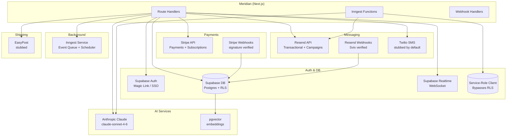

# Layer Report: Integration

**Agent:** integration
**Completed:** 2026-03-20
**Severity legend:** CRITICAL / HIGH / MEDIUM / LOW / INFO

---

## Executive Summary

Meridian integrates with 7 external services: Supabase (DB + Auth), Stripe (payments + webhooks), Anthropic Claude (AI), Inngest (event-driven jobs), Resend (email + webhooks), Twilio (SMS), and EasyPost (shipping). The integrations are generally well-designed with dry-run modes, lazy initialization, proper webhook signature verification, and typed client wrappers. Several high-severity issues exist: hardcoded studio IDs in Inngest functions that bypass multi-tenancy, a service-role Supabase client used in background jobs that bypasses RLS, and schema inconsistencies that will cause runtime failures when the automation engine activates.

---

## Integration Map

### Supabase (PostgreSQL + Auth + Realtime)

**Client architecture:**
- `@meridian/supabase/src/client.ts` — browser client using `createBrowserClient` with the publishable (anon) key
- `@meridian/supabase/src/server.ts` — server client using `createSSRClient` with cookie-based session management
- `lib/inngest/helpers.ts:getAdminClient()` — service-role client for background jobs (bypasses RLS)

**Usage pattern:**
- All route handlers use `createServerClient()` from `@/lib/supabase/server`
- `useSupabase()` hook provides browser client to React components
- `useRealtimeSubscription()` hook uses Supabase Realtime (WebSockets) — not 60s polling as stated in language detection

**Notable:** The Inngest service-role client uses the `SUPABASE_SERVICE_ROLE_KEY` env var and is explicitly documented to bypass RLS. All Inngest queries must manually filter by `studio_id`. The `evaluate-triggers.ts` function does this correctly but the hardcoded `STUDIO_ID` constant overrides the multi-tenant intent.

**Observed env vars:**
- `NEXT_PUBLIC_SUPABASE_URL`
- `NEXT_PUBLIC_SUPABASE_PUBLISHABLE_DEFAULT_KEY` (non-standard name — not `NEXT_PUBLIC_SUPABASE_ANON_KEY`)
- `SUPABASE_SERVICE_ROLE_KEY`

### Stripe (Payments + Webhooks)

**Client:** `stripe` npm package v20.4.1

**Integration points:**
- `POST /api/webhooks/stripe` — webhook handler with signature verification using `constructWebhookEvent`
- Subscription management (create, update, cancel)
- Payment intent creation for one-time charges
- Invoice management

**Webhook events handled:**
- `customer.subscription.created` → updates member `membership_status`
- `customer.subscription.updated` → updates `membership_status`, handles `cancel_at_period_end`
- `payment_intent.succeeded`
- `invoice.paid`
- `invoice.payment_failed` (presumably)

**Key concern:** Webhook writes to `.from('members')` but API layer reads from `.from('profiles')`. If these are different tables, Stripe subscription data is written to a table never read by the frontend.

**Env vars required:**
- `STRIPE_SECRET_KEY`
- `STRIPE_WEBHOOK_SECRET`

### Anthropic Claude (AI)

**Client:** `@anthropic-ai/sdk` v0.80.0

**Pattern:** Every AI function instantiates a new `Anthropic` client per call:
```typescript
const anthropic = new Anthropic({ apiKey: process.env.ANTHROPIC_API_KEY });
```

No shared client singleton exists. This is fine for serverless but slightly wasteful.

**Model:** `claude-sonnet-4-6` uniformly across all 13+ functions.

**Fallback pattern:** All AI functions check `if (!process.env.ANTHROPIC_API_KEY)` before calling Claude and invoke a rules-based fallback. This is an excellent defensive pattern.

**Env vars required:**
- `ANTHROPIC_API_KEY`

### Inngest (Event-Driven Jobs)

**Client:** `inngest` v4.0.2

**Registered functions (12):**
1. `automation-evaluate-triggers` — runs every 10 minutes
2. `automation-execute-flow` — executes per-member automation steps
3. `cron/daily-metrics` — daily metric computation
4. `cron/cohort-refresh` — member cohort refresh
5. `cron/trainer-metrics` — trainer performance
6. `cron/ai-insights` — AI insight generation
7. `cron/report-scheduler` — scheduled report delivery
8. `cron/export-cleanup` — export file cleanup
9. `cron/payroll-reminder` — payroll period alerts
10. `cron/invoice-overdue-check` — corporate invoice dunning
11. `cron/contract-expiry-check` — corporate contract alerts
12. `cron/corporate-credits-refresh` — corporate credit cycle reset

**Serve endpoint:** `GET/POST/PUT /api/inngest` — standard Inngest Next.js adapter

**Architecture concern:** Inngest uses a service-role Supabase client that bypasses RLS. All Inngest functions must manually filter by `studio_id`. In `evaluate-triggers.ts` the STUDIO_ID is hardcoded to the development UUID. In production, this will only process flows for one studio.

**Concurrency control:** `evaluate-triggers` uses `concurrency: [{ limit: 1 }]` to prevent overlapping runs — correct.

**Env vars required:**
- `INNGEST_SIGNING_KEY`
- `INNGEST_EVENT_KEY`

### Resend (Email)

**Client:** `resend` v6.9.4

**Implementation:** `lib/resend.ts` — well-structured wrapper with:
- `sendTransactionalEmail()` — single recipient
- `sendCampaignEmail()` — campaign sends with `Message-ID`, `X-Campaign-ID`, `X-Member-ID` headers and Resend tags for webhook attribution
- `sendBatchEmails()` — batch up to 100 emails per call
- `RESEND_DRY_RUN` mode for testing
- Lazy initialization singleton

**Webhook handler:** `POST /api/webhooks/resend` — uses Svix for signature verification, handles: `email.delivered`, `email.opened`, `email.clicked`, `email.bounced`, `email.complained`, `email.received` (reply detection)

**Hardcoded from address:** `'The Sauna Guys <noreply@thesaunaguys.com>'` — must be configurable via studio settings for multi-tenant deployment.

**Env vars required:**
- `RESEND_API_KEY`
- `RESEND_WEBHOOK_SECRET`
- `RESEND_FROM_ADDRESS` (optional, with hardcoded fallback)
- `RESEND_DRY_RUN` (optional)

### Twilio (SMS)

**Client:** `twilio` v5.13.0 installed as a dependency

**Implementation:** `lib/sms/` — clean factory pattern with:
- `StubProvider` — no-op with console logging (currently active default)
- `TwilioProvider` — dynamically imported when `SMS_PROVIDER=twilio`
- `createSMSProvider()` factory reads `SMS_PROVIDER` env var
- `sms` singleton exported for use by automation engine

**Current status:** SMS is stubbed — all sends succeed silently with fake IDs. Twilio is installed but not the default. The `POST /api/webhooks/twilio` webhook handler exists (content not fully reviewed).

**Architecture:** The provider abstraction is excellent — swapping Twilio for another SMS provider requires only implementing the `SMSProvider` interface.

### EasyPost (Shipping)

**Client:** Not directly observed in reviewed code, but `ShippingLabel` type is defined in `@meridian/types` with EasyPost fields (`easypost_shipment_id`, `easypost_rate_id`, `easypost_label_id`).

**Routes:** `GET /api/shipping/rates`, `POST /api/webhooks/easypost`

**Current status:** Referenced in Phase 4 plan. Current implementation is likely stubbed (EasyPost stub mentioned in language detection).

---

## Integration Dependency Diagram



---

## Error Handling at Integration Boundaries

| Integration | Retry Logic | Circuit Breaker | Timeout | Fallback |
|-------------|------------|----------------|---------|---------|
| Supabase DB | None | None | None | Partial (hardcoded UUID fallback) |
| Stripe | None | None | None | Error returned as 500 |
| Anthropic | None | None | None | Rules-based fallback |
| Inngest | Built-in retries (configurable) | None | Inngest manages | Retry queue |
| Resend | None | None | None | Returns error, does not retry |
| Twilio | None | None | None | Returns error |
| EasyPost | Unknown | Unknown | Unknown | Unknown |

**Summary:** No explicit retry logic or circuit breakers are implemented at integration call sites. Anthropic and Resend calls have error handling that logs and continues gracefully but do not retry. Inngest has built-in retry queues for background jobs.

---

## Findings

**CRITICAL — Inngest service-role client bypasses RLS and is hardcoded to one studio:**
`evaluate-triggers.ts` hardcodes `STUDIO_ID = '11111111-1111-1111-1111-111111111111'` and the service-role client bypasses Supabase RLS. If a second studio's data is in the database, their automation flows would be invisible to the trigger evaluator. When Meridian goes multi-tenant, this will silently fail to process any studio except the hardcoded one.

**HIGH — Supabase publishable key naming inconsistency:**
The server client (`packages/supabase/src/server.ts`) uses `process.env.NEXT_PUBLIC_SUPABASE_PUBLISHABLE_DEFAULT_KEY!` — this is a non-standard Supabase environment variable name. The standard is `NEXT_PUBLIC_SUPABASE_ANON_KEY`. If this env var is absent in a deployment environment (e.g., Netlify), both browser and server Supabase clients will silently initialize with `undefined` as the key, causing all DB queries to fail with auth errors rather than a clear startup error.

**HIGH — Resend from address hardcoded to 'The Sauna Guys' domain:**
`FROM_ADDRESS` defaults to `'The Sauna Guys <noreply@thesaunaguys.com>'`. This cannot be a SaaS product where studios use their own domains for outbound email without changing this constant. Must be a studio settings field, not a `.env` var.

**HIGH — Automation trigger bug causes all Inngest flows to silently fail:**
`evaluate-triggers.ts` queries `.eq('status', 'active')` on `automation_flows`, but the schema defines `is_active BOOLEAN`. The query will return 0 flows every 10 minutes. No automation flows will ever be evaluated or executed. This bug was identified in the data-model layer as well.

**MEDIUM — No connection pooling or client reuse for Anthropic:**
Each AI route handler instantiates a new `Anthropic()` client per request. While this is fine for serverless, it means no connection reuse. A module-level singleton would be more efficient.

**MEDIUM — Inngest event key not validated at startup:**
If `INNGEST_EVENT_KEY` or `INNGEST_SIGNING_KEY` is missing, Inngest will fail silently when the first event is sent. There is no startup validation that verifies required env vars are present.

**LOW — No idempotency keys on Stripe payment creation:**
Stripe payment intent creation does not include idempotency keys. A network retry of a payment creation request could create duplicate charges. Idempotency keys (typically a UUID tied to the transaction record) are Stripe best practice.

**LOW — `canEnrollMember` in helpers.ts queries both `automation_enrollments` with and without status filter:**
When `allow_reenrollment = false`, the function checks for any enrollment record with any status. When `allow_reenrollment = true`, it checks for recent completions. But the enrollment lookup for the non-reenrollment case does not exclude 'failed' enrollments — a member who failed enrollment will be blocked from ever enrolling again.

---

## Findings Summary

| Severity | Count | Items |
|----------|-------|-------|
| CRITICAL | 1 | Inngest service-role + hardcoded STUDIO_ID |
| HIGH | 3 | Supabase key naming, Resend from address hardcoded, automation trigger bug |
| MEDIUM | 2 | Anthropic client not singleton, Inngest env validation |
| LOW | 2 | No Stripe idempotency keys, enrollment failure blocking reenrollment |
| INFO | 0 | — |
