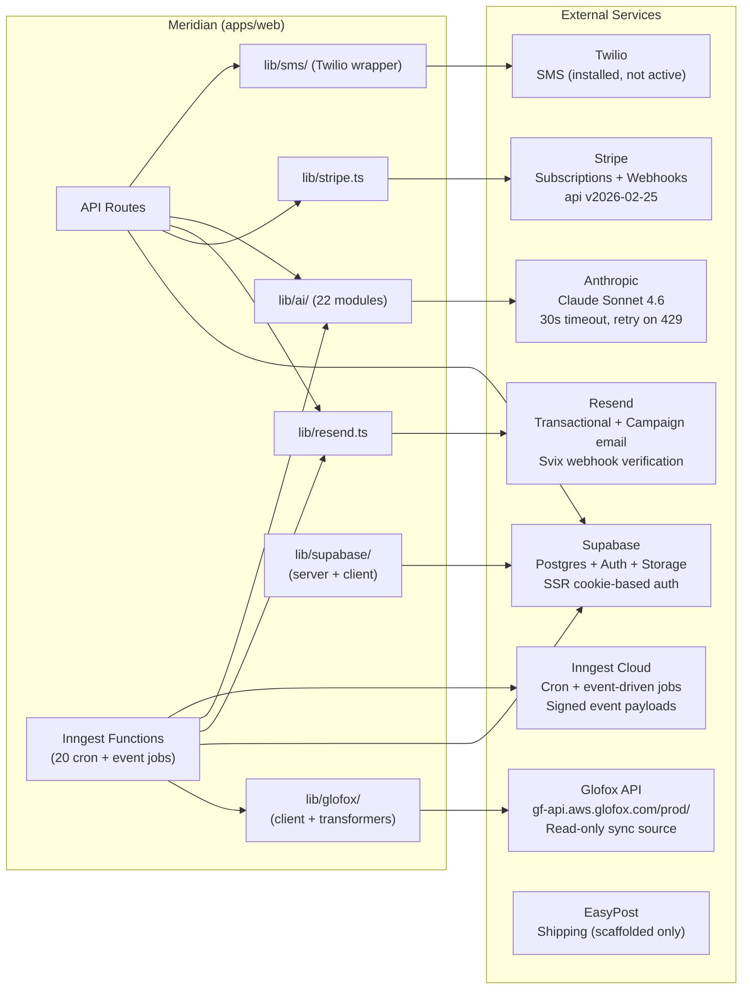

# Layer Report: Integration

**Audit Date:** 2026-04-05
**Agent:** integration
**Severity Scale:** Critical / High / Medium / Low / Info

---

## Executive Summary

Meridian integrates with 7 external services: Supabase (DB + Auth), Glofox API (legacy data sync), Stripe (payments), Resend (email), Inngest (background jobs), Anthropic (AI), and Twilio/EasyPost (SMS/shipping, partially implemented). The integration architecture is clean: each service has a dedicated lib module, secrets come from env vars, and webhook handlers verify signatures.

The Glofox integration is the most complex and highest-risk: it is a read-mostly sync layer with 50+ API methods, recently corrected endpoint paths, and a backfill function that processes all historical data. The credit pack backfill exists in the code but has never been triggered successfully (empty `credit_packs` table). The Stripe integration correctly uses service-role for webhooks and handles idempotency. Resend uses Svix for webhook verification.

Key risks: the Glofox sync is effectively a one-way data dependency with no circuit breaker — a Glofox API outage stops all member/class data from updating. The `glofox-sync-hourly` Inngest function has no timeout or partial-failure recovery per entity type.

---

## Integration Dependency Map

---

## Integration Analysis by Service

### Supabase (Primary — DB + Auth)
- **Pattern:** Server-side: `createServerClient()` using `@supabase/ssr` + cookie auth. Client-side: `createBrowserClient()`. Admin/cron: `getAdminClient()` with service-role key.
- **Auth:** JWT-based via Supabase Auth. `requireRole()` verifies JWT + role array.
- **Error handling:** All API routes check `error` from Supabase calls. Admin client (service-role) bypasses RLS — crons must filter by studio_id manually.
- **Risk:** RLS policies use `current_setting('app.studio_id')` but the setting is never explicitly set for anonymous/service-role clients. Phase 5 client-side access will require RLS rewrite. (Documented in middleware.ts TODO.)

### Glofox API (Legacy Sync)
- **Pattern:** Polling-based hourly sync via Inngest. Manual backfill triggered on demand.
- **Read-only policy:** Policy enforced in code — no Glofox write operations in tests.
- **Write-back:** `createBooking`, `cancelBooking`, `markAttendance` write-back to Glofox after Meridian actions. Fire-and-forget (failures logged to `glofox_write_status`).
- **Error handling:** Retry logic in `GlofoxClient` (3 retries with exponential backoff on rate limits). Per-entity error counts in `SyncResult`. Failed entities logged but sync continues.
- **Rate limiting:** Glofox API has undocumented rate limits. The client has per-request retry but no request-per-minute throttle.
- **Risk:** Glofox API outage stops incremental sync. No circuit breaker. No alerting.

### Stripe (Payments)
- **Pattern:** Direct Stripe (not Connect). Lazy singleton `getStripe()`.
- **Webhooks:** Signature verification via `constructWebhookEvent()`. Service-role Supabase client used (correct for server-to-server). Idempotency via `processed_webhook_events` table.
- **Events handled:** subscription.created, subscription.updated, subscription.deleted, invoice.payment_succeeded, invoice.payment_failed, checkout.session.completed.
- **Studio ID resolution:** Prefers `metadata.meridian_studio_id`, falls back to member lookup. Correct pattern.
- **Risk:** No webhook failure alerting. If the Stripe webhook endpoint returns 5xx, Stripe will retry — but no monitoring catches repeated failures.

### Resend (Email)
- **Pattern:** `sendCampaignEmail()` wrapper around Resend SDK. Templates rendered via Handlebars.
- **Webhooks:** Svix HMAC verification. Handles: delivered, opened, clicked, bounced, unsubscribed.
- **Campaign tracking:** Updates `email_send_log` and `campaign_recipients` on webhook events. Updates denormalized counts on `campaigns` table.
- **Bounce handling:** Hard bounces set `email_preferences.hard_bounced = true`. Campaign sends check this before delivering.
- **Risk:** `RESEND_WEBHOOK_SECRET` stored as env var. No evidence of secret rotation procedure.

### Inngest (Background Jobs)
- **Pattern:** 20 Inngest functions registered at `/api/inngest`. Mix of cron schedules and event-triggered functions.
- **Cron schedule summary:**
  - `0 7 * * *` — daily metrics (2 AM ET)
  - `0 8 * * *` — member enrichment (3 AM ET)
  - `0 9 * * *` — AI insights (4 AM ET)
  - `0 * * * *` — hourly Glofox sync
  - `*/10 * * * *` — automation trigger evaluation
- **Error handling:** Functions have `retries: 3` configured. Inngest Cloud handles retry scheduling.
- **Risk:** If Inngest Cloud goes down, no background processing occurs. No fallback mechanism.

### Anthropic (AI)
- **Pattern:** Lazy singleton with 30s timeout. `withRetry()` wrapper for 429/529. Rules-based fallback when API key absent.
- **Error handling:** Good. Most modules catch Anthropic errors and return fallback data.
- **Risk:** No spend monitoring or budget alerts. 10 AI routes unrated (see AI-003).

---

## Findings

### HIGH-INT-001: Glofox credit pack backfill exists in code but has never been triggered

**Severity:** High
**Location:** `apps/web/src/lib/inngest/functions/glofox-backfill.ts` (step 6: `backfill-credits`)

The backfill function has credit pack logic implemented at step 6: it calls `glofox.getCredits(member.glofox_id)` for each member. However, the `credit_packs` table is empty, indicating this backfill step either was skipped, failed silently, or the backfill was never triggered after the credit pack step was added.

**Recommendation:** Trigger the backfill function via the admin UI (`POST /api/glofox/backfill`) and monitor the `credit_packs` table. If the step fails, check `backfillResult.errorDetails` in the Inngest dashboard.

---

### HIGH-INT-002: Glofox hourly sync has no circuit breaker or partial-failure recovery

**Severity:** High
**Location:** `apps/web/src/lib/inngest/functions/glofox-sync-hourly.ts`

The hourly sync fetches members, events, bookings, and transactions from Glofox in sequential steps. If a step fails:
- Inngest will retry the entire function from the beginning (up to 3 times)
- Successfully-synced entities from earlier steps will be re-processed (upsert pattern mitigates data corruption)
- But if the failure is on a specific entity type (e.g., transactions), all retries re-fetch members and events unnecessarily

There is no circuit breaker: if Glofox is down, the sync will retry 3 times and then stop, leaving stale data with no alerting.

**Recommendation:**
1. Add Glofox sync failure alerting (send email or Slack notification when 3 retries are exhausted).
2. Make the `glofox_sync_state` table visible in the admin UI with error messages for failed entity types.
3. Consider per-entity-type sync steps so failures are isolated.

---

### MEDIUM-INT-003: RLS policies use current_setting('app.studio_id') — never set for server-side clients

**Severity:** Medium
**Location:** `apps/web/src/middleware.ts` (TODO comment), `scripts/phase2-migration.sql` (RLS policies)

Phase 2 RLS policies use `current_setting('app.studio_id')::uuid` for row isolation. However:
- Server-side route handlers use `createServerClient()` which does NOT set this setting
- Service-role clients bypass RLS entirely
- The middleware.ts has a TODO acknowledging this: "RLS policies must be rewritten to use auth.uid() or current_setting must be set via set_config"

Currently, all queries manually filter by `studio_id` in WHERE clauses — the RLS policies are effectively bypass-by-pattern rather than enforcement. This is acceptable until Phase 5 (member-facing client-side access), but the RLS policies give a false sense of security.

**Recommendation:** Document clearly that current RLS policies are not the actual security boundary. Plan RLS rewrite for Phase 5.

---

### MEDIUM-INT-004: Inngest automation cooldown check does not prevent parallel step execution

**Severity:** Medium
**Location:** `apps/web/src/lib/inngest/functions/evaluate-triggers.ts`, `automation_cooldowns` table

The `automation_cooldowns` table enforces a 24-hour per-member email/SMS cooldown. The `evaluate-triggers` function checks this cooldown before enrolling a member. However, if two automation flows run simultaneously in the same 10-minute window and both qualify the same member, two separate Inngest step runs could both pass the cooldown check before either has inserted the cooldown record.

This is a race condition: a member could receive two automation messages within the same 10-minute window if two flows trigger simultaneously.

**Recommendation:** Move the cooldown enforcement to the `execute-flow` step (after enrollment) and use an atomic upsert with `ON CONFLICT DO NOTHING` to prevent duplicate executions.

---

### LOW-INT-005: No Glofox API rate limit throttle — only per-request retry

**Severity:** Low
**Location:** `apps/web/src/lib/glofox/client.ts`

The Glofox client retries on 429 with backoff, but there is no proactive rate limiter. During the backfill (which iterates all members to fetch credits), the client could generate 200+ requests in rapid succession, triggering Glofox rate limits and causing the backfill to proceed very slowly.

**Recommendation:** Add a configurable `rateLimitMs` parameter to `GlofoxClient.fetchAll()` that adds a small delay between paginated requests.

---

### LOW-INT-006: Webhook secret rotation has no documented procedure

**Severity:** Low
**Location:** `.env.example`

Secrets for Stripe webhook, Resend webhook, Inngest signing key, and email unsubscribe HMAC are stored in environment variables with no documented rotation procedure. If any of these secrets is compromised, there is no runbook for rotating them without downtime.

**Recommendation:** Create a `docs/runbooks/secret-rotation.md` documenting the rotation procedure for each secret, including which Netlify environment variables to update and which services to notify.

---

### INFO-INT-007: Glofox write-back is correctly flagged as per-policy read-mostly

**Severity:** Info
**Location:** Memory file: `feedback_glofox_no_writes.md`

Per the project memory, Glofox write operations (createBooking, markAttendance, cancelBooking) are intentional and have been approved for specific event-driven use cases. The write-back policy is documented. Tests do not write to Glofox.

---

## Summary Table

| ID | Severity | Category | Title |
|----|----------|----------|-------|
| HIGH-INT-001 | High | Data | Glofox credit pack backfill exists but has never been triggered |
| HIGH-INT-002 | High | Reliability | Glofox sync has no circuit breaker or failure alerting |
| MEDIUM-INT-003 | Medium | Security | RLS policies use current_setting — never set for server-side clients |
| MEDIUM-INT-004 | Medium | Reliability | Automation cooldown check has race condition for parallel flows |
| LOW-INT-005 | Low | Performance | Glofox client lacks proactive rate limit throttle |
| LOW-INT-006 | Low | Operations | Webhook secret rotation has no documented procedure |
| INFO-INT-007 | Info | Policy | Glofox write-back policy correctly documented and approved |
