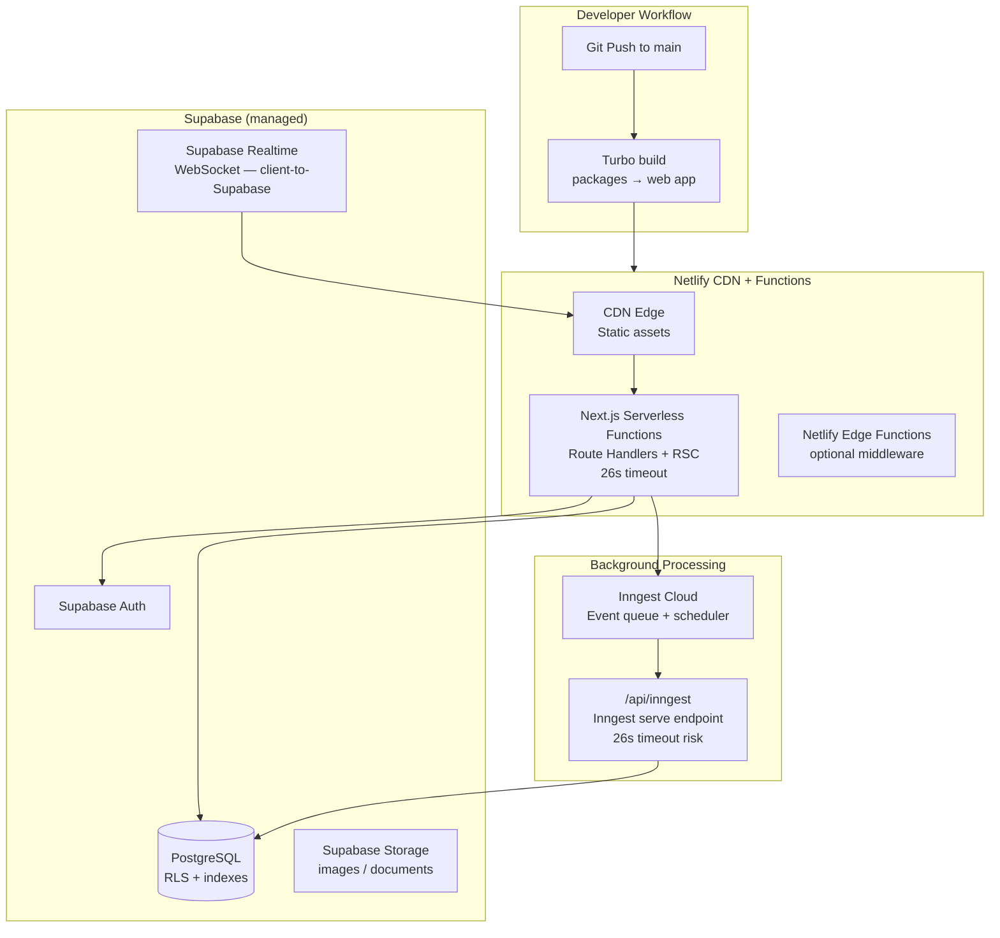

# Layer Report: Performance & Infrastructure

**Agent:** performance-infra
**Completed:** 2026-03-20
**Severity legend:** CRITICAL / HIGH / MEDIUM / LOW / INFO

---

## Executive Summary

Meridian's infrastructure is lightweight and well-suited for its current scale (single studio, ~45k lines). The Next.js 16 / Turbopack build is fast, Netlify handles hosting, and Inngest manages background job complexity elegantly. Database performance is supported by thoughtful Phase 2 indexing. The primary performance concerns are: unbounded query patterns in several AI data-gathering routes, no HTTP caching strategy on API responses, no pagination enforcement on analytics endpoints, and the Supabase Realtime implementation contradicting the documented 60s polling strategy.

---

## Build Configuration

### Next.js Configuration

`apps/web/next.config.ts` is effectively empty:
```typescript
const nextConfig: NextConfig = {
  /* config options here */
};
```

**Missing configurations that could improve performance:**
- No `images.domains` or `images.remotePatterns` (needed for member avatars or product images)
- No `headers()` function to set `Cache-Control` or security headers
- No `compress` option (Next.js enables gzip by default, so acceptable)
- No `experimental.turbo` config (Turbopack is enabled via dev script, build likely uses webpack)

### Turbopack

Language detection identifies `Turbopack` as the build tool. The `dev` script uses `next dev` (Next.js 16 default is Turbopack for dev). The `build` script uses `next build` (webpack for production by default in Next.js 16 unless `experimental.turbo` is configured). No Turbopack production build config was found.

### Dependencies

Notable performance-relevant dependencies:
- `framer-motion` v12.4.10 — animation library (~50KB gzipped)
- `recharts` v2.15.4 — chart library (~80KB gzipped)
- `reactflow` v11.11.4 — flow diagram library (~100KB gzipped)
- `@dnd-kit/core` + `sortable` — drag-and-drop
- `swagger-ui-react` v5.32.1 — Swagger UI (~400KB gzipped, loaded only on `/docs/api`)

**Code splitting risk:** If all pages are bundled together, the Swagger UI (~400KB) and reactflow would load on every admin page. Next.js App Router has automatic per-route code splitting that should mitigate this. No explicit `next/dynamic` imports were observed to confirm lazy loading of heavy dependencies.

---

## Caching Strategy

### Application-Level Caching

| Cache | Location | TTL | Invalidation |
|-------|---------|-----|-------------|
| AI Briefings | `ai_briefings` table | 30 min | None (time-based) |
| AI Predictions | `ai_cache` table | 24 hr | None (time-based) |
| AI Insights | `ai_cache` table | Configurable | None (time-based) |

### HTTP Caching

No `Cache-Control` headers are set on any API responses. All API responses are effectively `no-cache` by default in Next.js. For frequently accessed read-only analytics data (e.g., `GET /api/analytics/summary`), appropriate caching could significantly reduce database load.

### Browser Caching

No Service Worker or PWA manifest was found. The Netlify deployment will use Netlify's default CDN caching for static assets.

### Next.js Data Caching

Next.js 16 App Router has built-in `fetch()` caching (by default `no-store` for Server Components that use cookies, which applies to all auth-protected routes). No explicit `next: { revalidate }` or `unstable_cache` usage was found.

---

## Database Query Performance

### N+1 Patterns

**Confirmed N+1 in churn prediction:**
The `buildChurnInput()` function in `/api/ai/churn-prediction/route.ts` runs 12 parallel Supabase queries for a single member. While these are parallelized with `Promise.all()` (acceptable), calling this for a list of members (e.g., a batch churn analysis) would multiply to N×12 queries. The Inngest `analytics/batch-churn` event type exists, suggesting batch processing is planned — it should use aggregate SQL queries rather than per-member parallel fetches.

**AI briefing N+1 pattern:**
`GET /api/ai/briefing` runs 9+ parallel queries for every briefing generation. Cached at 30 minutes, so acceptable in steady state, but cold-start on first request of the day fires all 9 queries simultaneously.

### Unbounded Queries

All list endpoints use pagination (confirmed `limit` and `offset` parameters with `range(offset, offset + limit - 1)`). The maximum is enforced at `Math.min(parseInt(limit), 100)`. However:

- `/api/analytics/daily-metrics`, `/api/analytics/cohorts`, and `/api/analytics/revenue-breakdown` — content not reviewed in detail but names suggest they return aggregated data that could be computationally expensive without date bounds
- Campaign batch send: sends emails per recipient via `sendBatchEmails(emails: BatchEmail[])` with a hardcoded 100-email Resend batch limit. Large campaigns (1000+ members) would need multiple sequential batches — no chunking logic was observed in the campaign send route

### Missing Indexes (corroborating data-model findings)

- `bookings(member_id, status)` — queried in churn prediction, activity feed, and capacity checks
- `bookings(checked_in_at)` — date-range queries in multiple analytics endpoints
- `transactions(member_id, created_at)` — spend aggregation in churn and analytics
- `profiles(email, studio_id)` — dedup check on member creation

---

## Infrastructure Configuration

### Netlify Hosting

`hosting: "Netlify"` per language detection. No `netlify.toml` was found in the project root. Without `netlify.toml`, Netlify uses auto-detection for Next.js (via `@netlify/plugin-nextjs`).

**Implications:**
- Next.js Server Components and Route Handlers deploy as Netlify Edge Functions or serverless functions
- No explicit function timeout configuration found (default Netlify timeout is 10s for background functions, 26s for foreground)
- No explicit memory configuration

**Concern:** Long-running Inngest functions are invoked via `POST /api/inngest`. If the Inngest webhook call takes longer than the Netlify function timeout (26s), the function will be killed mid-execution. Inngest handles retries at the platform level, but partial execution could leave enrollments in an inconsistent state.

### Supabase Realtime vs Polling

The language-detection file states `"realtime": "60s polling (Phase 1)"`. However, `use-realtime.ts` implements Supabase Realtime WebSocket subscriptions, not polling:

```typescript
const channel = supabase.channel(channelName)
  .on('postgres_changes', ...)
  .subscribe()
```

This is a real-time WebSocket subscription, not polling. This means either:
1. The language detection metadata is outdated and Realtime WebSockets are already in use, OR
2. The `useRealtimeSubscription` hook exists but is not used in the Command Center (which uses polling instead)

If WebSockets are active in production, Netlify's serverless function model may not support long-lived WebSocket connections. Supabase Realtime connections are client-side (browser) WebSockets directly to Supabase, not through Netlify — so this is actually fine architecturally.

### CI/CD Pipeline

No `.github/workflows/`, `netlify.toml` CI config, or other CI pipeline configuration was found. Deployments to Netlify are likely triggered by Git pushes via Netlify's automatic deploy integration. There is no:
- Build-time type checking
- Pre-deploy lint
- Automated test run (though there are no tests to run)
- Environment-specific deploy previews configuration

---

## Infrastructure Diagram



---

## Findings

**HIGH — Campaign batch send has no chunking for large recipient lists:**
The `sendBatchEmails()` function enforces a 100-email maximum per call and returns an error if exceeded. Large campaigns (500+ members) will fail unless the campaign send route implements chunking. No chunking was observed in the campaign send route.

**HIGH — Netlify function timeout risk for Inngest step functions:**
Inngest functions are invoked via `POST /api/inngest`. If any Inngest step runs longer than 26 seconds (Netlify foreground limit), the function will be killed. `evaluate-triggers.ts` iterates over all active flows and all trigger types — with many flows, this could exceed the timeout. Inngest's built-in step chunking (`step.run()`) mitigates this, but only if steps are correctly defined.

**MEDIUM — No HTTP caching on read-heavy analytics endpoints:**
`GET /api/analytics/summary`, `/api/analytics/daily-metrics`, and similar read-only endpoints have no `Cache-Control` headers. As the studio grows, these endpoints will be called on every admin page load without any server-side or CDN caching.

**MEDIUM — Supabase Realtime vs 60s polling inconsistency:**
`use-realtime.ts` implements WebSocket subscriptions. Language detection says "60s polling." The actual real-time strategy in use on production pages is unclear. This should be documented and made consistent.

**MEDIUM — No `netlify.toml` for function timeout or build configuration:**
Without explicit Netlify configuration, function timeouts, memory limits, and build commands are inferred. A `netlify.toml` should be added to pin the Next.js plugin version, set `functions.timeout`, and configure build cache.

**LOW — Heavy dependencies may not be code-split:**
`reactflow` (~100KB), `recharts` (~80KB), and `swagger-ui-react` (~400KB) are installed. If Next.js App Router's automatic code splitting does not handle these correctly, they will bloat the initial bundle. No explicit `next/dynamic` lazy imports were observed.

**LOW — No Next.js image optimization configuration:**
`next/image` optimization requires `remotePatterns` config for external image URLs. With no `next.config.ts` settings, external member avatar URLs or product images will not be optimized.

**INFO — `turbo.json` lint task not cached:**
The `lint` task in `turbo.json` has no `outputs` configuration, so lint results are never cached by Turborepo. Every `turbo lint` run re-executes ESLint from scratch.

---

## Findings Summary

| Severity | Count | Items |
|----------|-------|-------|
| CRITICAL | 0 | — |
| HIGH | 2 | Campaign batch send no chunking, Netlify timeout risk for Inngest |
| MEDIUM | 3 | No HTTP caching on analytics, Realtime vs polling inconsistency, no netlify.toml |
| LOW | 2 | Heavy dependency code splitting unconfirmed, no image optimization config |
| INFO | 1 | Turborepo lint not cached |
