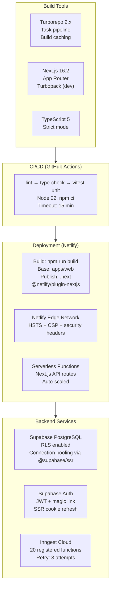

# Layer Report: Performance & Infrastructure

**Audit Date:** 2026-04-05
**Agent:** performance-infra
**Severity Scale:** Critical / High / Medium / Low / Info

---

## Executive Summary

Meridian runs on Netlify (serverless Next.js) backed by Supabase (PostgreSQL + Auth) and Inngest (background jobs). The infrastructure stack is well-chosen for a Phase 1 SaaS: serverless eliminates server management, Supabase handles auth + DB, Inngest handles background processing. CI runs on GitHub Actions with lint/typecheck/unit tests on every push to main.

Performance concerns cluster around data layer patterns rather than frontend bundle size. The most significant: the `cron-member-enrichment` loads all attended bookings into JavaScript memory for aggregation; missing composite indexes on high-frequency queries; and 60-second polling on the Command Center means revenue data that is already wrong (daily_metrics) is also slow to refresh. The Next.js build configuration is minimal but appropriate — no custom webpack config, Turbopack used in dev.

---

## Infrastructure Diagram



---

## Build Configuration Analysis

### Next.js Config (`apps/web/next.config.ts`)
- `serverExternalPackages: ['@react-pdf/renderer']` — correct, avoids bundling large PDF renderer server-side
- `transpilePackages: ['@meridian/types']` — ensures monorepo package is transpiled
- `images.remotePatterns` — only Supabase Storage allowed (good)
- No custom webpack config — relies on Next.js defaults
- No bundle analyzer configured

### Turbopack (dev only)
- Turbopack is used in dev via `next dev` — not in production builds (`next build` still uses webpack)
- Build caching via `.turbo/` directory

### TypeScript
- TypeScript 5 with `strict` mode (inferred from type annotations in source)
- `tsconfig` not directly read but strict types observed throughout

---

## Performance Findings

### HIGH-PERF-001: cron-member-enrichment loads all bookings into JS memory

**Severity:** High
**Location:** `apps/web/src/lib/inngest/functions/cron-member-enrichment.ts`

As documented in DM-005, the enrichment cron fetches all `attended=true` bookings for the studio into a JavaScript array, then aggregates in-memory via a Map. At current scale (small studio), total attended bookings may be ~500 rows. At 500 members × 2 years × 10 classes/month = 120,000 rows, this becomes a serverless function memory problem (Netlify Functions have 1GB but Node heap for JSON at 120k rows is non-trivial).

The cron runs daily in an Inngest step with a 10-minute timeout. Memory pressure could cause timeouts or OOM crashes.

**Recommendation:**
```sql
SELECT member_id, COUNT(*) as visit_count, MAX(checked_in_at) as last_visit
FROM bookings
WHERE studio_id = $1 AND attended = true
GROUP BY member_id
```
Replace the full-table fetch with this aggregate. Transfer ~N_members rows instead of ~N_bookings rows.

---

### HIGH-PERF-002: Missing composite indexes on 3 high-frequency query paths

**Severity:** High
**Location:** Schema (corroborates DM-004)

Same finding as DM-004 but from a performance perspective:

1. **`cron-evaluate-triggers` runs every 10 minutes** and queries `profiles(studio_id, engagement_status)`. With no index on `(studio_id, engagement_status)`, each 10-minute evaluation is a partial table scan.

2. **`cron-daily-metrics` runs daily** and queries `transactions(studio_id, created_at, status)`. Date-range queries on large transaction tables are the canonical case for composite indexes.

3. **`GET /api/members` (members directory)** queries `members JOIN profiles` by `studio_id`. The join performance depends on appropriate indexes on the FK relationship.

**Impact:** At current scale (single small studio), these are not yet causing timeouts. At Phase 4 (multi-tenant SaaS with 50+ studios), each eval loop iterates all studios, multiplying the scan cost.

---

### MEDIUM-PERF-003: 60-second polling on Command Center for metrics that are wrong

**Severity:** Medium
**Location:** `apps/web/src/hooks/use-command-center-data.ts` (inferred), Command Center page

The Command Center uses 60-second polling (per the architecture documentation). It fetches `daily_metrics` data that is already known to be wrong. This means the dashboard is:
1. Polling every 60 seconds
2. Returning wrong revenue data on each poll

The polling adds unnecessary database load for data that doesn't change except via the nightly cron.

**Recommendation:** Switch Command Center revenue/metrics to a server-side initial fetch (RSC) + manual refresh button. Reserve polling for genuinely real-time data (active check-ins, live class occupancy).

---

### MEDIUM-PERF-004: ExecutiveDashboardClient makes 4+ API calls client-side on each render

**Severity:** Medium
**Location:** `apps/web/src/app/(admin)/analytics/dashboards/executive/_components/ExecutiveDashboardClient.tsx`

The executive dashboard client component fetches `/api/analytics/summary`, `/api/analytics/revenue-breakdown`, `/api/analytics/cohorts`, and `/api/ai/insights` in the browser. Each call adds network latency. These are sequential if they have data dependencies or parallel if independent.

**Recommendation:** Move these fetches to the RSC page layer using direct Supabase calls. Pass initial data as props. Reserve client-side fetching for interactive refresh triggers only.

---

### MEDIUM-PERF-005: No bundle analyzer — bundle size unknown

**Severity:** Medium
**Location:** `apps/web/next.config.ts`

The Next.js config has no bundle analyzer configured. Key heavy dependencies include:
- `reactflow` (automation flow builder) — substantial client-side bundle
- `recharts` (analytics charts)
- `@react-pdf/renderer` (marked as external — correct)
- `framer-motion` (animation library)
- `swagger-ui-react` (API docs page)

Without analysis, it's unknown whether these are properly code-split or if they end up in the initial bundle.

**Recommendation:** Add `@next/bundle-analyzer` as a dev dependency and run `ANALYZE=true npm run build` to inspect chunk sizes.

---

### LOW-PERF-006: Integration tests disabled — no performance regression detection

**Severity:** Low
**Location:** `.github/workflows/ci.yml`

With integration tests disabled (TQ-003), there is no automated detection of database query performance regressions. A slow query introduced in a PR would only be caught if it visibly times out in production.

**Recommendation:** Provision the Supabase test instance (MED-27) and enable integration tests. Add query timing assertions for critical paths (bookings list, member 360 fetch).

---

### LOW-PERF-007: No HTTP caching headers on analytics API routes

**Severity:** Low
**Location:** `/api/analytics/daily-metrics`, `/api/analytics/revenue-breakdown`, `/api/analytics/snapshot`

Analytics routes return data that changes at most once per day (via nightly cron). However, they return no `Cache-Control` headers. Each visit to the revenue dashboard or analytics pages triggers fresh DB queries.

**Recommendation:** Add `Cache-Control: private, max-age=300` (5-minute cache) to analytics routes that aggregate `daily_metrics` data. This is safe because the data only changes at 2 AM ET.

---

### INFO-PERF-008: Netlify @netlify/plugin-nextjs handles ISR and Edge Function routing automatically

**Severity:** Info
**Location:** `netlify.toml`, `apps/web/package.json`

The `@netlify/plugin-nextjs` v5.x plugin correctly handles Next.js App Router on Netlify, including server components, edge functions, and image optimization. No manual configuration needed. This is the recommended deployment path.

---

### INFO-PERF-009: Turbopack in dev — build uses standard webpack

**Severity:** Info
**Location:** `apps/web/scripts/dev` = `next dev`

Turbopack is active in development only (via `next dev`). Production builds use webpack. This is the expected configuration for Next.js 16 — Turbopack production builds are not yet stable. No action required.

---

## CI/CD Assessment

### Strengths
- `concurrency` group with `cancel-in-progress: true` prevents queued builds from blocking
- Node 22 matches the `engines` requirement
- Unit tests run in CI with all required env vars as test values
- 15-minute timeout prevents runaway jobs

### Gaps
- Integration tests commented out (never run)
- No E2E test step in CI (Playwright must be run manually)
- No build artifact caching beyond npm cache
- No performance budget enforcement (bundle size, Lighthouse CI)

---

## Summary Table

| ID | Severity | Category | Title |
|----|----------|----------|-------|
| HIGH-PERF-001 | High | Performance | Member enrichment cron loads all bookings into JS memory |
| HIGH-PERF-002 | High | Performance | Missing composite indexes on 3 high-frequency query paths |
| MEDIUM-PERF-003 | Medium | Performance | 60-second polling fetches wrong data from daily_metrics |
| MEDIUM-PERF-004 | Medium | Performance | Executive dashboard makes 4+ client-side API calls on render |
| MEDIUM-PERF-005 | Medium | Build | No bundle analyzer — client bundle size unknown |
| LOW-PERF-006 | Low | CI/CD | Integration tests disabled — no query performance regression detection |
| LOW-PERF-007 | Low | Caching | Analytics API routes lack Cache-Control headers |
| INFO-PERF-008 | Info | Infrastructure | @netlify/plugin-nextjs correctly configured for App Router |
| INFO-PERF-009 | Info | Build | Turbopack in dev only — production uses webpack as expected |
