# Project Structure Audit Report

**Agent**: project-structure
**Model**: claude-sonnet-4-6
**Timestamp**: 2026-04-02T00:00:00Z

---

## Scope

- **Files examined**: ~391 TypeScript files, 17 SQL files, 2 Python files, 1 CSS file (533 total tracked)
- **Files skipped**: node_modules, .next, .turbo, dist/build outputs
- **Directories covered**: apps/web/src (all), packages/ (all 3), scripts/, docs/ (structure only)
- **Language/Framework context**: Turborepo monorepo, Next.js 16 (App Router), React 19, Supabase, Stripe, Anthropic, Tailwind v4, shadcn/ui, Inngest, Vitest + Playwright

---

## Executive Summary

Meridian is a well-structured Turborepo monorepo following a layered architecture inside a single Next.js 16 App Router application. The project has expanded rapidly across four phases and shows good structural intent — route groups, a dedicated lib layer, shared packages — but accumulates several cohesion debts: the `@meridian/supabase` package is entirely unused by the application it was built for, there are three parallel methods of Supabase client instantiation, and 218 files contain a hardcoded studio ID that a utility function was created specifically to eliminate. The most structurally significant risk is a Node version mismatch between the package engine requirement (>=22) and the Netlify deployment configuration (Node 20), which would cause build failures in CI/CD.

---

## Architecture Overview

### Pattern: Route-Group Layered Architecture (Next.js App Router)

The application uses Next.js App Router route groups as the primary architectural boundary:

- `(admin)` — full admin dashboard, 48 pages
- `(employee)` — employee portal, 9 pages
- `(auth)` — login and auth callback, 2 pages
- `api/` — 148 route handlers organized by domain

Horizontally, the `src/` directory uses a clean separation:
- `app/` — all routes (pages + API)
- `components/` — shared UI primitives only (no feature components)
- `lib/` — all business logic, integrations, and utilities
- `hooks/` — React data hooks (polling-based data access)
- `contexts/` — React context (auth only)

This is a **Feature-Grouped, Layer-Based hybrid**: routes are grouped by user role, but business logic lives in a shared `lib/` layer rather than inside each route group. For a single-app monorepo, this is appropriate.

### Module Map

```
apps/web/src/
  app/
    (admin)/              — Admin dashboard (48 pages)
      page.tsx            — Command Center (root)
      layout.tsx          — Admin shell (sidebar + header, 'use client')
      use-command-center-data.ts  — [MISPLACED] data hook in app/ directory
      analytics/          — 6 sub-pages (dashboards, insights, migration, pricing, reports, trainers)
      corporate/          — 3 sub-pages + [id] dynamic route
      docs/api/           — Swagger UI API documentation
      engagement/         — Engagement overview
      marketing/          — 4 sub-pages (automations, campaigns, content, leads)
      members/[id]/       — Member directory + detail
      operations/         — 2 sub-pages (documents, payroll)
      revenue/            — 2 sub-pages (orders, products)
      schedule/           — Class calendar
      segments/           — Smart segments
      settings/           — 2 sub-pages (geofence, sms)
    (employee)/           — Employee portal (9 pages)
      employee/           — All pages nested under /employee/ prefix
        classes/          — Trainer class management
        clock/            — Clock in/out
        page.tsx          — Employee home
        pay/              — Pay & taxes
        performance/      — Trainer performance
        profile/          — Employee profile
        promo/            — Promo code management
        schedule/         — Employee schedule
        timesheets/       — Time tracking
      [ORPHAN dirs]       — classes/, pay/, performance/, profile/, promo/, schedule/, timesheets/ (empty, no page.tsx)
    (auth)/               — Login, auth callback
    api/                  — 148 route handlers
      ai/                 — 13 AI endpoints (briefing, churn-prediction, health-score, etc.)
      analytics/          — 7 analytics endpoints
      automations/        — Automation CRUD
      bookings/           — Booking management
      campaigns/          — Email/SMS campaigns
      check-in/           — QR check-in
      classes/            — Class management
      clock/              — Employee clock in/out
      content/            — Content hub
      corporate/          — Corporate accounts
      cron/               — Scheduled jobs (waitlist-promote)
      email-preferences/  — Unsubscribe preferences
      email-templates/    — Email template management
      employees/          — Employee CRUD
      events/             — Event management
      geofence/           — Geofence configuration
      glofox/             — Glofox sync (backfill, status, sync)
      inngest/            — Inngest serve endpoint
      invoices/           — Invoice management
      leads/              — Lead pipeline
      members/            — Member CRUD
      migration/          — Glofox data migration
      openapi/            — OpenAPI spec endpoint
      orders/             — Order management
      payroll/            — Payroll periods
      pricing/            — Pricing management
      pricing-simulator/  — Pricing scenario simulation
      products/           — Merchandise products
      qr/                 — QR code generation
      reports/            — Report generation + export
      revenue/            — Revenue metrics
      segments/           — Smart segments
      settings/           — Studio settings
      shipping/           — Shipping rates
      sms/                — SMS sending
      staff/              — Staff management
      trainers/           — Trainer management + leaderboard
      transactions/       — Transaction records
      unsubscribe/        — Email unsubscribe flow
      webhooks/           — Stripe, Resend, Twilio, EasyPost webhooks
    unsubscribe/          — Public unsubscribe page
    layout.tsx            — Root layout (providers: AuthProvider, TooltipProvider)
    globals.css           — Tailwind v4 design tokens
    error.tsx             — Global error boundary
    not-found.tsx         — 404 page

  components/
    ui/                   — 24 shadcn/ui primitive components
    layout/               — header.tsx, sidebar.tsx (admin shell)
    glofox/               — DataSyncButton.tsx (1 file)
    command-palette.tsx   — Cmd+K command palette

  lib/
    ai/                   — 14 AI module files (Anthropic integrations)
      client.ts           — Singleton Anthropic client + utilities
      briefing.ts         — [NOTE: briefing logic lives in anthropic.ts, not here]
      booking-patterns.ts, churn-prediction.ts, cross-sell.ts,
      insights-generator.ts, intake-enrichment.ts, pricing-analyzer.ts,
      report-narrative.ts, revenue-anomaly.ts, seasonal-predictor.ts,
      trainer-comparison.ts, trainer-summary.ts, waitlist-messaging.ts
    anthropic.ts          — [MISNAMED] 1,699-line file containing briefing + recommendations logic
    auth/                 — get-studio-id.ts, require-role.ts
    glofox/               — client.ts, index.ts, migration.sql, program-resolver.ts, transformers.ts, types.ts
    inngest/              — client.ts, helpers.ts, index.ts
      functions/          — 19 Inngest function definitions (cron + event-driven)
    reports/              — csv-export.ts, engine.ts, pdf-export.ts, templates.ts
    sms/                  — index.ts, types.ts
      providers/          — twilio.ts
    supabase/             — client.ts, middleware.ts, server.ts
    email-templates.ts    — Handlebars email templates
    rate-limit.ts         — In-memory rate limiter
    resend.ts             — Resend email client
    stripe.ts             — Stripe client + helpers
    utils.ts              — cn() utility only
    validation.ts         — Zod schemas

  hooks/                  — 13 React hooks (mostly AI + Supabase data access)
  contexts/               — auth-context.tsx (single context)
  __tests__/              — Unit + integration tests
    unit/api/             — 14 API route test files
    unit/lib/             — 4 lib test files
    integration/          — 6 integration test files
    helpers/              — Mock factories for Supabase, Glofox, Inngest, Next

packages/
  @meridian/types         — 12 TypeScript type/interface files (domain models)
    index.ts exports: auth, members, classes, bookings, revenue, trainers,
                      employees, merch, marketing, guests, analytics, corporate
  @meridian/utils         — 3 utility files (currency, dates, constants)
  @meridian/supabase      — 2 files: createClient (browser), createServerClient (server)

scripts/ (root)           — SQL seed/migration files + 2 Python import scripts
apps/web/scripts/         — 4 Glofox utility scripts (discovery, exploration, data pull, backfill)
e2e/                      — 10 Playwright spec files + auth state storage
docs/                     — Product docs, design guides, phase plans, scrutiny reports
```

### Entry Points

| Entry Point | Path | Purpose |
|---|---|---|
| Root layout | `apps/web/src/app/layout.tsx` | Provider tree root (AuthProvider, TooltipProvider) |
| Admin home | `apps/web/src/app/(admin)/page.tsx` | Command Center dashboard |
| Employee home | `apps/web/src/app/(employee)/employee/page.tsx` | Employee portal home |
| Login | `apps/web/src/app/(auth)/login/page.tsx` | Auth entry |
| Auth callback | `apps/web/src/app/(auth)/auth/callback/` | Supabase magic link callback |
| Middleware | `apps/web/src/middleware.ts` | Auth guard on all protected routes |
| Inngest | `apps/web/src/app/api/inngest/route.ts` | Background job scheduler endpoint |
| Unsubscribe | `apps/web/src/app/unsubscribe/[token]/page.tsx` | Public email unsubscribe page |

### Module Dependencies

**High-coupling modules (most incoming dependencies):**
- `@/lib/supabase/server` — imported by ~100+ API route handlers
- `@/lib/auth/require-role` — imported by 58 of 148 API routes (intentional central auth pattern)
- `@/lib/rate-limit` — imported by all AI route handlers
- `@/lib/ai/client` — imported by 13 AI lib modules

**Lowest coupling (orphaned or lightly used):**
- `@meridian/supabase` — 0 imports from web app (package is fully unused)
- `@meridian/utils` — 0 imports from web app (package is effectively unused)
- `@meridian/types` — 2 imports from web app (significantly underused given 12 domain type files)
- `apps/web/src/lib/ai/cross-sell.ts` — no API route
- `apps/web/src/lib/ai/pricing-analyzer.ts` — no API route
- `apps/web/src/lib/ai/seasonal-predictor.ts` — no API route
- `apps/web/src/lib/ai/report-narrative.ts` — no API route
- `apps/web/src/lib/ai/trainer-comparison.ts` — no API route

**Circular dependency risk:** None detected at the module boundary level. `lib/` modules import from each other in one direction (AI modules import from `lib/ai/client`; inngest functions import from `lib/inngest/client` and `lib/ai/*`; API routes import from `lib/*`).

---

## Findings

### CRITICAL

---

**CRIT-001: Node version mismatch between package engine and Netlify deployment**

- **File**: `/netlify.toml` line 10, `/package.json` engines field
- **Detail**: `package.json` declares `"engines": { "node": ">=22.0.0" }`. `netlify.toml` sets `NODE_VERSION = "20"`. Node 20 is below the declared minimum. This will cause build failures on Netlify if the engine constraint is enforced, or silently run on an unsupported Node version.
- **Evidence**: `netlify.toml:10: NODE_VERSION = "20"` vs `package.json: "node": ">=22.0.0"`
- **Fix**: Change `NODE_VERSION = "22"` in `netlify.toml`.

---

**CRIT-002: E2E auth tokens with real JWT credentials committed to the repository**

- **File**: `apps/web/e2e/.auth/admin.json`, `apps/web/e2e/.auth/employee.json`
- **Detail**: These files contain live Supabase JWT access tokens, refresh tokens, and session data for real test accounts (`meridian-e2e-admin@test.meridian.app`). There is no `.gitignore` inside `e2e/.auth/` and the root `.gitignore` does not exclude `e2e/.auth/`. While the tokens may be expired, the pattern means live tokens will be committed after every `auth:setup` run.
- **Evidence**: `e2e/.auth/admin.json` contains `"access_token":"eyJhbGciOiJFUzI1NiI..."` and `"refresh_token":"iealmrlfxkby"`.
- **Fix**: Add `e2e/.auth/*.json` to `.gitignore`. Playwright's auth setup documentation explicitly recommends this.

---

### HIGH

---

**HIGH-001: `@meridian/supabase` package is completely unused**

- **Files**: `packages/supabase/src/client.ts`, `packages/supabase/src/server.ts`
- **Detail**: The monorepo has a dedicated `@meridian/supabase` package with `createClient` (browser) and `createServerClient` (server) functions. Zero files in `apps/web/src` import from `@meridian/supabase`. Instead, `apps/web/src/lib/supabase/` contains functionally identical implementations — the server implementations are character-for-character duplicates. The package exists but is entirely bypassed.
- **Evidence**: `grep -rn "from '@meridian/supabase'" apps/web/src` returns 0 results. `packages/supabase/src/server.ts` and `apps/web/src/lib/supabase/server.ts` implement the same `createServerClient()` function with identical logic.
- **Impact**: Two competing Supabase client factories maintained in parallel. Any change to cookie handling must be made in two places. The `@meridian/supabase` package provides false confidence about code sharing.
- **Fix**: Either delete `packages/supabase/` and use only `@/lib/supabase/`, or migrate `apps/web/src/lib/supabase/` to import from `@meridian/supabase` and delete the local copy.

---

**HIGH-002: 218 files contain a hardcoded studio ID literal**

- **Files**: `apps/web/src/lib/auth/get-studio-id.ts` (the fix), ~208 remaining callsites
- **Detail**: The UUID `11111111-1111-1111-1111-111111111111` is hardcoded as a constant in 218 locations across the codebase. A `getStudioId()` utility was created with a TODO note to migrate all routes to use it, but only 10 files have been migrated. This is a blocker for multi-tenancy — the SaaS goal requires every query to resolve studio_id dynamically from the authenticated user's profile.
- **Evidence**: `grep -rn "11111111-1111-1111-1111-111111111111" apps/web/src | wc -l` returns 218. `get-studio-id.ts` contains `// TODO: Migrate all route handlers to use this utility`.
- **Impact**: Multi-tenancy is structurally impossible until all 218 hardcoded IDs are removed. A second studio onboarded to the platform would receive another studio's data.
- **Fix**: Systematic migration of all 218 callsites to use `getStudioId(profile)`. API routes should use `requireRole()` which already calls `getStudioId()` internally.

---

**HIGH-003: Inconsistent authentication pattern across 148 API routes**

- **Files**: All files under `apps/web/src/app/api/`
- **Detail**: The `requireRole()` helper at `lib/auth/require-role.ts` provides a canonical, composable auth check. However, only 58 of 148 API routes use it. The remaining 90 routes use ad-hoc `supabase.auth.getUser()` calls, manual profile fetches, and inline studio_id resolution — with varying error handling and inconsistent role checking logic.
- **Evidence**: `grep -rn "requireRole" apps/web/src/app/api | wc -l` = 58. `grep -rn "supabase.auth.getUser" apps/web/src/app/api | wc -l` = 169.
- **Impact**: Routes that bypass `requireRole()` may have weaker auth guarantees. Role escalation risks if an employee-level route omits role checking. Maintenance burden is high.
- **Fix**: Migrate remaining API routes to use `requireRole()`. This also resolves the studio_id propagation issue (HIGH-002) for server-side routes.

---

**HIGH-004: Five AI modules in `lib/ai/` have no corresponding API route**

- **Files**: `lib/ai/cross-sell.ts`, `lib/ai/pricing-analyzer.ts`, `lib/ai/seasonal-predictor.ts`, `lib/ai/report-narrative.ts`, `lib/ai/trainer-comparison.ts`
- **Detail**: These five AI modules implement complete AI functions using the Anthropic SDK, but none have a corresponding `app/api/ai/[module]/route.ts` endpoint. They cannot be invoked from the frontend. Either they were built speculatively and are not yet wired up, or they are meant to be called from other route handlers (in which case the calling routes are not apparent).
- **Evidence**: `ls apps/web/src/app/api/ai/` shows 13 endpoint directories; `ls apps/web/src/lib/ai/` shows 14 module files (plus client.ts). The 5 unmatched modules have no importers in the API routes.
- **Fix**: Either create API route handlers for these modules (if they are planned for Phase 3+ features) or annotate them clearly as upcoming/phase-gated. If they have no planned endpoint, they are dead code.

---

**HIGH-005: `lib/anthropic.ts` is a 1,699-line misnamed file**

- **Files**: `apps/web/src/lib/anthropic.ts`
- **Detail**: This file is named as if it were the Anthropic client initialization, but `lib/ai/client.ts` is the actual singleton client. `lib/anthropic.ts` contains `generateBriefing()`, `generateRecommendations()`, and extensive business logic — it is effectively a second AI module file that imports from `lib/ai/client`. It is imported by one API route (`api/ai/briefing/route.ts`) and one test file. All other AI routes import directly from their respective `lib/ai/*.ts` module.
- **Evidence**: `apps/web/src/app/api/ai/briefing/route.ts:3: import { generateBriefing, BriefingContext } from "@/lib/anthropic"`. The file contains `import { getAnthropicClient, AI_MODEL, extractText, parseAIJson } from "@/lib/ai/client"`.
- **Impact**: Confusing for any developer expecting `lib/anthropic.ts` to be the client singleton. The briefing module is inconsistently located compared to all other AI modules in `lib/ai/`.
- **Fix**: Move `generateBriefing()` and related functions from `lib/anthropic.ts` into `lib/ai/briefing.ts` (consistent with sibling modules). Update `api/ai/briefing/route.ts` import.

---

### MEDIUM

---

**MED-001: `@meridian/types` is severely underused (2 imports in 391 TypeScript files)**

- **Files**: `packages/types/src/` (12 domain type files)
- **Detail**: The `@meridian/types` package defines types for all domain entities: members, classes, bookings, revenue, trainers, employees, merch, marketing, guests, analytics, corporate. Despite this, only 2 files in `apps/web/src` import from it (`schedule/page.tsx` and `hooks/use-supabase.ts`). The majority of the codebase uses `Record<string, unknown>` or inline type assertions, especially in data-fetching code.
- **Evidence**: `grep -rn "from '@meridian/types'" apps/web/src | wc -l` = 2.
- **Impact**: The shared types package does not provide its intended value. Type safety is lower than it appears. When the iOS app or other consumers are built, there is no enforced shared contract.
- **Fix**: Audit pages and API routes to replace `Record<string, unknown>` casts with proper `@meridian/types` imports. This is a Phase 5 prerequisite.

---

**MED-002: `@meridian/utils` has zero imports in the web application**

- **Files**: `packages/utils/src/` (currency.ts, dates.ts, constants.ts)
- **Detail**: Similar to the supabase package issue, `@meridian/utils` exports currency formatting, date utilities, and constants — but `apps/web/src` imports none of them. Instead, `apps/web/src/lib/utils.ts` exists but only contains the `cn()` CSS utility. Currency/date formatting is done inline throughout the codebase (e.g., `use-command-center-data.ts:formatCurrency`, `use-command-center-data.ts:formatEasternTime`).
- **Evidence**: `grep -rn "from '@meridian/utils'" apps/web/src` returns 0 results.
- **Impact**: Duplicate formatting logic scattered across files. Inconsistent number/date formatting possible.
- **Fix**: Consolidate utility functions. Either use `@meridian/utils` throughout the web app, or acknowledge that these utilities are future cross-package infrastructure and document accordingly.

---

**MED-003: Duplicate `reactflow` and `@reactflow/*` packages in `package.json`**

- **File**: `apps/web/package.json`
- **Detail**: The package lists both the `reactflow` monolith package (v11.11.4) and three `@reactflow/*` sub-packages (`@reactflow/background`, `@reactflow/controls`, `@reactflow/core`). The source code only imports from `'reactflow'` (the monolith). The `@reactflow/*` sub-packages are unused.
- **Evidence**: `grep -rn "from '@reactflow" apps/web/src` returns 0 results. `grep -rn "from 'reactflow'" apps/web/src` returns 2 results (both in marketing automations pages).
- **Impact**: Three unused packages inflate bundle analysis and install size. Both the monolith and sub-packages resolve the same underlying code, risking version conflicts.
- **Fix**: Remove `@reactflow/background`, `@reactflow/controls`, and `@reactflow/core` from `package.json`. Keep only `reactflow`.

---

**MED-004: `tailwindcss-animate` in devDependencies is unused (superseded by `tw-animate-css`)**

- **File**: `apps/web/package.json` lines 58, 78
- **Detail**: `tw-animate-css` (in dependencies) is the package actually imported in `globals.css`. `tailwindcss-animate` (in devDependencies) is the predecessor package. Both serve the same purpose. Only `tw-animate-css` is used.
- **Evidence**: `globals.css:2: @import "tw-animate-css"`. No file imports `tailwindcss-animate`.
- **Fix**: Remove `tailwindcss-animate` from devDependencies.

---

**MED-005: `shadcn` CLI package incorrectly placed in runtime `dependencies`**

- **File**: `apps/web/package.json` line 53
- **Detail**: `"shadcn": "^4.1.0"` is listed under `dependencies` (runtime). The `shadcn` package is a code-generation CLI tool — it should be in `devDependencies` if listed at all. It does not need to be in the production bundle.
- **Fix**: Move `shadcn` to `devDependencies`.

---

**MED-006: Seven empty orphaned directories in the `(employee)` route group**

- **Files**: `apps/web/src/app/(employee)/classes/`, `pay/`, `performance/`, `profile/`, `promo/`, `schedule/`, `timesheets/`
- **Detail**: The employee portal's actual pages live under `/employee/[page]/`. Seven directories exist at `(employee)/[page]/` (one level up) with no `page.tsx`, `layout.tsx`, or any other files. These are empty directories that would generate Next.js 404s if navigated to directly, and clutter the route tree.
- **Evidence**: `find apps/web/src/app/"(employee)"/classes -type f` returns nothing. All 9 `page.tsx` files are under `(employee)/employee/`.
- **Fix**: Delete the 7 empty directories. They appear to be leftover scaffolding from a route restructuring.

---

**MED-007: `use-command-center-data.ts` placed inside the `app/` directory instead of `hooks/`**

- **File**: `apps/web/src/app/(admin)/use-command-center-data.ts`
- **Detail**: This is a React hook (named `useCommandCenterData`, prefixed with `use-`) containing data fetching logic. It lives inside the `(admin)` route group directory — an unconventional location that breaks the project's own convention of putting hooks in `src/hooks/`. The file is 399 lines and contains business logic, type definitions, formatting utilities, and mock data.
- **Evidence**: The file exports `useCommandCenterData`, `formatEasternTime`, and `formatCurrency` and lives at `app/(admin)/use-command-center-data.ts` while all other hooks live in `src/hooks/`.
- **Fix**: Move to `src/hooks/use-command-center-data.ts`. Extract the `formatCurrency` and `formatEasternTime` utilities to `@meridian/utils` or `src/lib/utils.ts`.

---

**MED-008: In-memory rate limiter is incompatible with serverless deployment**

- **File**: `apps/web/src/lib/rate-limit.ts`
- **Detail**: The rate limiter uses a module-level `Map` (in-process memory). On Netlify (serverless), each request may spin up a fresh function instance — the rate limit state is not shared across instances and resets on cold starts. The file itself contains a comment acknowledging this: `"Suitable for single-instance deployments. For multi-instance / serverless, replace with a Redis-backed implementation."`
- **Evidence**: `rate-limit.ts:12: const rateLimitMap = new Map<...>()`. The comment at line 8 explicitly flags this limitation.
- **Impact**: Rate limiting on AI endpoints provides no protection in production on Netlify. A user can exceed limits by hitting different serverless instances.
- **Fix**: Replace with Upstash Redis (compatible with Edge runtime) or Supabase-backed rate limiting before production traffic on AI endpoints.

---

**MED-009: `lib/glofox/migration.sql` is a schema migration file stored inside application source**

- **File**: `apps/web/src/lib/glofox/migration.sql`
- **Detail**: A SQL migration file is co-located with TypeScript application code inside `src/lib/`. SQL migrations belong in `scripts/` or a dedicated `supabase/migrations/` directory where they can be version-controlled and applied via Supabase CLI. This file is not importable by TypeScript and has no execution mechanism.
- **Evidence**: File at `apps/web/src/lib/glofox/migration.sql`. The `scripts/` directory at the root contains other SQL migration files (the correct location).
- **Fix**: Move to `scripts/glofox-migration.sql` and document its run order.

---

**MED-010: Auth context creates a new Supabase browser client on every render cycle without memoization stability**

- **File**: `apps/web/src/contexts/auth-context.tsx`
- **Detail**: The `AuthProvider` wraps `createBrowserClient()` in `useMemo()` but with an empty dependency array — this is correct. However, the context imports directly from `@supabase/ssr` rather than from `@/lib/supabase/client` (the project's centralized Supabase factory). This is a fourth distinct instantiation path for the Supabase client.
- **Evidence**: `auth-context.tsx:4: import { createBrowserClient } from '@supabase/ssr'` while `use-command-center-data.ts` uses `createBrowserClient` from `@/lib/supabase/client` and `use-supabase.ts` also uses `@/lib/supabase/client`.
- **Fix**: Import from `@/lib/supabase/client` consistently. Ideally expose a stable singleton rather than creating new instances per context.

---

### LOW

---

**LOW-001: All 48 admin pages and 9 employee pages use `'use client'` — RSC is not utilized**

- **Files**: All `page.tsx` files under `(admin)/` and `(employee)/`
- **Detail**: Every page component in the admin and employee portals is a client component. React Server Components are not used anywhere in the route pages. This means no server-side data fetching, no streaming, and larger JavaScript bundles than necessary. Pages that show static or server-fetched data (settings, docs/api, analytics reports) could benefit from RSC.
- **Impact**: Missed performance optimization opportunity. Not a functional bug.
- **Fix**: Evaluate pages with primarily server-fetched data (settings, docs, reports) for RSC conversion. Not urgent for Phase 2.

---

**LOW-002: `next.config.ts` is nearly empty — no transpile configuration for monorepo packages**

- **File**: `apps/web/next.config.ts`
- **Detail**: The Next.js config only sets `images.remotePatterns` and `serverExternalPackages`. It does not configure `transpilePackages` for the `@meridian/*` workspace packages. This works because the packages use direct TypeScript source (`.main` points to `./src/index.ts`), but it bypasses Next.js's module resolution optimizations and could cause issues with certain dependency patterns.
- **Evidence**: `packages/types/package.json: "main": "./src/index.ts"` — packages export raw TypeScript, not compiled JS.

---

**LOW-003: Two parallel Playwright test worker patterns (e2e auth setup runs ahead of tests)**

- **File**: `apps/web/playwright.config.ts`
- **Detail**: The Playwright config is well-structured with an `auth-setup` dependency chain. However, `workers: 1` means all tests run serially. With 10 spec files across admin and employee suites, this significantly slows the E2E suite. The auth JSON files committed to the repo (see CRIT-002) mean the setup phase may not need to re-run if tokens are valid, which is a fragile assumption.

---

**LOW-004: `tailwind.config` is empty string in `components.json`**

- **File**: `apps/web/components.json` line 6
- **Detail**: `"tailwind": { "config": "" }` — the config path is empty. In Tailwind v4 this is expected (no `tailwind.config.js` file), but shadcn CLI may behave unexpectedly when adding new components if it cannot find a config file.

---

**LOW-005: `@base-ui/react` dependency listed but no imports found**

- **File**: `apps/web/package.json` line 21
- **Detail**: `@base-ui/react` (a Radix alternative) is listed as a dependency. No imports of `@base-ui/react` appear in the source. This may be a leftover from an early evaluation or a planned migration.
- **Evidence**: `grep -rn "from '@base-ui/react'" apps/web/src` returns 0 results.
- **Fix**: Remove if not intentional.

---

**LOW-006: Multiple seed/migration SQL files without clear execution order documentation**

- **Files**: `scripts/` directory (13 SQL files + 2 Python files)
- **Detail**: The scripts directory contains multiple seed files (`seed-bookings-transactions.sql`, `seed-bookings-transactions-v2.sql`, `seed-bookings-transactions-fixed.sql`), batched class import files (`classes_batch_1.sql` through `classes_chunk_6.sql`), and migration files. There is no README or ordering document. The presence of `v2` and `fixed` variants suggests iterative manual fixes.
- **Fix**: Add a `scripts/README.md` documenting which SQL files are canonical vs. legacy, and the correct execution order.

---

**LOW-007: `GLOFOX_STUDIO_ID` env var present alongside hardcoded studio ID**

- **File**: `apps/web/.env.local`
- **Detail**: The environment file contains `GLOFOX_STUDIO_ID` which suggests the Glofox-side studio ID is properly externalized. However, the Meridian-side `studio_id` for the local studio (The Sauna Guys) is not in env — `DEFAULT_STUDIO_ID` is not set in `.env.local`, meaning `get-studio-id.ts` always falls through to the hardcoded literal.
- **Fix**: Add `DEFAULT_STUDIO_ID=11111111-1111-1111-1111-111111111111` to `.env.local` to make the fallback chain consistent with `getStudioId()`'s design.

---

### INFO

---

**INFO-001: Project has a well-designed auth middleware with explicit public route allow-lists**

`apps/web/src/middleware.ts` correctly separates public routes, public API routes (webhook endpoints), cron endpoints, and protected routes. The middleware appropriately returns JSON 401 for unauthenticated API requests rather than redirecting.

**INFO-002: Inngest is properly set up for background jobs (19 functions)**

The `lib/inngest/functions/` directory contains a comprehensive set of cron and event-driven functions covering: daily metrics, AI insights, cohort refresh, contract expiry, corporate credits, export cleanup, overdue invoices, payroll reminders, report scheduling, trainer metrics, and Glofox sync operations. The `serve()` endpoint at `api/inngest/route.ts` is correctly configured.

**INFO-003: Test infrastructure is comprehensive in structure**

Unit tests cover 14 API route categories, 4 lib modules, and integration tests cover auth flows, CRUD, AI endpoints, Inngest helpers, and Stripe webhooks. Mocks exist for Supabase, Glofox, Inngest, and Next.js. The structure mirrors the source tree cleanly.

**INFO-004: Rate limiting applied consistently to all 13 AI endpoints**

Every `api/ai/` route handler calls `rateLimit()` before invoking the Anthropic SDK. The pattern is consistent — though the implementation is unsuitable for serverless (MED-008).

**INFO-005: The `apps/web/` directory contains an `AGENTS.md` / `CLAUDE.md` warning about Next.js 16 API differences**

This is intentional and good practice for AI-assisted development: it warns that Next.js 16 (a future/canary version at time of writing) may have breaking changes from training data.

**INFO-006: Glofox integration is read-only at the API level**

The middleware does not expose any Glofox write endpoints. The `lib/inngest/functions/` contains `glofox-create-booking.ts`, `glofox-cancel-booking.ts`, and `glofox-mark-attendance.ts` — these exist as Inngest functions (background jobs) rather than direct HTTP handlers, which is the correct approach for write operations that need reliability guarantees.

---

## Diagrams

See `/Users/zach/Desktop/literal-fishstick/.audit/diagrams/project-structure.mmd`

```mermaid
flowchart TB
    subgraph Monorepo["Turborepo Monorepo"]
        subgraph SharedPackages["Shared Packages"]
            PT["@meridian/types\n12 domain type files"]
            PU["@meridian/utils\ncurrency, dates, constants"]
            PS["@meridian/supabase\ncreateClient, createServerClient"]
        end

        subgraph WebApp["apps/web — Next.js 16"]
            subgraph AppRouter["App Router"]
                MW["middleware.ts\nAuth guard"]
                RL["Root Layout\nAuthProvider + TooltipProvider"]

                subgraph AdminGroup["(admin) — 48 pages"]
                    AL["Admin Layout\nsidebar + header"]
                    CC["Command Center"]
                    SCH["Schedule"]
                    MEM["Members"]
                    REV["Revenue"]
                    MKT["Marketing"]
                    CRP["Corporate"]
                    OPS["Operations"]
                    ANL["Analytics"]
                    SEG["Segments"]
                    SET["Settings"]
                end

                subgraph EmployeeGroup["(employee) — 9 pages"]
                    EL["Employee Layout\n+ clock widget"]
                    EMP["Employee Home"]
                    EC["Classes"]
                    EP["Pay & Taxes"]
                    EPF["Performance"]
                    EPRO["Promo"]
                end

                subgraph AuthGroup["(auth)"]
                    LGN["Login"]
                    CB["Auth Callback"]
                end

                subgraph API["API Routes — 148 handlers"]
                    AIAPI["ai/ — 13 endpoints"]
                    ANLAPI["analytics/ — 7 endpoints"]
                    GLFAPI["glofox/ — sync endpoints"]
                    WBHAPI["webhooks/ — Stripe, Resend, Twilio"]
                    CRNAPI["cron/ — waitlist-promote"]
                    DOMAPI["Domain APIs\nbookings, members, classes,\nrevenue, corporate, etc."]
                end
            end

            subgraph LibLayer["lib/ — Business Logic"]
                AILIB["ai/ — 14 modules\n5 have no API route"]
                ANTH["anthropic.ts\n1699 lines, misnamed"]
                AUTH["auth/\nrequireRole, getStudioId"]
                GLF["glofox/\nclient + transformers"]
                ING["inngest/\n19 background functions"]
                SUP["supabase/\nclient + server + middleware"]
                STR["stripe.ts"]
                RES["resend.ts"]
                SMS["sms/ — Twilio provider"]
                RL2["rate-limit.ts\nin-memory only"]
                RPT["reports/\ncsv + pdf export"]
            end

            subgraph HooksLayer["hooks/ — 13 React hooks"]
                AIHOOKS["AI hooks\nchurn, health-score, etc."]
                SUHOOKS["use-supabase.ts\ngeneric query hook"]
                EMPHOOKS["use-employee.ts\nclock in/out"]
            end

            subgraph ContextLayer["contexts/"]
                AUTHCTX["auth-context.tsx\nuser, profile, studioId"]
            end

            subgraph Components["components/"]
                UI["ui/ — 24 shadcn primitives"]
                LAY["layout/\nsidebar + header"]
                GLFCOMP["glofox/\nDataSyncButton"]
                CMD["command-palette.tsx"]
            end
        end
    end

    MW --> AppRouter
    RL --> AdminGroup
    RL --> EmployeeGroup
    RL --> AuthGroup
    RL --> API

    DOMAPI --> AUTH
    AIAPI --> AUTH
    AIAPI --> RL2
    AIAPI --> AILIB
    AIAPI --> ANTH

    AUTH --> SUP
    AUTH --> AUTH
    ING --> AILIB
    ING --> GLF
    DOMAPI --> SUP
    DOMAPI --> STR

    AdminGroup --> HooksLayer
    AdminGroup --> Components
    EmployeeGroup --> HooksLayer
    EmployeeGroup --> Components
    HooksLayer --> AUTHCTX
    HooksLayer --> SUP

    classDef healthy fill:#10B981,color:#fff,stroke:#059669
    classDef warning fill:#F59E0B,color:#fff,stroke:#D97706
    classDef critical fill:#EF4444,color:#fff,stroke:#DC2626
    classDef orphan fill:#9CA3AF,color:#fff,stroke:#6B7280

    class AdminGroup,EmployeeGroup,AUTH,ING,STR,RES,SMS,RPT,UI,LAY,CMD,AIHOOKS,SUHOOKS,EMPHOOKS,AUTHCTX healthy
    class AILIB,ANTH,RL2,DOMAPI,AIAPI warning
    class PS,PU orphan
    class PT warning
```



---

## Metrics

```json
{
  "monorepo": {
    "apps": 1,
    "packages": 3,
    "packages_used": 1,
    "packages_unused": 2
  },
  "web_app": {
    "total_source_lines": 91667,
    "typescript_files": 391,
    "tsx_files": 94,
    "page_components": 59,
    "api_route_handlers": 148,
    "ai_api_endpoints": 13,
    "ai_lib_modules": 14,
    "ai_modules_without_api_route": 5,
    "inngest_functions": 19,
    "shared_ui_components": 24,
    "react_hooks": 13,
    "react_contexts": 1,
    "unit_test_files": 18,
    "integration_test_files": 6,
    "e2e_spec_files": 10,
    "hardcoded_studio_id_occurrences": 218,
    "routes_using_requireRole": 58,
    "routes_using_inline_auth": 90,
    "supabase_client_instantiation_paths": 4
  },
  "findings_summary": {
    "CRITICAL": 2,
    "HIGH": 5,
    "MEDIUM": 10,
    "LOW": 7,
    "INFO": 6
  },
  "package_deps_issues": {
    "unused_runtime_deps": ["@base-ui/react", "@reactflow/background", "@reactflow/controls", "@reactflow/core", "shadcn"],
    "unused_devDeps": ["tailwindcss-animate"],
    "misplaced_deps": ["shadcn (should be devDependency)"]
  }
}
```

---

## Files Examined

**Configuration:**
- `/Users/zach/Desktop/literal-fishstick/package.json`
- `/Users/zach/Desktop/literal-fishstick/turbo.json`
- `/Users/zach/Desktop/literal-fishstick/netlify.toml`
- `/Users/zach/Desktop/literal-fishstick/.gitignore`
- `/Users/zach/Desktop/literal-fishstick/apps/web/package.json`
- `/Users/zach/Desktop/literal-fishstick/apps/web/next.config.ts`
- `/Users/zach/Desktop/literal-fishstick/apps/web/tsconfig.json`
- `/Users/zach/Desktop/literal-fishstick/apps/web/eslint.config.mjs`
- `/Users/zach/Desktop/literal-fishstick/apps/web/postcss.config.mjs`
- `/Users/zach/Desktop/literal-fishstick/apps/web/components.json`
- `/Users/zach/Desktop/literal-fishstick/apps/web/playwright.config.ts`
- `/Users/zach/Desktop/literal-fishstick/apps/web/vitest.config.ts`
- `/Users/zach/Desktop/literal-fishstick/apps/web/vitest.integration.config.ts`
- `/Users/zach/Desktop/literal-fishstick/apps/web/.env.local` (keys only, not values)
- `/Users/zach/Desktop/literal-fishstick/apps/web/e2e/.auth/admin.json` (structure only)

**Shared Packages:**
- `/Users/zach/Desktop/literal-fishstick/packages/types/package.json`
- `/Users/zach/Desktop/literal-fishstick/packages/types/src/index.ts`
- `/Users/zach/Desktop/literal-fishstick/packages/utils/package.json`
- `/Users/zach/Desktop/literal-fishstick/packages/utils/src/index.ts`
- `/Users/zach/Desktop/literal-fishstick/packages/supabase/package.json`
- `/Users/zach/Desktop/literal-fishstick/packages/supabase/src/index.ts`
- `/Users/zach/Desktop/literal-fishstick/packages/supabase/src/client.ts`
- `/Users/zach/Desktop/literal-fishstick/packages/supabase/src/server.ts`

**App Router (layout + entry):**
- `/Users/zach/Desktop/literal-fishstick/apps/web/src/app/layout.tsx`
- `/Users/zach/Desktop/literal-fishstick/apps/web/src/app/globals.css`
- `/Users/zach/Desktop/literal-fishstick/apps/web/src/app/(admin)/layout.tsx`
- `/Users/zach/Desktop/literal-fishstick/apps/web/src/app/(employee)/layout.tsx`
- `/Users/zach/Desktop/literal-fishstick/apps/web/src/app/(admin)/use-command-center-data.ts`
- `/Users/zach/Desktop/literal-fishstick/apps/web/src/app/api/inngest/route.ts`
- `/Users/zach/Desktop/literal-fishstick/apps/web/src/app/api/ai/briefing/route.ts`

**Library layer:**
- `/Users/zach/Desktop/literal-fishstick/apps/web/src/lib/ai/client.ts`
- `/Users/zach/Desktop/literal-fishstick/apps/web/src/lib/anthropic.ts` (header, 30 lines)
- `/Users/zach/Desktop/literal-fishstick/apps/web/src/lib/auth/get-studio-id.ts`
- `/Users/zach/Desktop/literal-fishstick/apps/web/src/lib/auth/require-role.ts`
- `/Users/zach/Desktop/literal-fishstick/apps/web/src/lib/supabase/client.ts`
- `/Users/zach/Desktop/literal-fishstick/apps/web/src/lib/supabase/server.ts`
- `/Users/zach/Desktop/literal-fishstick/apps/web/src/lib/supabase/middleware.ts`
- `/Users/zach/Desktop/literal-fishstick/apps/web/src/lib/stripe.ts`
- `/Users/zach/Desktop/literal-fishstick/apps/web/src/lib/rate-limit.ts`
- `/Users/zach/Desktop/literal-fishstick/apps/web/src/lib/inngest/helpers.ts`
- `/Users/zach/Desktop/literal-fishstick/apps/web/src/lib/glofox/migration.sql` (header)
- `/Users/zach/Desktop/literal-fishstick/apps/web/src/lib/utils.ts`

**Auth and context:**
- `/Users/zach/Desktop/literal-fishstick/apps/web/src/middleware.ts`
- `/Users/zach/Desktop/literal-fishstick/apps/web/src/contexts/auth-context.tsx`
- `/Users/zach/Desktop/literal-fishstick/apps/web/src/hooks/use-supabase.ts`

**Directory structure maps (via find/ls):**
- All directories under `apps/web/src/` (3 levels deep)
- All directories under `apps/web/src/app/` (full depth)
- All files under `apps/web/src/lib/` and `apps/web/src/components/`
- All files under `packages/*/src/`
- `scripts/` directory listing
- `e2e/` directory listing
- `docs/` directory listing
