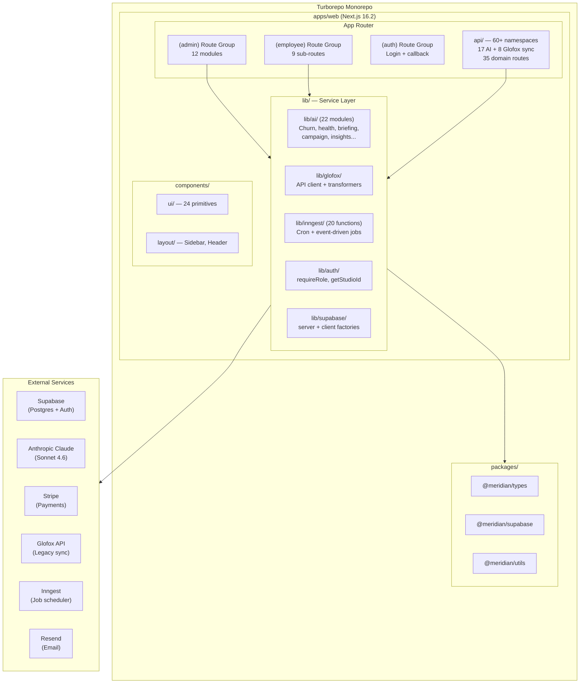

# Layer Report: Project Structure

**Audit Date:** 2026-04-05
**Agent:** project-structure
**Severity Scale:** Critical / High / Medium / Low / Info

---

## Executive Summary

Meridian is a Turborepo monorepo with a single primary application (`apps/web`) — a Next.js 16.2 app running on React 19. The architecture follows a well-structured feature-module layout inside the Next.js App Router with route groups for role separation. Three shared packages (`types`, `supabase`, `utils`) provide reuse across future apps. The project is in active Phase 1 to 2 transition with 430 TypeScript source files and approximately 80,000 estimated lines.

The structure is clean and purposeful. Key risks center on an oversized monolith within `apps/web`, a `'use client'` admin layout that forces client-side rendering on all children despite a 32-page RSC conversion, and no second app yet despite the monorepo scaffold.

---

## Directory Tree (Top 3 Levels)

```
literal-fishstick/                    # Turborepo root
├── apps/
│   └── web/                          # Next.js 16.2 + React 19 app
│       ├── src/
│       │   ├── app/                  # App Router entry point
│       │   │   ├── (admin)/          # Admin dashboard (12 modules)
│       │   │   ├── (auth)/           # Login + auth callback
│       │   │   ├── (employee)/       # Employee portal (9 sub-routes)
│       │   │   ├── api/              # 60+ API route namespaces
│       │   │   └── unsubscribe/      # Public email unsubscribe
│       │   ├── components/           # Shared UI components
│       │   │   ├── ui/               # Base design system (24 primitives)
│       │   │   ├── layout/           # Sidebar, Header, CommandPalette
│       │   │   └── glofox/           # Glofox-specific components
│       │   ├── contexts/             # React contexts (auth-context only)
│       │   ├── hooks/                # 14 custom hooks (AI, data, realtime)
│       │   ├── lib/                  # Core logic layer
│       │   │   ├── ai/               # 22 AI feature modules
│       │   │   ├── auth/             # Auth helpers (require-role, studio)
│       │   │   ├── glofox/           # Glofox API client + transformers
│       │   │   ├── inngest/          # 20 cron/background functions
│       │   │   ├── reports/          # Report generation
│       │   │   ├── sms/              # SMS provider abstraction
│       │   │   └── supabase/         # DB client (client.ts, server.ts)
│       │   └── __tests__/            # Unit + integration test suites
│       ├── e2e/                      # Playwright E2E tests
│       └── scripts/                  # DB and utility scripts
├── packages/
│   ├── types/                        # Shared TypeScript types
│   ├── supabase/                     # Supabase client factory
│   └── utils/                        # Shared utilities (dates, currency)
├── docs/                             # Architecture docs, research, prompts
├── scripts/                          # Root-level utility scripts
└── .audit/ .scrutiny/ .github/       # Meta tooling
```

---

## Architectural Pattern

**Pattern:** Feature-module monolith inside Next.js App Router with domain-driven API surface.

Meridian uses the Route Group pattern (`(admin)`, `(auth)`, `(employee)`) to cleanly separate role-based surfaces without affecting URL paths. Within each surface, modules map closely to business domains: schedule, members, revenue, marketing, corporate, operations, analytics.

The `lib/` directory acts as a service/domain layer — all business logic lives here, not in route handlers. Route handlers (`app/api/`) are thin: they authenticate via `requireRole()`, delegate to lib functions, and return JSON. This is a healthy separation of concerns.

**Architectural style:** Layered monolith with feature-based organization. Not yet hexagonal (no explicit ports/adapters), but the `requireRole` plus service-function pattern approximates it within Next.js constraints.

---

## Module Boundaries

| Module | Route Group | API Namespace | Lib Module | Background Jobs |
|--------|-------------|---------------|------------|-----------------|
| Command Center | `(admin)/` | `/api/analytics/snapshot` | `ai/briefing.ts` | `cron-daily-metrics` |
| Schedule | `(admin)/schedule` | `/api/classes`, `/api/bookings` | — | `glofox-sync-hourly` |
| Members | `(admin)/members` | `/api/members` | — | `cron-member-enrichment` |
| Revenue | `(admin)/revenue` | `/api/revenue`, `/api/transactions` | — | `cron-daily-metrics` |
| Marketing | `(admin)/marketing` | `/api/campaigns`, `/api/automations`, `/api/leads` | `ai/campaign.ts` | `evaluate-triggers`, `execute-flow` |
| Corporate | `(admin)/corporate` | `/api/corporate`, `/api/events` | — | `cron-corporate-credits` |
| Operations | `(admin)/operations` | `/api/employees`, `/api/clock`, `/api/payroll` | — | `cron-payroll-reminder` |
| Analytics | `(admin)/analytics` | `/api/analytics/*`, `/api/reports` | `ai/insights-generator.ts` | `cron-ai-insights`, `cron-report-scheduler` |
| Employee Portal | `(employee)/employee` | `/api/clock`, `/api/employees` | — | — |
| Segments | `(admin)/segments` | `/api/segments` | — | — |
| Engagement | `(admin)/engagement` | — | — | — |
| AI Layer | — | `/api/ai/*` (17 endpoints) | `lib/ai/` (22 modules) | `cron-ai-insights` |
| Glofox Sync | — | `/api/glofox/*` | `lib/glofox/` | `glofox-sync-hourly`, `glofox-backfill` |

---

## Dependency Graph

```
apps/web
  ├── @meridian/types        (shared entity types)
  ├── @meridian/supabase     (DB client factory)
  └── @meridian/utils        (currency, dates, constants)

apps/web external dependencies (key):
  ├── next 16.2.0            (framework)
  ├── @supabase/ssr          (auth + DB)
  ├── @anthropic-ai/sdk      (AI)
  ├── stripe                 (payments)
  ├── inngest                (background jobs)
  ├── resend                 (email)
  ├── twilio                 (SMS — installed, provider-agnostic wrapper)
  ├── reactflow              (automation flow builder UI)
  ├── recharts               (analytics charts)
  ├── @react-pdf/renderer    (invoice PDF generation)
  ├── handlebars             (email template rendering)
  └── zod                    (validation)
```

---

## Architecture Diagram



---

## Findings

### MEDIUM-PS-001: Admin layout forces client boundary on all 32 admin pages

**Severity:** Medium
**Location:** `apps/web/src/app/(admin)/layout.tsx`

The `(admin)/layout.tsx` has `'use client'` at the top and uses `useState`, `useEffect`, and `usePathname`. This layout wraps all 32 admin pages, meaning even RSC-converted pages must re-hydrate through this client boundary. The 32-page RSC conversion noted in the critical context gains only partial benefit — data fetching in individual `page.tsx` files can be async/server, but the layout shell and all children re-render on the client. The `Sidebar` and `Header` being client components is expected, but the top-level layout itself does not need to be a client component.

**Recommendation:** Extract the keyboard shortcut handler and sidebar state into a dedicated `AdminShell` client component. Make `(admin)/layout.tsx` a server component that renders `<AdminShell>` around `{children}`.

---

### LOW-PS-002: Monorepo scaffold underutilized — only one app

**Severity:** Low
**Location:** Root `package.json`, `turbo.json`

The Turborepo setup properly declares `apps/*` and `packages/*` workspaces, but only `apps/web` exists. Three shared packages exist (`types`, `supabase`, `utils`) but the iOS app (React Native), landing page (Astro), and future member web portal would all benefit from them. This is expected at Phase 1 but creates a risk: if package boundaries are not enforced now, extracting them later is harder.

**Recommendation:** Enforce `@meridian/types` usage strictly — no inline type duplication inside `apps/web`. Add a lint rule or turbo boundary check.

---

### LOW-PS-003: `glofox/` components directory lacks ownership documentation

**Severity:** Low
**Location:** `apps/web/src/components/glofox/`

There is a `components/glofox/` directory alongside the main component tree. If these are migration-era UI components, they should be clearly scoped and have a documented deprecation path once Glofox sync is complete.

**Recommendation:** Add a comment header explaining the purpose and expected lifespan of these components.

---

### INFO-PS-004: 14 AI-specific hooks co-located with data hooks

**Severity:** Info
**Location:** `apps/web/src/hooks/`

The `hooks/` directory contains 14 hooks of which approximately 10 are AI-specific (`use-ai-search.ts`, `use-churn-prediction.ts`, `use-booking-patterns.ts`, etc.). As the AI surface grows, mixing data hooks with AI hooks in one flat directory reduces discoverability.

**Recommendation:** Consider a `hooks/ai/` subdirectory as the AI hook count grows.

---

### INFO-PS-005: Admin and Employee portals co-located in a single app

**Severity:** Info
**Location:** `apps/web/src/app/`

Admin dashboard and employee portal are co-located in the same Next.js app via route groups. This is intentional per the PRD but means both surfaces share the same deployment, auth middleware, and bundle. If the employee portal eventually needs a separate subdomain or kiosk deployment, extraction will be required.

**Recommendation:** Document this as a known architectural constraint. Evaluate at Phase 4 when geofencing and kiosk mode are added.

---

## Summary Table

| ID | Severity | Category | Title |
|----|----------|----------|-------|
| MEDIUM-PS-001 | Medium | Architecture | Admin layout forces unnecessary client boundary on all pages |
| LOW-PS-002 | Low | Monorepo | Shared packages underutilized — single app today |
| LOW-PS-003 | Low | Codebase | glofox/ components directory lacks ownership documentation |
| INFO-PS-004 | Info | Organization | AI hooks co-located with data hooks in flat directory |
| INFO-PS-005 | Info | Architecture | Admin + Employee co-located in single deployment unit |
