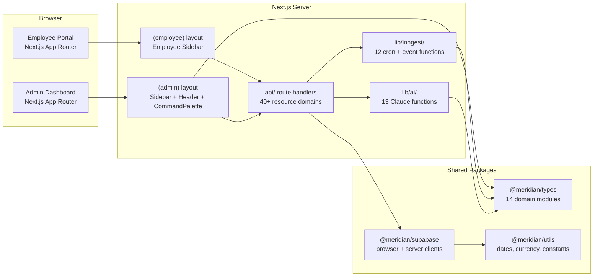

# Layer Report: Project Structure

**Agent:** project-structure
**Completed:** 2026-03-20
**Severity legend:** CRITICAL / HIGH / MEDIUM / LOW / INFO

---

## Executive Summary

Meridian is a Turborepo monorepo containing a single Next.js 16 (App Router) web application and three shared packages. The codebase follows a well-organized feature-based routing structure inside the `(admin)` and `(employee)` route groups, with a clean separation of route handlers under `src/app/api/`. The architecture is coherent and scales cleanly toward Phase 5 (member-facing). Several structural gaps exist that warrant attention before Phase 5 begins.

---

## Directory Tree (Top 3 Levels)

```
literal-fishstick/                    ← monorepo root
├── apps/
│   └── web/                          ← Next.js 16 App Router (sole app)
│       └── src/
│           ├── app/
│           │   ├── (admin)/          ← Admin dashboard route group
│           │   ├── (auth)/           ← Auth routes (login, callback)
│           │   ├── (employee)/       ← Employee portal route group
│           │   ├── api/              ← REST route handlers (~120 routes)
│           │   └── unsubscribe/      ← Public unsubscribe flow
│           ├── components/
│           │   ├── layout/           ← Sidebar, Header
│           │   └── ui/               ← shadcn/ui primitives (~20 components)
│           ├── contexts/             ← AuthContext
│           ├── hooks/                ← 13 AI-specific hooks + utility hooks
│           └── lib/
│               ├── ai/               ← 13 Claude-powered function modules
│               ├── inngest/          ← Event-driven automation engine
│               │   └── functions/    ← 12 cron + event functions
│               ├── reports/          ← CSV/PDF export + report engine
│               └── sms/              ← SMS abstraction layer
├── packages/
│   ├── types/                        ← Shared TypeScript types (14 modules)
│   ├── supabase/                     ← Shared Supabase client (browser + server)
│   └── utils/                        ← Shared utilities (dates, currency, constants)
├── scripts/                          ← SQL migration scripts + data import scripts
├── docs/                             ← Product docs, design guides, phase plans
└── turbo.json                        ← Turborepo task pipeline
```

---

## Architectural Pattern

**Pattern:** Feature-based routing with shared-package monorepo

Meridian uses Next.js App Router route groups to isolate concerns:
- `(admin)` — full admin dashboard, protected by role-based layout
- `(employee)` — employee portal, separate sidebar/nav
- `(auth)` — login and OAuth callback
- `api/` — REST handlers organized by resource domain

This is a variant of the **vertical slice** pattern — each feature domain (members, revenue, marketing, etc.) has its own directory subtree under both the page layer and the API layer. This avoids the "flat controller" anti-pattern common in older Next.js apps.

**Positive:** The monorepo structure means type safety and utilities are enforced across all future apps (iOS, landing page, member portal). The `@meridian/types` package is the canonical data contract.

---

## Module Boundaries

### Admin Modules (route group: `(admin)`)

| Module | Route | Subpages | Status |
|--------|-------|----------|--------|
| Command Center | `/` | — | Complete |
| Schedule | `/schedule` | — | Complete |
| Members | `/members` | — | Complete |
| Revenue | `/revenue` | `/products`, `/orders` | Complete |
| Marketing | `/marketing` | `/campaigns`, `/automations`, `/leads`, `/content` | Complete |
| Corporate | `/corporate` | `/new`, `/events`, `/[id]` | Complete |
| Operations | `/operations` | `/payroll`, `/documents` | Complete |
| Analytics | `/analytics` | `/dashboards`, `/insights`, `/reports`, `/trainers`, `/pricing`, `/migration` | Complete |
| Segments | `/segments` | — | Complete |
| Engagement | `/engagement` | — | Complete |
| Settings | `/settings` | `/sms`, `/geofence` | Complete |
| API Docs | `/docs/api` | — | Complete |

### Employee Portal (route group: `(employee)`)

| Section | Route |
|---------|-------|
| Home | `/employee` |
| My Schedule | `/employee/schedule` |
| Timesheets | `/employee/timesheets` |
| Pay & Taxes | `/employee/pay` |
| My Profile | `/employee/profile` |
| My Classes | `/employee/classes` |
| Performance | `/employee/performance` |
| Promo Code | `/employee/promo` |
| Clock In/Out | `/employee/clock` |

### API Surface (resource domains)

ai, analytics, auth, automations, bookings, campaigns, check-in, classes, clock, content, corporate, cron, email-preferences, email-templates, employees, events, geofence, inngest, invoices, leads, members, migration, openapi, orders, payroll, pricing-simulator, products, qr, reports, revenue, segments, settings, shipping, sms, staff, trainers, transactions, unsubscribe, webhooks

**Total route handler directories:** 40+ resource domains → ~120 HTTP endpoints

### Shared Packages

| Package | Purpose | Exports |
|---------|---------|---------|
| `@meridian/types` | Canonical TypeScript type definitions | 14 domain modules |
| `@meridian/supabase` | Browser + server Supabase clients | `createClient()`, `createServerClient()` |
| `@meridian/utils` | Shared utilities | `dates`, `currency`, `constants` |

---

## Dependency Graph

```mermaid
graph TD
    subgraph Monorepo
        WEB[apps/web<br/>Next.js 16]
        TYPES[packages/types<br/>@meridian/types]
        SUPA[packages/supabase<br/>@meridian/supabase]
        UTILS[packages/utils<br/>@meridian/utils]
    end

    subgraph External Services
        SUPABASE_SVC[Supabase<br/>Postgres + Auth + RLS]
        STRIPE[Stripe<br/>Payments + Webhooks]
        ANTHROPIC[Anthropic Claude<br/>claude-sonnet-4-6]
        INNGEST[Inngest<br/>Event-Driven Jobs]
        RESEND[Resend<br/>Email + Webhooks]
        TWILIO[Twilio<br/>SMS]
        EASYPOST[EasyPost<br/>Shipping]
    end

    WEB --> TYPES
    WEB --> SUPA
    WEB --> UTILS
    SUPA --> SUPABASE_SVC
    WEB --> SUPABASE_SVC
    WEB --> STRIPE
    WEB --> ANTHROPIC
    WEB --> INNGEST
    WEB --> RESEND
    WEB --> TWILIO
    WEB --> EASYPOST
```

---

## Key Observations

### Strengths

1. **Clean route group separation** — `(admin)`, `(employee)`, `(auth)` boundaries prevent unintentional coupling and make role-based auth straightforward.
2. **Shared types package** — `@meridian/types` enforces a single source of truth for all data contracts. Every future surface (iOS, web booking portal) imports from here.
3. **AI functions properly isolated** — `src/lib/ai/` contains 13 discrete modules, each responsible for one AI capability. Not scattered across route handlers.
4. **Inngest event definitions are typed** — `MeridianEvents` type map in `client.ts` means all event producers/consumers are type-checked.
5. **Turborepo build pipeline** — `dependsOn: ["^build"]` ensures packages build before the app. Clean dependency ordering.

### Findings

**MEDIUM — Sidebar shortcut collision:**
In `sidebar.tsx`, both the "Analytics" (`id: 'analytics'`) and "Segments" (`id: 'segments'`) nav items are assigned `shortcut: '8'`. The "Engagement" item is assigned `shortcut: '9'` but there are 10 items. Command palette keyboard shortcuts will collide for Analytics and Segments.

**MEDIUM — Sidebar user is hardcoded:**
The sidebar displays `"Zach M." / "Studio Owner"` as hardcoded strings. The employee portal sidebar hardcodes `"Whitney C." / Trainer`. These must be wired to the auth context before Phase 5 or any multi-tenant deployment.

**MEDIUM — Duplicate route directories in `(employee)`:**
The employee section contains duplicate top-level directories mirroring `/employee/*`:
- `/apps/web/src/app/(employee)/classes/` and `/apps/web/src/app/(employee)/employee/classes/`
- `/apps/web/src/app/(employee)/pay/` and `/apps/web/src/app/(employee)/employee/pay/`
- Similar for: performance, profile, promo, schedule, timesheets

This creates ambiguity about which routes are canonical. The shallow versions may be orphaned stubs.

**LOW — No `middleware.ts` found at app level:**
Auth protection currently relies on each layout checking auth state. A centralized `middleware.ts` for session validation and route protection would be more robust and would be required for Phase 5 member-facing routes.

**LOW — `scripts/` directory contains raw SQL not tracked in a migration framework:**
SQL scripts (`phase2-migration.sql`, seed files, class batch imports) are ad-hoc files not integrated into any migration tooling (Supabase CLI migrations, Flyway, etc.). This increases the risk of schema drift between environments.

**INFO — No `turbo.json` lint caching:** The `lint` task has `dependsOn: ["^build"]` but no `outputs` defined, meaning lint results are never cached. For a codebase at this scale, this will slow CI.

**INFO — Astro landing page referenced but absent:** CLAUDE.md mentions an Astro landing page with "partial build exists." No `apps/landing` or similar directory exists in the monorepo. This is deferred to Phase 5 but should be scaffolded before then to avoid integration surprises.

---

## Architecture Diagram



---

## Findings Summary

| Severity | Count | Items |
|----------|-------|-------|
| CRITICAL | 0 | — |
| HIGH | 0 | — |
| MEDIUM | 3 | Sidebar shortcut collision, hardcoded user identity, duplicate employee route directories |
| LOW | 2 | No middleware.ts, ad-hoc SQL scripts |
| INFO | 2 | Lint caching, missing Astro app |
