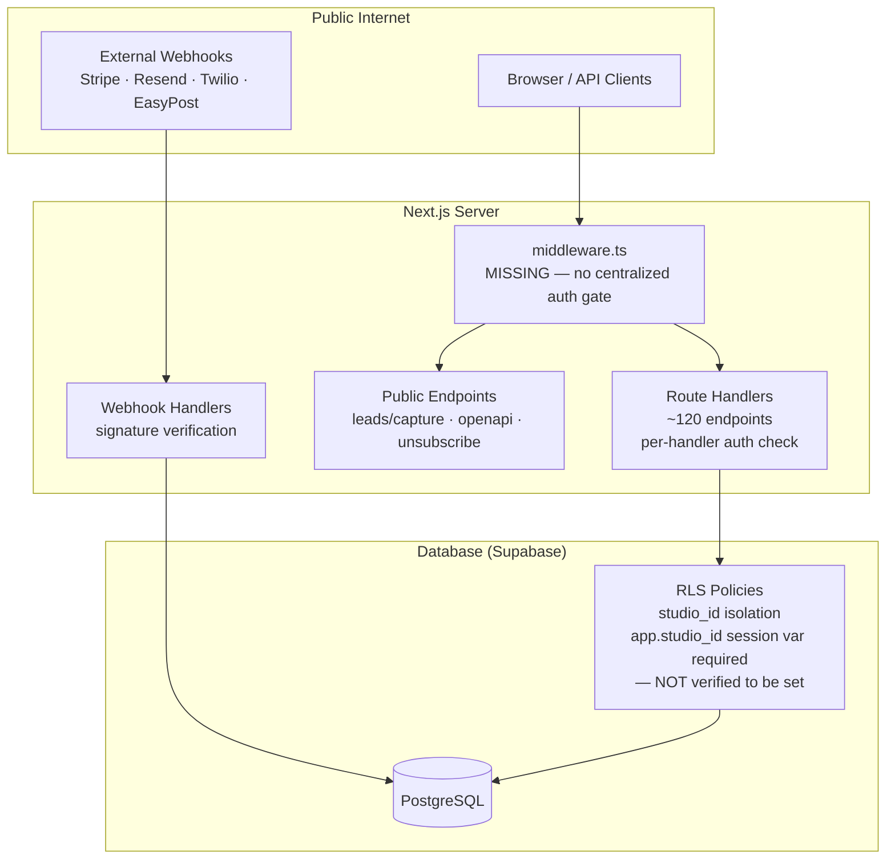

# Layer Report: Security

**Agent:** security
**Completed:** 2026-03-20
**Severity legend:** CRITICAL / HIGH / MEDIUM / LOW / INFO

**Disclaimer:** This is heuristic source-code analysis, not a penetration test or formal security audit. Dynamic vulnerabilities, infrastructure misconfigurations, and secrets in runtime environment are outside the scope of this report.

---

## Executive Summary

Meridian has solid foundational security: Supabase Auth for passwordless authentication, HTTPS-enforced JWT sessions, Stripe and Resend webhook signature verification (svix), and row-level security (RLS) on all database tables. The primary security risks are architectural: missing centralized auth middleware (any new route handler can accidentally become public), lack of role-based authorization on ~95% of admin endpoints, hardcoded studio IDs that bypass multi-tenant isolation, and an Anthropic API key exposure risk if the AI endpoints are ever made public or if rate limiting is not added.

---

## Authentication Analysis

### Mechanism: Supabase Auth (Magic Link / SSO)

- Passwordless — eliminates password-based attack vectors (credential stuffing, brute force)
- Session stored in httpOnly cookies via `@supabase/ssr`
- JWT validated server-side with `supabase.auth.getUser()` on every request

### Auth Enforcement Pattern

```typescript
const { data: { user }, error: authError } = await supabase.auth.getUser();
if (authError || !user) {
  return NextResponse.json({ error: 'Unauthorized' }, { status: 401 });
}
```

This pattern appears correctly in all reviewed route handlers. However, it is per-handler boilerplate with no centralized enforcement. A new handler that omits this check is instantly a public endpoint.

**Missing:** No `middleware.ts` at the Next.js app root to gate all `/api/*` routes before they reach handlers.

### Public Endpoints (No Auth Required)

| Endpoint | Risk |
|----------|------|
| `POST /api/leads/capture` | No rate limit — spam/abuse risk |
| `GET /api/openapi` | Exposes full API schema |
| `GET /api/unsubscribe/[token]` | Token-based — acceptable |
| `POST /api/webhooks/stripe` | Signature-verified — acceptable |
| `POST /api/webhooks/resend` | Signature-verified — acceptable |
| `POST /api/webhooks/twilio` | Unknown verification status |
| `POST /api/webhooks/easypost` | Unknown verification status |

---

## Authorization Analysis

### Role-Based Access Control

Only one endpoint performs role checking:
- `GET/POST /api/campaigns` — checks `roles.includes('admin') || roles.includes('manager')`

All other endpoints (~119 remaining) verify only authentication (user exists) not authorization (user has appropriate role to access the resource). Examples:
- `GET /api/staff` — any authenticated member can list all staff
- `GET /api/revenue` — any authenticated member can see revenue metrics
- `GET /api/payroll/periods` — any authenticated member can view payroll data
- `PATCH /api/members/[id]` — any authenticated member can modify any member's data
- `DELETE /api/bookings/[id]` — any authenticated member can cancel any booking

**Multi-role accounts:** The `profiles.roles` TEXT[] field supports `['admin', 'member']` and `['trainer', 'member']`. The authorization gap means member-role users who are legitimate app users have unrestricted access to all admin data.

---

## Multi-Tenancy / RLS Analysis

### RLS Policies

All Phase 2 tables have RLS enabled with policies that use `current_setting('app.studio_id')::uuid`. This is a Supabase pattern where the server sets `app.studio_id` via a session variable before queries.

**Concern:** The route handlers resolve `studio_id` from `profiles.studio_id` (correct for multi-tenancy) but approximately 15+ handlers fall back to a hardcoded UUID: `profile?.studio_id ?? '11111111-1111-1111-1111-111111111111'`. If a user's profile lookup fails (deleted profile, corrupted session), they silently get access to the development studio's data.

**Inngest:** Uses a service-role client that bypasses RLS entirely. This is the documented intent (`must explicitly filter by studio_id`), but only the hardcoded STUDIO_ID is used. Cross-tenant data leakage in background jobs is possible once a second studio is onboarded.

### Supabase RLS Configuration

Per the Phase 2 migration SQL:
```sql
CREATE POLICY "campaigns_studio_isolation" ON campaigns
  FOR ALL USING (studio_id = current_setting('app.studio_id')::uuid);
```

This RLS pattern requires the application to set `app.studio_id` via a Postgres session variable before every query. If the application does NOT set this variable, the `current_setting()` call will raise an error or return null, potentially causing all queries to fail (secure fail) or return empty results. Verification that the server client sets this session variable was not found in the reviewed code — the server client in `packages/supabase/src/server.ts` is a standard `createSSRClient` with no custom session variable injection.

**This may mean RLS policies are not actually being applied** for Phase 2 tables, as the required `app.studio_id` session variable is never set.

---

## Secret Management

### Env Var Patterns

All secrets are accessed via `process.env.*`. No secrets were found hardcoded in source code. The following sensitive env vars are referenced:

| Variable | Sensitivity | Usage |
|----------|------------|-------|
| `ANTHROPIC_API_KEY` | HIGH | AI API calls |
| `STRIPE_SECRET_KEY` | HIGH | Stripe server operations |
| `STRIPE_WEBHOOK_SECRET` | HIGH | Webhook verification |
| `SUPABASE_SERVICE_ROLE_KEY` | CRITICAL | Bypasses all RLS |
| `RESEND_API_KEY` | HIGH | Email sending |
| `RESEND_WEBHOOK_SECRET` | HIGH | Webhook verification |
| `NEXT_PUBLIC_SUPABASE_URL` | LOW | Public endpoint |
| `NEXT_PUBLIC_SUPABASE_PUBLISHABLE_DEFAULT_KEY` | LOW | Anon key |

**Positive:** The `SUPABASE_SERVICE_ROLE_KEY` is only used in `lib/inngest/helpers.ts` (server-side, never client-side). The `NEXT_PUBLIC_*` vars are correctly limited to non-sensitive values.

**Risk:** `.env.local` exists in `apps/web/` (confirmed by directory listing). If this file were accidentally committed, all secrets would be exposed. `.gitignore` presumably excludes it.

---

## Input Validation

### Observed Validation Patterns

- `POST /api/classes` — validates `class_type_id`, `start_time`, `end_time`, `capacity` presence; validates `capacity > 0`; validates date parsing; validates `end > start`
- `POST /api/members` — validates `email` and `full_name` presence; validates email regex
- `POST /api/bookings` — validates `class_id` and `member_id` presence

### Missing Validation

- No Zod schema validation on any endpoint (Zod is a dependency but not used in route handlers)
- No `Content-Type` validation on POST endpoints
- No max body size enforcement
- String injection: `search` parameter in `/api/members` is passed directly to `.ilike('%${search}%')` via Supabase PostgREST — Supabase parameterizes this, so SQL injection is not possible, but extremely long search strings could affect performance
- `GET /api/migration/import` processes uploaded CSV data with a custom parser — CSV parsing logic is custom-written and only seen partially; injection risks in CSV data need verification

---

## XSS / Content Security

- `isomorphic-dompurify` is installed as a dependency — likely used for sanitizing user-generated HTML content (campaign email bodies, content posts)
- `handlebars` is installed — used for email template rendering. Handlebars auto-escapes by default, but triple-braces `{{{unsafe}}}` would not escape. Usage not fully reviewed.
- HTML email bodies stored in database as `body_html` TEXT — if rendered without sanitization in future member-facing surfaces, XSS risk

---

## Webhook Security

| Webhook | Signature Verification | Notes |
|---------|----------------------|-------|
| Stripe | `constructWebhookEvent()` — HMAC SHA-256 | Correct |
| Resend | Svix `wh.verify()` — HMAC | Correct |
| Twilio | Not reviewed | Risk if unverified |
| EasyPost | Not reviewed | Risk if unverified |
| Inngest | Inngest SDK handles | Correct |

---

## Security Architecture Diagram



---

## Findings

**CRITICAL — RLS isolation policies may not be enforced:**
Phase 2 RLS policies use `current_setting('app.studio_id')::uuid`. No code was found that sets this Postgres session variable before queries. If the variable is never set, the RLS policy comparison will either error or use a null value, potentially causing all RLS policies to fail-open (return nothing) or fail-closed (error). Either way, multi-tenant isolation may not be working as intended for Phase 2 tables.

**HIGH — No centralized auth middleware:**
All 120+ route handlers individually perform auth checks. A new route handler that omits the boilerplate is immediately publicly accessible. Before Phase 5, `middleware.ts` must protect all `/api/*` routes except an explicit allowlist.

**HIGH — Missing role authorization on ~95% of admin endpoints:**
Any authenticated session — including a `member`-role account — can read revenue data, modify member records, access payroll data, and more. The role check in `campaigns/route.ts` is the sole example of role enforcement and should be a pattern applied uniformly.

**HIGH — Hardcoded studio UUID fallback in 15+ route handlers:**
`profile?.studio_id ?? '11111111-1111-1111-1111-111111111111'` silently assigns an authenticated user to the development studio if their profile lookup fails. A malicious actor who can trigger a profile lookup failure (e.g., by deleting their own profile while holding a valid JWT) gains access to that studio's data.

**MEDIUM — No rate limiting on public or AI endpoints:**
`/api/leads/capture` (public) and all 13 AI endpoints have no rate limiting. The AI endpoints have real monetary cost (Anthropic API) and should have per-user, per-minute rate limits. The leads endpoint is spam-reachable without any defense.

**MEDIUM — DOMPurify dependency present but usage not verified:**
`isomorphic-dompurify` is installed but its application in the email rendering pipeline and content post display was not confirmed. If HTML content from the database is rendered without DOMPurify sanitization in any user-facing context (particularly Phase 5 member portal), XSS risk exists.

**MEDIUM — Twilio and EasyPost webhook verification status unknown:**
The Stripe and Resend webhooks correctly verify signatures. The Twilio and EasyPost webhook handlers were not fully reviewed. Unverified webhooks allow spoofed events to modify member or order data.

**LOW — `/api/openapi` publicly exposes full API schema:**
The OpenAPI endpoint is unauthenticated. In a SaaS product, the internal API schema should either be gated or filtered before exposure.

**LOW — Handlebars triple-brace risk in email templates:**
`handlebars` is installed for email template rendering. If any template uses `{{{unsafe_var}}}` (unescaped interpolation), user-supplied data could inject HTML into emails. Audit required.

**INFO — Service role key is correctly server-only:**
`SUPABASE_SERVICE_ROLE_KEY` is only referenced in `lib/inngest/helpers.ts`, a server-side module. It is never in `NEXT_PUBLIC_*` vars or client-side code. This is correct.

---

## Findings Summary

| Severity | Count | Items |
|----------|-------|-------|
| CRITICAL | 1 | RLS policies may not be enforced (app.studio_id never set) |
| HIGH | 3 | No auth middleware, missing role authorization, hardcoded UUID fallback |
| MEDIUM | 3 | No rate limiting, DOMPurify usage unverified, Twilio/EasyPost webhook verification unknown |
| LOW | 2 | OpenAPI public, Handlebars XSS risk |
| INFO | 1 | Service role key correctly server-side |
