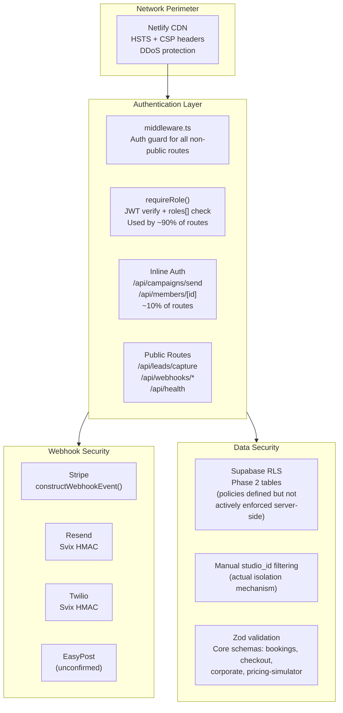

# Layer Report: Security

**Audit Date:** 2026-04-05
**Agent:** security
**Severity Scale:** Critical / High / Medium / Low / Info

---

## Executive Summary

Meridian's security posture is solid for a Phase 1 platform targeting a single studio. Authentication uses Supabase JWTs with role-based access via a centralized `requireRole()` helper. Webhook handlers verify signatures. Secrets are env-var based. Content Security Policy is configured in Netlify headers. No hardcoded API keys or plaintext secrets were found in source code.

Critical/High issues: (1) the AI natural language search executes AI-generated SQL against production data without confirmed DB-layer read-only enforcement; (2) the rate limiter is non-functional for cross-instance protection; (3) two API routes bypass `requireRole()` and use inline auth with `DEFAULT_STUDIO_ID` fallbacks; (4) the EasyPost webhook may lack signature verification. These issues are compounded by the fact that 10 AI routes have no rate limiting, creating an unauthenticated cost exposure vector if session tokens are stolen.

Note: This is heuristic analysis, not a substitute for dedicated security tooling (SAST, DAST, penetration testing).

---

## Security Architecture



---

## Findings

### HIGH-SEC-001: AI NL Search executes AI-generated SQL without confirmed DB-layer read-only enforcement

**Severity:** High
**Location:** `apps/web/src/app/api/ai/search/route.ts`, `apps/web/src/lib/ai/nl-search.ts`

The NL search pipeline generates SQL via Claude, validates it starts with `SELECT` at the application layer, then executes via `execute_readonly_sql` Supabase RPC. The RPC definition was not found in audited SQL migration files. If the RPC does not enforce:
- `SET TRANSACTION READ ONLY`
- A read-only database role with only SELECT grants

...then the application-layer SELECT check can be bypassed by:
- Prompt injection crafting a SELECT with side-effecting functions
- A multi-statement query (though Postgres parameterized queries mitigate this)

The schema context in the system prompt exposes all table and column names including sensitive fields (`email`, `phone`, `health_score`, `date_of_birth`).

**Classification:** This is a High severity finding rather than Critical because: the route requires owner/manager role authentication, and Claude's instruction-following is generally reliable for basic SQL constraints.

**Recommendation:**
1. Locate or create `execute_readonly_sql` as a `SECURITY DEFINER` function running under a read-only role.
2. Add `SET LOCAL statement_timeout = '5000'` inside the function.
3. Post-generation: assert the SQL contains `studio_id = '...'` before execution.
4. Consider column allowlisting for sensitive fields in the schema context.

---

### HIGH-SEC-002: Rate limiter is non-functional for cross-instance protection — AI cost attack vector

**Severity:** High
**Location:** `apps/web/src/lib/rate-limit.ts`

The rate limiter returns an in-memory result optimistically and updates Supabase asynchronously. In a serverless environment with N concurrent instances, each instance has its own counter. A user can make N × 20 = up to N×20 requests per minute against AI endpoints without hitting the limit. With Netlify's autoscaling, N could be 10+ during traffic spikes.

Combined with the 10 unrated AI routes, a stolen session token could generate significant Anthropic API costs.

**Recommendation:** Rewrite `rateLimit()` to be async — await the Supabase atomic increment, return the real count. Add `rateLimit()` to all AI routes using a studio-level key.

---

### HIGH-SEC-003: POST /api/campaigns/send uses inline auth with DEFAULT_STUDIO_ID fallback

**Severity:** High
**Location:** `apps/web/src/app/api/campaigns/send/route.ts`

This route uses inline auth (not `requireRole()`) and uses `DEFAULT_STUDIO_ID` as the studio identifier. A user whose profile has `studio_id = null` would send bulk campaign emails against the hardcoded studio, potentially cross-contaminating studio data at SaaS launch.

**Recommendation:** Refactor to use `requireRole(['owner', 'manager'])` which throws a 403 if `studio_id` is null.

---

### MEDIUM-SEC-004: getStudioId() utility returns DEFAULT_STUDIO_ID as fallback — fail-open design

**Severity:** Medium
**Location:** `apps/web/src/lib/auth/get-studio-id.ts`

```typescript
export function getStudioId(profile: { studio_id?: string | null }): string {
  return profile?.studio_id || process.env.DEFAULT_STUDIO_ID || DEFAULT_STUDIO_ID;
}
```

This function fails open: if a profile has no `studio_id`, it returns the default studio ID. This means any authenticated user with a partial profile can read/write another studio's data. The TODO in `MED-008` acknowledges routes need to be migrated away from this pattern.

**Recommendation:** Add a `required` parameter to `getStudioId()` that throws a 403 instead of returning the fallback. Migrate all routes per MED-008.

---

### MEDIUM-SEC-005: EasyPost webhook may lack signature verification

**Severity:** Medium
**Location:** `apps/web/src/app/api/webhooks/easypost/route.ts` (directory confirmed, content unread)

The middleware allowlist includes `/api/webhooks/easypost` as a public route. The Stripe and Resend webhooks have explicit signature verification. EasyPost webhooks should be verified using their HMAC-SHA256 signature header.

**Recommendation:** Implement EasyPost webhook signature verification using the `X-Hmac-Signature-256` header. Store the EasyPost webhook secret in `EASYPOST_WEBHOOK_SECRET` env var (already present in `.env.example`).

---

### MEDIUM-SEC-006: Content Security Policy uses 'unsafe-inline' and 'unsafe-eval' for scripts

**Severity:** Medium
**Location:** `netlify.toml`

```
Content-Security-Policy: "... script-src 'self' 'unsafe-inline' 'unsafe-eval' ..."
```

`'unsafe-inline'` and `'unsafe-eval'` in `script-src` significantly weaken XSS protections. These are required by some React runtime behaviors and Stripe.js, but they should be scoped as narrowly as possible.

**Recommendation:**
1. Evaluate whether `'unsafe-eval'` is still needed after the React 19 / Next.js 16 upgrade. The React compiler may have eliminated eval usage.
2. Replace `'unsafe-inline'` with `nonce-based` CSP for inline scripts where possible.
3. At minimum, document why these flags are required and add them to a periodic review list.

---

### MEDIUM-SEC-007: Zod validation inconsistently applied — only 4 schemas exist for 150 routes

**Severity:** Medium
**Location:** `apps/web/src/lib/validation.ts`

The `validateBody()` utility with Zod schemas exists for 4 endpoints: bookings, checkout, corporate, pricing-simulator. The remaining ~140 POST/PUT routes parse `request.json()` directly and validate fields with ad-hoc if-checks. This is inconsistent and creates risk of unexpected input shapes causing database errors or logic bugs.

**Recommendation:** Extend Zod validation to all state-mutating routes (POST/PUT/DELETE). Prioritize: members, campaigns, automations, leads.

---

### LOW-SEC-008: SUPABASE_SERVICE_ROLE_KEY used inline in Stripe webhook — not from shared helper

**Severity:** Low
**Location:** `apps/web/src/app/api/webhooks/stripe/route.ts`

The Stripe webhook creates a Supabase client inline using `SUPABASE_SERVICE_ROLE_KEY`. Other service-role clients use `getAdminClient()` from `lib/inngest/helpers.ts`. This inconsistency means if the service role client initialization needs to change (e.g., adding a custom header or timeout), it must be updated in multiple places.

**Recommendation:** Extract a `getWebhookSupabaseClient()` helper to a shared location used by all webhook handlers.

---

### LOW-SEC-009: X-Frame-Options: DENY may block legitimate iframe embeds

**Severity:** Low
**Location:** `netlify.toml`

`X-Frame-Options: DENY` prevents all iframe embedding. The SnapWidget Instagram embed uses an iframe and may be rendered in a member portal page. If the member portal (Phase 5) is served from the same origin, this header would block it.

**Recommendation:** Switch to `Content-Security-Policy: frame-ancestors 'self'` which is more flexible and allows same-origin iframes while still preventing clickjacking from external origins.

---

### INFO-SEC-010: No secrets in source code — confirmed clean

**Severity:** Info

A search for real API key patterns (`sk_live_*`, long base64 strings) in all TypeScript source files returned no results. All secrets are properly referenced via `process.env.*`. The `.env.example` file contains only placeholder values. HSTS, CSP, `X-Content-Type-Options`, and `Referrer-Policy` headers are correctly configured.

---

## Summary Table

| ID | Severity | Category | Title |
|----|----------|----------|-------|
| HIGH-SEC-001 | High | Security | NL Search executes AI-generated SQL without DB read-only enforcement |
| HIGH-SEC-002 | High | Security | Rate limiter non-functional — AI cost attack via stolen session |
| HIGH-SEC-003 | High | Auth | /api/campaigns/send uses inline auth with DEFAULT_STUDIO_ID fallback |
| MEDIUM-SEC-004 | Medium | Auth | getStudioId() fails-open with DEFAULT_STUDIO_ID for missing profiles |
| MEDIUM-SEC-005 | Medium | Security | EasyPost webhook may lack signature verification |
| MEDIUM-SEC-006 | Medium | Security | CSP uses unsafe-inline and unsafe-eval for script-src |
| MEDIUM-SEC-007 | Medium | Validation | Zod validation exists for 4 of 150 routes — inconsistently applied |
| LOW-SEC-008 | Low | Architecture | Service-role client created inline in webhook — not from shared helper |
| LOW-SEC-009 | Low | Security | X-Frame-Options: DENY may block Phase 5 same-origin iframes |
| INFO-SEC-010 | Info | Security | No hardcoded secrets found in source code |
