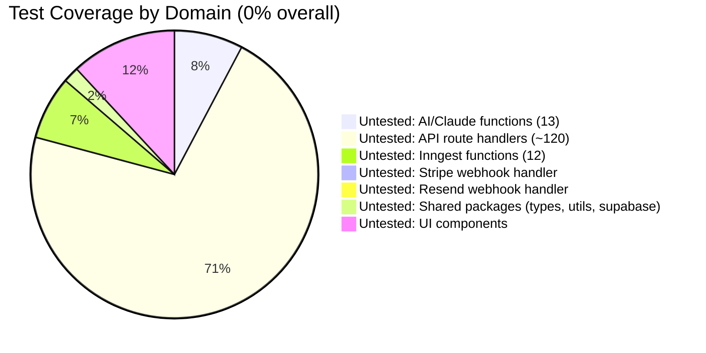

# Layer Report: Testing Quality

**Agent:** testing-quality
**Completed:** 2026-03-20
**Severity legend:** CRITICAL / HIGH / MEDIUM / LOW / INFO

---

## Executive Summary

Meridian has zero application-level tests. No unit tests, integration tests, E2E tests, or snapshot tests exist anywhere in the `apps/` or `packages/` directories. The `test_frameworks` field in language-detection.json is an empty array, confirming this. The project ships entirely on manual testing and type safety. This is a manageable risk for Phase 1 internal tooling but becomes a critical gap as the system approaches Phase 5 (member-facing, production-scale deployment) and particularly given the financial, booking, and multi-tenant nature of the platform.

---

## Test Inventory

### Application Tests

| Category | Count | Coverage |
|----------|-------|---------|
| Unit tests | 0 | 0% |
| Integration tests | 0 | 0% |
| E2E tests | 0 | 0% |
| Snapshot tests | 0 | 0% |
| API route tests | 0 | 0% |
| Component tests | 0 | 0% |
| **Total** | **0** | **0%** |

Note: Tests found in `node_modules/` (zod, tsconfig-paths, entities) are library tests, not application tests.

### Test Infrastructure

| Item | Status |
|------|--------|
| Test runner (Jest, Vitest, Playwright) | Not installed |
| CI/CD pipeline | Not found |
| Coverage thresholds | None |
| `test` script in package.json | Absent |
| GitHub Actions / CI config | Not found |
| Pre-commit hooks | Not found |

---

## Critical Untested Paths

### Financial / Revenue

1. **Stripe webhook handler** (`/api/webhooks/stripe`) — processes `subscription.created`, `subscription.updated`, `payment_intent.succeeded`, `invoice.paid`. No tests verify that membership status updates correctly on subscription events, that refunds update the right records, or that failed payments trigger dunning.

2. **Booking creation with capacity check** (`POST /api/bookings`) — the count-then-insert approach has an acknowledged race condition. No test verifies atomic behavior under concurrent requests.

3. **Credit pack expiry and grace period logic** — 7-day grace period on credit expiry is a documented edge case policy. No test verifies that expired credits are correctly blocked after the grace period.

4. **Trainer bonus threshold calculation** — bonus is earned when check-ins exceed threshold (default: 7). No test verifies the check-in count excludes the trainer's own booking, which is a documented business rule.

5. **Strike system** — progressive penalties ($5 for 2nd strike, $10 for 3rd, rolling 30-day window). No test verifies correct penalty amounts, expiry windows, or the exempt toggle behavior.

### AI / Automation

6. **Automation trigger evaluation** (`evaluate-triggers.ts`) — runs every 10 minutes and enrolls members in flows. No test verifies that the STUDIO_ID hardcoding doesn't cause cross-tenant leakage, or that the `status = 'active'` query bug (vs `is_active = true`) is caught.

7. **Churn prediction fallback** — `predictChurn()` has a rules-based fallback when `ANTHROPIC_API_KEY` is absent. No test verifies the fallback produces valid `ChurnPredictionResult` shapes.

8. **AI response JSON parsing** — multiple AI functions parse `JSON.parse(claudeResponse)`. If Claude returns malformed JSON (which can happen), the route handler will throw an unhandled exception. No test exercises this failure mode.

### Multi-tenancy / Security

9. **RLS enforcement** — no integration test verifies that a member from Studio A cannot read Studio B's data. This is the most critical security property of the entire platform.

10. **Role-based access** — no test verifies that a `member`-role JWT cannot call admin APIs. The only role check in the codebase (`campaigns/route.ts`) is untested.

### Data Integrity

11. **Resend webhook processing** — idempotency for `email.opened` (only counts first open), click URL accumulation, hard bounce suppression. All untested.

12. **Automation enrollment uniqueness** — the `UNIQUE(automation_id, member_id)` constraint is never tested against re-enrollment flows.

---

## Test Anti-Patterns

N/A — there are no tests to evaluate for anti-patterns. This section would normally cover excessive mocking, brittle snapshots, or commented-out tests.

---

## Coverage Diagram

---

## Prioritized Test Coverage Roadmap

Given zero test coverage, the highest-value first tests to write are:

**Tier 1 (before Phase 5 launch — critical paths):**
1. Stripe webhook handler — subscription lifecycle tests with mocked Stripe events
2. Booking capacity check — concurrent booking race condition simulation
3. RLS multi-tenant isolation — integration test verifying cross-studio data leakage is impossible
4. Role-based API authorization — verify member JWT cannot reach admin endpoints
5. Credit pack grace period logic

**Tier 2 (before production scale):**
6. Churn prediction — verify fallback output shape validity
7. Automation trigger evaluation — mock DB to verify flow activation logic
8. Strike penalty calculation — unit test the rules-based logic
9. Resend webhook idempotency — test first-open-only counting
10. AI JSON parsing — test malformed Claude response handling

**Suggested stack:** Vitest (unit/integration) + Playwright (E2E) + `@supabase/supabase-js` with a test project for integration tests.

---

## Findings

**CRITICAL — Zero test coverage on financial transaction paths:**
Stripe webhook, payment recording, dunning, credit management, and refunds all execute without any test harness. A regression in any of these paths would directly impact revenue and member financial data with no automated detection.

**CRITICAL — Zero test coverage on multi-tenant RLS enforcement:**
There is no programmatic verification that Supabase RLS policies correctly isolate studio data. A policy misconfiguration (possible during Phase 4 corporate module additions or Phase 5 member portal) would go undetected until a member reports seeing another studio's data.

**HIGH — No test infrastructure exists at all:**
No test runner, no `test` npm script, no CI pipeline. Adding tests requires first setting up the entire testing infrastructure. This is a significant uplift that should be planned as a discrete project.

**HIGH — AI endpoints have no error boundary tests:**
13 Claude-powered endpoints parse AI responses with `JSON.parse()` and no try/catch around the parse call in several implementations. A single malformed AI response will crash the route handler and return a 500 error with no graceful degradation.

**MEDIUM — No CI pipeline to catch regressions:**
Without CI, there is no automated check that the TypeScript compiles (`type-check` script exists but is not run automatically), that linting passes, or that any future tests pass before deployment to Netlify.

**MEDIUM — No type-check run in build pipeline:**
`turbo.json` defines `type-check` as a task but it is not in the `build` pipeline's `dependsOn`. TypeScript errors would only be caught manually.

**LOW — No contract tests between `@meridian/types` and DB schema:**
The field name mismatches identified in the data-model layer (e.g., `credits_remaining` vs `remaining`, `members` vs `profiles`) would be caught immediately by integration tests or contract tests comparing the TypeScript type shapes against actual DB column names.

---

## Findings Summary

| Severity | Count | Items |
|----------|-------|-------|
| CRITICAL | 2 | Zero financial path test coverage, zero RLS isolation tests |
| HIGH | 2 | No test infrastructure, no AI error boundary tests |
| MEDIUM | 2 | No CI pipeline, type-check not in build |
| LOW | 1 | No schema contract tests |
| INFO | 0 | — |
