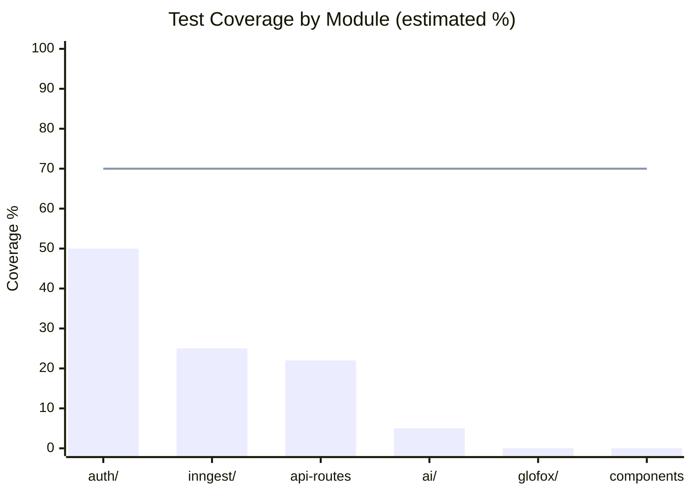

# Layer Report: Testing Quality

**Audit Date:** 2026-04-05
**Agent:** testing-quality
**Severity Scale:** Critical / High / Medium / Low / Info

---

## Executive Summary

Meridian has a Vitest-based unit test suite (46 test files), a Vitest integration test suite (6 test files requiring a real Supabase instance), and a Playwright E2E suite (10 spec files). The overall test-to-code ratio is reasonable for a Phase 1 project but coverage thresholds are set at 30% — significantly below industry standard. Key gaps include: zero tests for the AI layer modules, no coverage for the 6 new trigger types in `evaluate-triggers.ts`, and integration tests that are commented out of CI (never run). Tests for recently-changed Glofox client methods were not found.

---

## Test Inventory

### Unit Tests (46 files)

| Category | Files | Coverage Area |
|----------|-------|---------------|
| API routes — domain | 22 | bookings, check-in, classes, clock, corporate, invoices, leads, members, settings, staff |
| API routes — webhooks | 1 | Stripe webhook effects |
| API routes — AI | 1 | ai-search |
| API routes — campaigns | 1 | campaigns |
| Lib — auth | 2 | require-role, get-studio-id |
| Lib — inngest | 5 | cron-member-enrichment, evaluate-triggers, glofox-sync-enrichment, helpers |
| Lib — member-360 | 1 | member_360 view logic |
| Lib — rate-limit | 1 | rate-limit |
| Lib — resend | 1 | email send |
| Lib — validation | 1 | phone normalization |
| Lib — automation-templates | 1 | automation templates |
| Phone normalization | 1 | 14 API routes integration test |

### Integration Tests (6 files — NOT run in CI)

| File | Purpose |
|------|---------|
| `ai-endpoints.test.ts` | Real Anthropic API calls |
| `api-bookings.test.ts` | Real Supabase booking flows |
| `auth-flow.test.ts` | Real Supabase auth |
| `inngest-helpers.test.ts` | Inngest event helpers |
| `stripe-webhook-effects.test.ts` | Stripe webhook DB effects |
| `supabase-crud.test.ts` | Basic CRUD operations |

**Note:** Integration tests are commented out of CI with `# MED-27` — they require a dedicated Supabase test project that has not been provisioned.

### E2E Tests (10 spec files — Playwright)

| Spec | Pages Covered |
|------|--------------|
| `auth.setup.ts` | Auth bootstrap |
| `login.spec.ts` | Login flow |
| `command-center.spec.ts` | Command Center |
| `schedule.spec.ts` | Schedule page |
| `members.spec.ts` | Members directory |
| `revenue.spec.ts` | Revenue dashboard |
| `marketing.spec.ts` | Marketing module |
| `corporate.spec.ts` | Corporate module |
| `analytics.spec.ts` | Analytics dashboards |
| `employee-portal.spec.ts` | Employee portal |

---

## Test Coverage Analysis

### Coverage Configuration

From `vitest.config.ts`:
```
thresholds: {
  branches: 30,
  functions: 30,
  lines: 30,
  statements: 30,
}
```

**Assessment:** 30% thresholds are very low and will not catch meaningful regressions. Industry standard for business-critical paths is 70-80% branch coverage. For a fitness studio platform handling payments and member data, 30% is insufficient.

### Test-to-Code Ratio by Module

| Module | Source Files | Test Files | Ratio |
|--------|-------------|-----------|-------|
| `app/api/` (domain) | ~100 route files | 22 test files | ~22% |
| `lib/ai/` | 22 modules | 1 test file (ai-search only) | ~5% |
| `lib/inngest/` | 20 functions | 5 test files | 25% |
| `lib/auth/` | ~4 files | 2 test files | ~50% |
| `lib/glofox/` | 5 files | 0 test files | 0% |
| `lib/sms/` | ~3 files | 0 test files | 0% |
| `lib/reports/` | ~3 files | 0 test files | 0% |
| Components | ~40 files | 0 test files | 0% |

---

## Coverage Diagram



---

## Findings

### HIGH-TQ-001: AI layer has near-zero test coverage — 22 modules, 1 test

**Severity:** High
**Location:** `apps/web/src/lib/ai/`, `apps/web/src/__tests__/unit/api/ai-search.test.ts`

The AI layer has 22 modules (briefing, churn-prediction, health-score, campaign copy, insights generator, NL search, revenue anomaly, etc.). Only `ai-search` has a unit test. None of the following are tested:
- `briefing.ts` — the daily briefing that surfaces to the Command Center
- `churn-prediction.ts` — feeds member retention workflows
- `health-score.ts` — drives member health score display
- `insights-generator.ts` — produces actionable AI insights
- `revenue-anomaly.ts` — revenue anomaly detection

AI modules use a fallback pattern (rules-based when no API key configured). This fallback path is the correct target for unit tests and would not require mocking Anthropic.

**Recommendation:** Add unit tests for the rules-based fallback paths in each AI module. Mock `getAnthropicClient()` to return null in tests, then assert correct fallback behavior.

---

### HIGH-TQ-002: 6 new automation trigger types have no tests

**Severity:** High
**Location:** `apps/web/src/__tests__/unit/lib/inngest/evaluate-triggers.test.ts`, `apps/web/src/lib/inngest/functions/evaluate-triggers.ts`

The recent sprint added 6 trigger types: `never_booked`, `classpass_repeat`, `one_and_done`, `cooling_off`, `plan_upgrade_candidate`, `class_type_fan`. The `evaluate-triggers.test.ts` file likely tests only the original 12 types. The new trigger evaluation logic is untested and, combined with the schema CHECK constraint bug (DM-003), these code paths may never have been exercised.

**Recommendation:** Add a test case for each of the 6 new trigger types. Test both the qualifying-member detection logic and the enrollment creation.

---

### HIGH-TQ-003: Integration tests are disabled in CI — never run

**Severity:** High
**Location:** `.github/workflows/ci.yml`, `src/__tests__/integration/`

The CI workflow runs unit tests only. The integration test step is commented out with `# MED-27 — requires dedicated Supabase test project`. The 6 integration test files (covering bookings, auth, Stripe webhooks, Supabase CRUD) are never executed in CI. Any regression in these flows would only be caught by E2E tests or manual testing.

**Recommendation:**
1. Provision a dedicated Supabase test project with a seeded schema (a one-time setup task).
2. Uncomment the integration test CI step.
3. Alternatively, use Supabase local development (Docker) for integration tests — no external account required.

---

### MEDIUM-TQ-004: Glofox API client has zero test coverage after 15-method rewrite

**Severity:** Medium
**Location:** `apps/web/src/lib/glofox/client.ts` (906 lines)

The Glofox client has 906 lines across 50+ methods. 15 methods were recently rewritten with corrected endpoint paths. There are no unit tests for the client — no tests verify that the corrected endpoint paths, retry logic, pagination, or Unix-to-ISO timestamp conversion work correctly.

**Recommendation:** Add unit tests for the Glofox client using the `mock-glofox.ts` helper that already exists. Focus on: (1) the 15 corrected methods, (2) retry logic on rate limits, (3) `unixToISO()` edge cases (null, zero, object timestamps).

---

### MEDIUM-TQ-005: Coverage thresholds set at 30% — far below industry standard

**Severity:** Medium
**Location:** `apps/web/vitest.config.ts`

```
thresholds: { branches: 30, functions: 30, lines: 30, statements: 30 }
```

For a platform handling financial transactions, member data, and AI-driven workflows, 30% is inadequate. Reaching 30% likely happens by accident, not by intention.

**Recommendation:** Raise thresholds incrementally:
- Near-term (next 2 sprints): 50% across all metrics
- Medium-term (Phase 2 complete): 70% branch, 65% function/line
- Prioritize: auth layer (currently ~50%), API routes handling payments and member mutations

---

### MEDIUM-TQ-006: No component tests — 40+ React components untested

**Severity:** Medium
**Location:** `apps/web/src/components/`

The 24 UI primitives and all admin/employee page components have zero test coverage. The members page (`page.tsx`) alone is a 400+ line client component with complex state management. Component tests would catch rendering bugs introduced by the RSC conversion.

**Recommendation:** Add React Testing Library tests for at minimum: `MemberProfilePanel`, `AddMemberModal`, and the layout components. Use the existing `@testing-library/react` and `@testing-library/jest-dom` devDependencies.

---

### MEDIUM-TQ-007: Phone normalization test is an integration test masquerading as a unit test

**Severity:** Medium
**Location:** `apps/web/src/__tests__/unit/api/phone-normalization-integration.test.ts`

The file is named `phone-normalization-integration.test.ts` but is placed in the `unit/api/` directory. If it requires real DB connections it will fail silently in unit CI. If it mocks everything, the "integration" label is misleading.

**Recommendation:** Clarify placement: pure unit test for `normalizePhone()` function belongs in `unit/lib/`. Tests for API routes using phone normalization belong in `unit/api/` but should be clearly named. Move the actual integration test to `integration/` if it requires real DB.

---

### LOW-TQ-008: Playwright E2E tests cover all 10 major modules but lack data assertions

**Severity:** Low
**Location:** `apps/web/e2e/`

Playwright specs exist for all 10 major surfaces. However, E2E tests in early-stage projects often test only navigation ("can I reach the page") without asserting data correctness. With the `daily_metrics` revenue data known to be wrong, E2E tests checking "revenue shows a number" would pass incorrectly.

**Recommendation:** Add data-integrity assertions to at least the revenue and members E2E specs. Example: after seeding known test data, assert that the displayed MRR matches expected values.

---

### LOW-TQ-009: Test helpers (mock-supabase, mock-chainable) are sophisticated but undocumented

**Severity:** Low
**Location:** `apps/web/src/__tests__/helpers/`

The `mock-chainable.ts` and `mock-supabase.ts` helpers implement complex chainable mock patterns for the Supabase client. These are powerful but complex — new contributors would struggle to understand why `profilesCallCount++` is needed or when to use `createChainableMock` vs direct vi.fn().

**Recommendation:** Add JSDoc comments explaining the mock patterns and at least one usage example.

---

### INFO-TQ-010: `member-360.test.ts` is an excellent pattern for view logic testing

**Severity:** Info
**Location:** `apps/web/src/__tests__/unit/lib/member-360.test.ts`

The `member_360` view logic is tested by replicating the SQL CASE expressions in TypeScript and testing them as pure functions. This is the correct approach for database view logic that cannot be tested against a live DB in unit tests. This pattern should be documented and replicated for other complex SQL logic (e.g., `calculate_lead_score` RPC, `check_booking_capacity` trigger).

---

## Summary Table

| ID | Severity | Category | Title |
|----|----------|----------|-------|
| HIGH-TQ-001 | High | Coverage | AI layer has near-zero test coverage — 22 modules, 1 test |
| HIGH-TQ-002 | High | Coverage | 6 new automation trigger types have no tests |
| HIGH-TQ-003 | High | CI/CD | Integration tests disabled in CI — never run |
| MEDIUM-TQ-004 | Medium | Coverage | Glofox client has zero tests after 15-method rewrite |
| MEDIUM-TQ-005 | Medium | Standards | Coverage thresholds at 30% — far below industry standard |
| MEDIUM-TQ-006 | Medium | Coverage | No component tests for 40+ React components |
| MEDIUM-TQ-007 | Medium | Organization | Phone normalization test misplaced in unit directory |
| LOW-TQ-008 | Low | Quality | E2E tests check navigation but lack data integrity assertions |
| LOW-TQ-009 | Low | Documentation | Test helpers sophisticated but undocumented |
| INFO-TQ-010 | Info | Best Practice | member-360 test is a strong pattern for view logic testing |
