# Layer Report: UI/UX

**Audit Date:** 2026-04-05
**Agent:** ui-ux
**Severity Scale:** Critical / High / Medium / Low / Info

---

## Executive Summary

Meridian's admin dashboard is built on Next.js App Router with a shadcn-derived component library (based on `@base-ui/react` primitives), Tailwind CSS 4, Framer Motion for animations, and Lucide React for icons. The design system is intentionally "Linear meets Apple Health meets Stripe Dashboard" — information-dense, dark-mode capable, and confident.

The component architecture is largely sound. The 32-page RSC conversion was recent, but the `(admin)/layout.tsx` is still a client component, limiting RSC benefits. The UI has a meaningful design system with 24 primitives, consistent nav shortcuts (Cmd+0-9), and a command palette. Key gaps: engagement features (streak tracking, referrals) are scaffolded but return placeholder data; accessibility patterns are unconfirmed; the automation flow builder (ReactFlow) is a full client component with complex state that is completely untested.

---

## Component Hierarchy

```mermaid
flowchart TD
    ROOT["Root Layout\n(Server)"]
    ADMIN_LAYOUT["(admin)/layout.tsx\n'use client' - Sidebar + Header + CommandPalette"]
    ROOT --> ADMIN_LAYOUT

    subgraph PAGES["32 Admin Pages (RSC-converted)"]
        CC_PAGE["Command Center\npage.tsx (async)"]
        MEMBERS_PAGE["Members\npage.tsx (async)"]
        MEMBER_DETAIL["Member [id]\npage.tsx (async)"]
        REVENUE_PAGE["Revenue\npage.tsx (async)"]
        MARKETING_PAGE["Marketing\npage.tsx (async)"]
        AUTOMATIONS_PAGE["Automations\npage.tsx (async)"]
        ENGAGEMENT_PAGE["Engagement\npage.tsx (async)"]
        ANALYTICS_EXEC["Analytics/Executive\npage.tsx (RSC shell only)"]
    end

    ADMIN_LAYOUT --> PAGES

    subgraph CLIENTS["Client Components (_components/)"]
        MEMBER_PROFILE["MemberProfileClient\n'use client'"]
        ENGAGEMENT_CLIENT["EngagementClient\n'use client'"]
        AUTOMATIONS_CLIENT["AutomationsClient\n'use client' + ReactFlow"]
        CAMPAIGNS_NEW["CampaignNewClient\n'use client' 5-step wizard"]
        EXEC_CLIENT["ExecutiveDashboardClient\n'use client' (all data fetching)"]
    end

    PAGES --> CLIENTS

    subgraph DESIGN_SYSTEM["components/ui/ — 24 primitives"]
        BUTTON["button.tsx\n@base-ui/react + cva"]
        INPUT["input.tsx"]
        CARD["card.tsx"]
        CHART["chart.tsx\nRecharts wrapper"]
        TABLE["table.tsx"]
        DIALOG["dialog.tsx"]
        CMD["command.tsx\ncmdk"]
    end

    ADMIN_LAYOUT --> DESIGN_SYSTEM
    CLIENTS --> DESIGN_SYSTEM
```



---

## Design System Assessment

### Strengths

- **Consistent primitives:** 24 UI components using `@base-ui/react` + `class-variance-authority` for type-safe variants. Button has 6 variants, 5 sizes.
- **Dark mode ready:** Root layout applies theme color metadata. Tailwind CSS 4 handles dark mode via CSS variables.
- **Animation system:** Framer Motion is used consistently for page transitions (`fadeInUp`, `fadeInUpWithExit`). Motion tokens appear centralized in `lib/motion.ts`.
- **Navigation:** 10 nav items with Cmd+1 through Cmd+0 keyboard shortcuts. Command palette (Cmd+K) enables power-user navigation.
- **AI visual treatment:** Indigo-to-violet gradient border pattern for AI insight cards matches the design spec.

### Gaps

- **No documented design token file:** Colors are hardcoded as Tailwind arbitrary values (`text-[#4F46E5]`) or class names rather than a single source of truth CSS variable file.
- **Accessibility not audited:** ARIA labels, semantic HTML, keyboard navigation beyond shortcuts are not confirmed in the code reviewed.
- **Responsive design:** The admin dashboard appears desktop-first. No mobile breakpoint handling was observed in the sidebar or header components.

---

## Findings

### HIGH-UX-001: Engagement leaderboard returns hardcoded placeholder data for streak and referrals

**Severity:** High
**Location:** `apps/web/src/app/(admin)/engagement/page.tsx`

The Engagement page is a recently-added admin surface. The leaderboard computes `totalVisits` from the database correctly, but `currentStreak` and `referrals` are hardcoded to `-1` (rendered as "--" in the UI). The page has a prominent `TODO` comment:

```typescript
// TODO: Streak and referral data pipelines needed.
// - currentStreak requires a visit_streaks table or daily aggregation job
// - referrals requires a referrals table...
```

This means users who open the Engagement module see an incomplete leaderboard with dashes for the two most gamification-relevant fields.

**Recommendation:** Either implement the streak/referral data pipelines before shipping this page, or remove the columns from the leaderboard display until the data is available.

---

### HIGH-UX-002: ExecutiveDashboardClient fetches all data client-side — bypasses RSC conversion

**Severity:** High
**Location:** `apps/web/src/app/(admin)/analytics/dashboards/executive/page.tsx`

The executive dashboard RSC page is a thin wrapper:
```typescript
export default function ExecutiveDashboardPage() {
  return <ExecutiveDashboardClient />
}
```

The client component handles all data fetching via API routes because "API routes cannot be called from RSC without a full URL." This reasoning is incorrect — RSC pages can call Supabase directly without going through the API layer. The executive dashboard bypasses the RSC conversion entirely, adding unnecessary client-side waterfall data fetching.

**Recommendation:** Move data fetching into the RSC page using direct Supabase calls (not via `/api/*` routes). Pass initial data as props to `ExecutiveDashboardClient` which handles interactivity only.

---

### MEDIUM-UX-003: Admin layout is a full client component — RSC conversion gains are limited

**Severity:** Medium
**Location:** `apps/web/src/app/(admin)/layout.tsx`

As documented in project-structure findings, the `(admin)/layout.tsx` is `'use client'` with `useState`/`useEffect`/`usePathname`. This creates a client subtree root for all 32 admin pages. While individual `page.tsx` files can now be async server components, they render inside a client boundary and any async data they fetch still needs to be passed down correctly.

**Recommendation:** Extract the interactive shell (sidebar toggle, keyboard shortcuts, breadcrumbs) into `AdminShell` client component. Make the layout itself a server component.

---

### MEDIUM-UX-004: Automation flow builder is a 400+ line client component with no error boundaries

**Severity:** Medium
**Location:** `apps/web/src/app/(admin)/marketing/automations/[id]/page.tsx`

The automation flow editor uses ReactFlow — a complex graph visualization library. The page component is entirely `'use client'` with complex state (`useNodesState`, `useEdgesState`). Key issues:
- No React Error Boundary wrapping the ReactFlow canvas — a rendering error crashes the entire page
- No unsaved-changes warning when navigating away
- Save/load of flow JSON to/from the database is not confirmed to be atomic (partial flow saves could corrupt the automation)

**Recommendation:** Wrap the ReactFlow canvas in an Error Boundary. Add a `beforeunload` handler for unsaved changes. Validate flow JSON schema before saving.

---

### MEDIUM-UX-005: Campaign new wizard does not check email_preferences before showing recipient count

**Severity:** Medium
**Location:** `apps/web/src/app/(admin)/marketing/campaigns/new/page.tsx`

The 5-step campaign creation wizard shows "estimated recipients" based on segment count. However, the actual send (in `POST /api/campaigns/send`) filters out members with `marketing_email=false` or `hard_bounced=true`. The wizard's recipient count is an overestimate that may significantly differ from actual sends for studios with bounced/unsubscribed members.

**Recommendation:** The segment recipient count step should query `email_preferences` to show the actual deliverable count alongside the raw segment count.

---

### LOW-UX-006: Members page is still a full client component — did not receive RSC conversion

**Severity:** Low
**Location:** `apps/web/src/app/(admin)/members/page.tsx`

The members directory page has `'use client'` at the top and uses `useState`, `useEffect`, and browser Supabase client for data fetching. The member detail page (`[id]/page.tsx`) was converted to RSC. The directory listing itself was not converted.

**Recommendation:** Convert `members/page.tsx` to RSC: fetch the initial member list server-side, pass as props to a client component that handles search/filter UI state.

---

### LOW-UX-007: No loading states or Suspense boundaries for RSC pages

**Severity:** Low
**Location:** All RSC-converted `page.tsx` files

The RSC-converted pages do not have corresponding `loading.tsx` files in their route directories. Next.js uses `loading.tsx` to show a skeleton/spinner while the server component fetches data. Without it, users see a blank page flash during navigation to data-heavy pages.

**Recommendation:** Add `loading.tsx` skeleton files for the heaviest pages: member detail, revenue dashboard, analytics dashboards.

---

### LOW-UX-008: Dark mode toggle in sidebar but no persistent preference storage

**Severity:** Low
**Location:** `apps/web/src/components/layout/sidebar.tsx`

The sidebar has a sun/moon dark mode toggle. If user preference is stored only in memory (not in `localStorage` or the user's profile), it resets on page refresh.

**Recommendation:** Persist dark mode preference in `localStorage` and initialize the theme from storage on mount.

---

### INFO-UX-009: Command palette is implemented but scope is navigation-only

**Severity:** Info
**Location:** `apps/web/src/components/command-palette.tsx` (inferred)

The command palette (Cmd+K) is present in the admin layout. At this stage it appears to handle navigation shortcuts. The `@cmdk` package is installed and capable of supporting actions (create booking, invite member, run report). As the platform matures, expanding command palette scope would improve power-user efficiency.

---

## Summary Table

| ID | Severity | Category | Title |
|----|----------|----------|-------|
| HIGH-UX-001 | High | Data Integrity | Engagement leaderboard shows placeholder data for streak/referrals |
| HIGH-UX-002 | High | Architecture | Executive dashboard fetches all data client-side despite RSC conversion |
| MEDIUM-UX-003 | Medium | Architecture | Admin layout is client component — limits RSC benefits |
| MEDIUM-UX-004 | Medium | Reliability | Automation flow builder lacks error boundaries and unsaved-changes protection |
| MEDIUM-UX-005 | Medium | UX | Campaign recipient count doesn't account for unsubscribed/bounced members |
| LOW-UX-006 | Low | Performance | Members directory page not converted to RSC |
| LOW-UX-007 | Low | UX | No loading.tsx Suspense skeletons for RSC pages |
| LOW-UX-008 | Low | UX | Dark mode preference not persisted across page refresh |
| INFO-UX-009 | Info | UX | Command palette navigation-only — could expand to actions |
