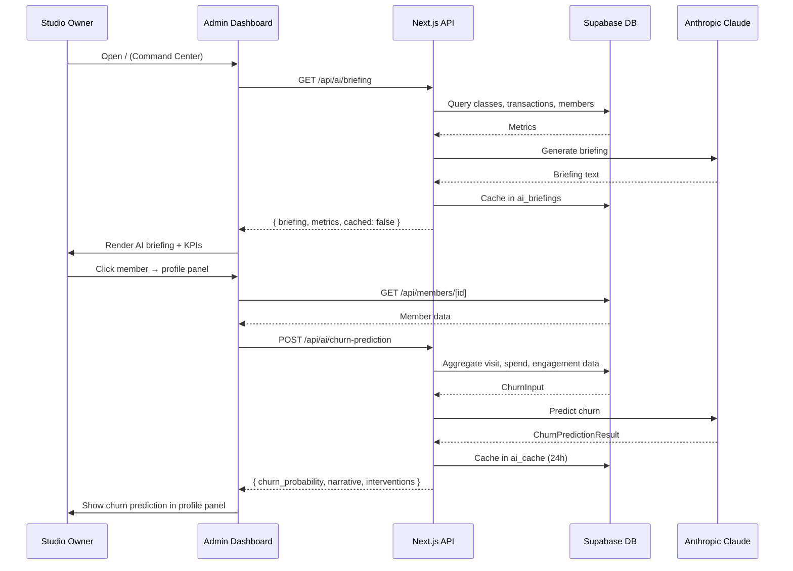

# Layer Report: User Flow

**Agent:** user-flow
**Completed:** 2026-03-20
**Severity legend:** CRITICAL / HIGH / MEDIUM / LOW / INFO

---

## Executive Summary

Meridian has two distinct user portals sharing the same Next.js app: the Admin Dashboard (studio owner/manager) and the Employee Portal. Both use role-based route group layouts. The primary admin flows (member management, class scheduling, booking, revenue) are well-structured with clear navigation. Several flows have broken or disconnected states: the employee clock-in flow doesn't persist, dark mode doesn't work in admin, and multiple pages show mock data instead of live API data. The member-facing flow (Phase 5) is entirely absent from the current codebase.

---

## Primary User Flows

### Flow 1: Admin Daily Operations (Primary Admin Flow)

```
Entry: Login → /login (magic link auth)
  → (auth callback) → /auth/callback
  → / (Command Center)
    → AI briefing loaded from /api/ai/briefing (30-min cache)
    → KPI metrics from /api/analytics/summary or /api/analytics/snapshot
    → Today's schedule from /api/classes?start_date=today
    → Activity feed from activity_log
    → Live facility status (polling via use-realtime)
```

**Command Center sub-flows:**
- "At Risk Members" → clicks through to `/members?filter=at-risk`
- "Revenue Today" → clicks through to `/revenue`
- Class capacity percentages → `/schedule`

### Flow 2: Member Management

```
/ → /members
  → Search + filter (tabs: All / Active / Paused / At Risk / New)
  → Member card click → slide-over profile panel opens
    → Overview tab: membership status, last visit, credits, health score
    → History tab: booking/visit history
    → Financials tab: transactions, LTV, billing
    → Communications tab: email log, preferences
  → AI health score: POST /api/ai/health-score (per-member)
  → Churn prediction: POST /api/ai/churn-prediction (per-member)
  → /segments → smart segment list → click → segment members
```

**Gap:** No "new member" creation flow found in the page component (no modal or form). POST /api/members exists but the UI trigger is absent from the visible members page.

### Flow 3: Class Scheduling

```
/ → /schedule
  → Week/month calendar view
  → Class creation: click time slot → form (class_type, start_time, capacity, trainer)
    → POST /api/classes
  → Class detail: click class → bookings list, check-in status
  → Walk-in kiosk: /schedule → kiosk mode → member QR scan → POST /api/check-in
  → Waitlist: full class → waitlisted members → automatic promotion via /api/cron/waitlist-promote
```

### Flow 4: Campaign Creation (Marketing Module)

```
/marketing → overview stats
  → /marketing/campaigns → campaign list
  → /marketing/campaigns/new → campaign builder
    → Channel select (email/SMS/push)
    → Audience: segment picker → GET /api/segments
    → Content: rich text editor + AI copy assist (POST /api/ai/campaign-copy)
    → A/B test toggle → variant config
    → Schedule or send immediately
    → POST /api/campaigns → POST /api/campaigns/send or /api/campaigns/send-test
  → Resend webhook updates campaign_recipients as sends happen
  → Campaign detail: real-time open/click metrics
```

### Flow 5: Automation Flow Builder

```
/marketing/automations → automation list
  → /marketing/automations/new → flow builder (reactflow canvas)
    → Trigger selection (12 trigger types)
    → Step builder: email / wait / condition / SMS / tag / update_field
    → Exit conditions
    → Activate flow → is_active = true
  → Inngest evaluate-triggers cron: every 10 minutes
    → Finds qualifying members
    → Creates automation_enrollments
    → Dispatches 'automation/execute_flow' event
  → execute-flow.ts Inngest function processes each step
```

**Gap:** Automation trigger evaluation has the `status = 'active'` vs `is_active BOOLEAN` bug (identified in data-model layer). If unresolved, no automation flow will ever be evaluated.

### Flow 6: Employee Clock In/Out

```
/employee → employee dashboard
  → Clock in button (header badge)
    → Current: sets React useState only (NOT persisted)
    → Expected: POST /api/clock with geolocation coordinates
  → /employee/clock → dedicated clock page
    → GPS location capture
    → Geofence check against /api/geofence records
    → POST /api/clock → creates ClockEntry in DB
  → /employee/timesheets → view past entries
  → Payroll: /employee/pay → pay stubs from /api/payroll/periods
```

**Critical gap:** The employee layout header's clock badge is wired to local state only. The actual clock flow lives at `/employee/clock` (separate page). There are two clock experiences with no shared state. An employee clicking the header badge sees it toggle visually but is not actually recording a clock entry.

### Flow 7: Corporate Account Management

```
/corporate → company accounts list
  → /corporate/new → create company account form
  → /corporate/[id] → company detail
    → Members: add/remove company members
    → Credit allocation management
    → Contract details
  → /corporate/events → event pipeline
    → Event status: inquiry → quoted → confirmed → deposit_paid → completed → invoiced → paid
    → RSVP management
    → Invoice generation → /api/invoices
```

### Flow 8: Analytics and Reporting

```
/analytics → overview
  → /analytics/dashboards → 3 pre-built dashboards (Executive, Daily Ops, Growth)
  → /analytics/reports → custom report builder
    → POST /api/reports → async generation via Inngest
    → Download: CSV or PDF export
  → /analytics/insights → AI insights panel
    → GET /api/ai/insights → POST to insights generator
    → Fingerprint-based dedup
  → /analytics/trainers → trainer performance comparison
    → GET /api/trainers/performance
  → /analytics/pricing → pricing simulator
    → Scenario modeling against current plans
  → /analytics/migration → Glofox data import wizard
    → Upload CSV → validate → wave-assign → import
```

---

## Dead-End Flows

1. **Admin dark mode toggle** — clicking the light/dark toggle in the admin sidebar does nothing. No visual feedback, no state change.

2. **Marketing overview page** — displays mock data. "View Campaign" links lead to real campaign routes, but the overview itself shows fabricated open rates and revenue attribution.

3. **`/engagement` page** — exists in the route group and sidebar nav but its content is unknown (only the file path was detected, not its content). This may be a stub page.

4. **`/docs/api` page** — renders a Swagger UI from the `/api/openapi` endpoint. Assuming the OpenAPI spec is correct, this is functional.

---

## Missing / Orphaned Pages

| Issue | Details |
|-------|---------|
| No `/members/[id]` page | Member profiles open as slide-over panels on the `/members` list page. There is no dedicated member profile URL. Deep linking to a specific member profile is not possible. |
| `/classes` in employee group | `/apps/web/src/app/(employee)/classes/` directory exists alongside `/employee/classes/` — one is likely an orphan. |
| No member-facing routes | Phase 5 (web booking portal, iOS) is absent. No `/book`, `/portal`, or member self-service pages exist. |
| No 404 or error page | No custom `not-found.tsx` or `error.tsx` found at the app root or route group level. |

---

## Primary User Flow Sequence Diagram



---

## Findings

**HIGH — Employee clock badge disconnected from persistence:**
The header clock badge in the employee layout uses `useState(true)` locally. No database write occurs when toggled. An employee could toggle it all day with zero effect on their timesheet or payroll. The real clock flow requires navigating to `/employee/clock`.

**HIGH — Multiple production pages display mock/hardcoded data:**
Marketing overview and analytics overview pages display hardcoded TypeScript data arrays as if they were live API responses. Admins cannot distinguish mock from real data.

**MEDIUM — No deep-linkable member profile URL:**
Member profiles open only as slide-over panels on the `/members` list page. There is no shareable or bookmarkable URL for a specific member. This will become critical when email or notification links need to point admins to specific member records.

**MEDIUM — Automation flow builder will silently not evaluate triggers:**
The `automation_flows` `is_active` vs `status` field mismatch means the Inngest cron trigger evaluator finds zero active flows every time it runs. Automations appear configured in the UI but never execute.

**MEDIUM — No custom error boundaries or 404 pages:**
If an API call fails, Next.js will either show a generic error or throw to the root error boundary. User-facing error states are not designed.

**LOW — `/engagement` page content unknown:**
The engagement page exists in the sidebar nav and routing but its content was not accessible for review. If it is a stub, users navigating to it will see an empty or broken page.

**LOW — No loading states on member profile AI sections:**
The churn prediction and health score AI calls are asynchronous. If the AI API is slow, the profile panel may show empty sections without loading indicators. (Skeleton components exist in the design system but their use here is not confirmed.)

---

## Findings Summary

| Severity | Count | Items |
|----------|-------|-------|
| CRITICAL | 0 | — |
| HIGH | 2 | Clock badge disconnected, mock data on production pages |
| MEDIUM | 3 | No deep-link member URLs, automation triggers silently broken, no error pages |
| LOW | 2 | Engagement page unknown, AI loading states unconfirmed |
| INFO | 0 | — |
